[toc]

#### Basics

##### What is Python doing here

LLDB (the debugger used by Xcode i.e.) has an embedded Python interpreter and provides a Python API to automate and extend debugging tasks. As far as Python is concerned, it has a library/module named **lldb** ([reference](https://lldb.llvm.org/use/python-reference.html)) that when imported makes the debug session related data available.

> The entire LLDB API is available as Python functions through a **script bridging interface**. This means the LLDB APIs can be used directly from python either interactively or to build python apps that provide debugger features. <br>Additionally, Python can be used as a programmatic interface within the lldb command interpreter (we refer to this for brevity as the **embedded interpreter**).

##### script command

Anytime a breakpoint is hit, a LLDB session is already active and the command **script** can be entered there to start a Python session.

Over here, the current target has been printed using LLDB's Python API.

```swift
target = lldb.debugger.GetSelectedTarget()
```


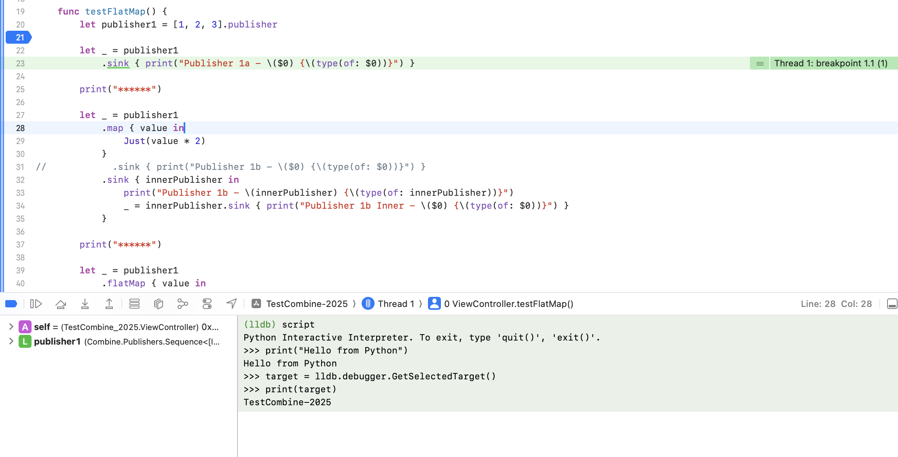

To exit the Python session the command is  `exit`.

##### Importing a Python script

Save the Python script somewhere in the file system and then import it using **command script import**.

```
command script import >scriptPath>
```

| Python script                                                | Imported in LLDB with `command script import`                |
| ------------------------------------------------------------ | ------------------------------------------------------------ |
| 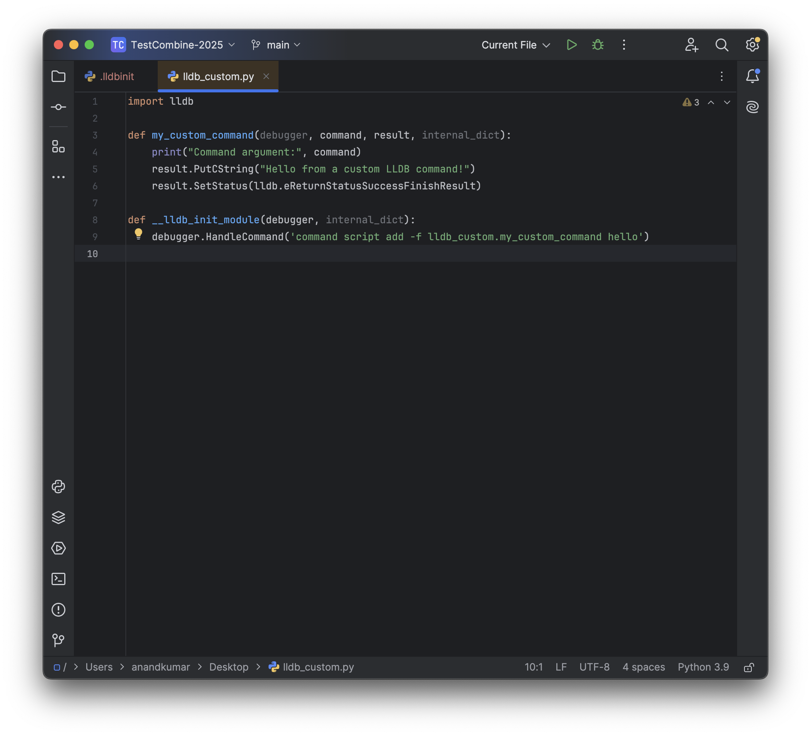 | 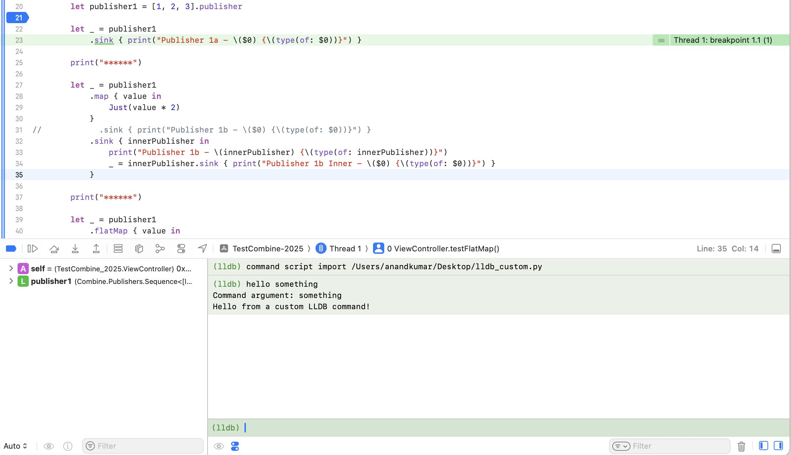 |

##### Syntax/structure of Python script

What is probably happening here is that the LLDB session is being told that there is a new command called **hello**. <br>**__lldb_init_module()** is likely the function in Python script that gets called first by LLDB.

```python
def __lldb_init_module(debugger, internal_dict):
    debugger.HandleCommand('command script add -f lldb_custom.my_custom_command hello')
```

 In the above example, the implementation says that the command `hello` should route to the function `my_custom_command` (implmentation shown below). **command** gives the command line arguments that are passed.

```python
def my_custom_command(debugger, command, result, internal_dict):
    print("Command argument:", command)
    result.PutCString("Hello from a custom LLDB command!")
    result.SetStatus(lldb.eReturnStatusSuccessFinishResult)
```

> The registered command even shows up in autosuggest of Xcode's LLDB session once `command script import` is done. Note that the command has to be at least more than 4-5 characters long for the autosuggest to activate. <br><br>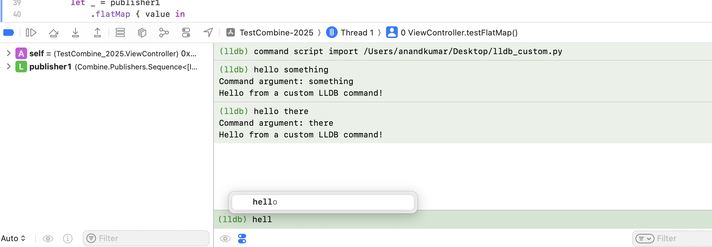


The custom lldb command is what gives inthe last part of the argument to `debugger.HandleCommand`, and the function it should call is specified just before it, the preceding part of that before the dot seems to be the file name.

##### lldbinit file

In scheme settings, a `lldbinit` file can be specified. This file gets automatically run in the beginning of very debugger session, and then anything there is already available in debugger all throughout. 

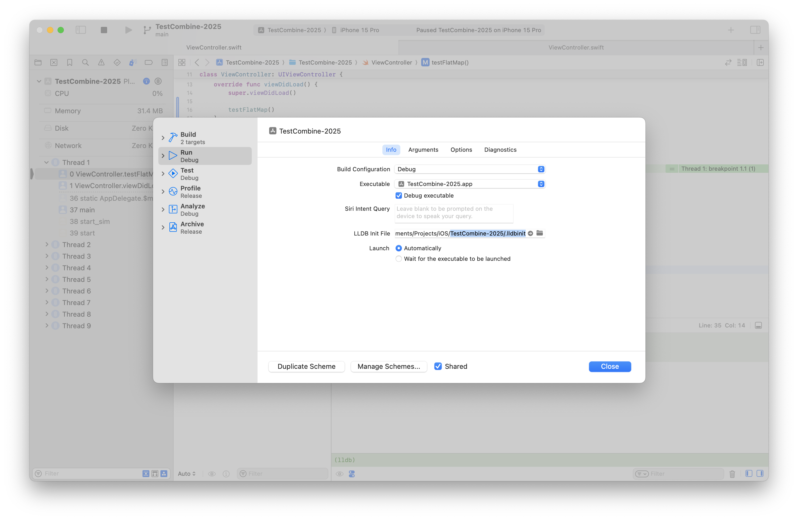

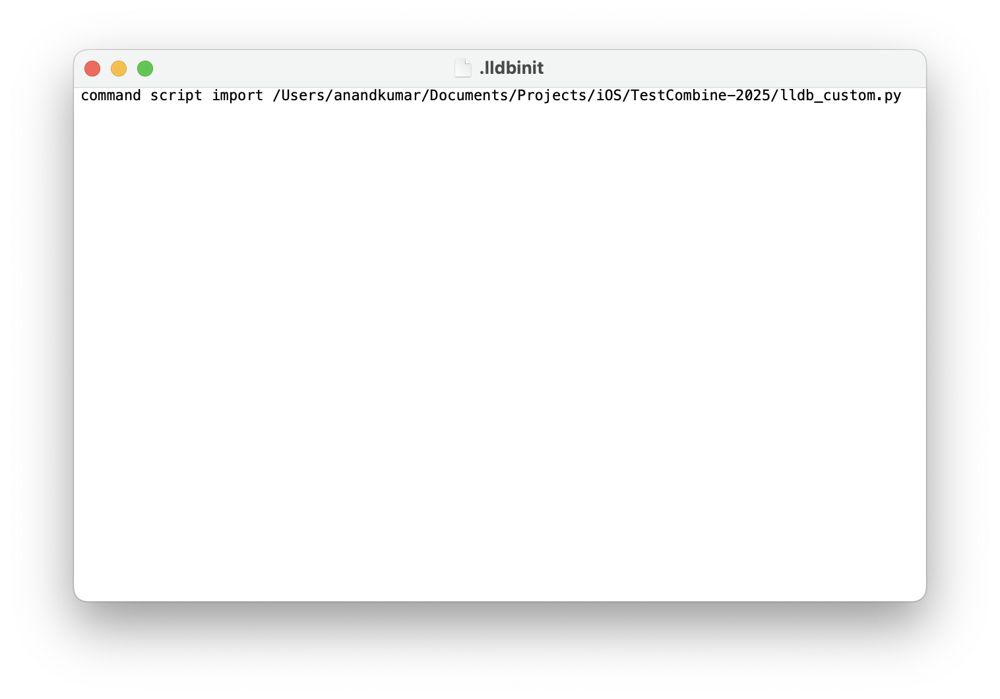

> Note that relative paths like `SRCROOT` can be used here in scheme settings 
>
> 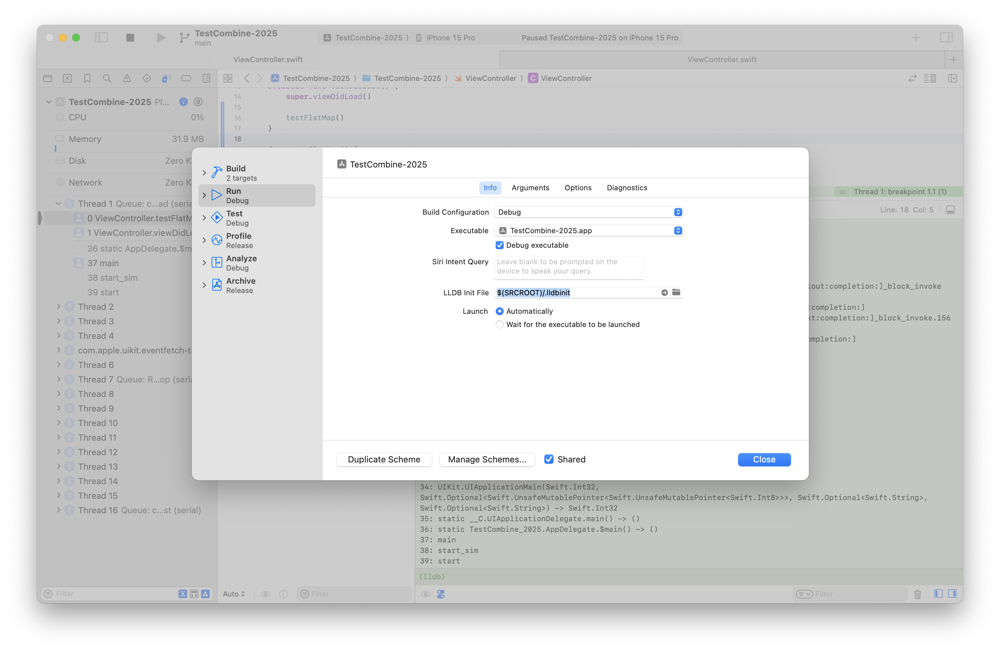
>
> but they are not supported 'inside' lldbinit files (out of box from Xcode, etc. but there could be indirect ways.) <br><br>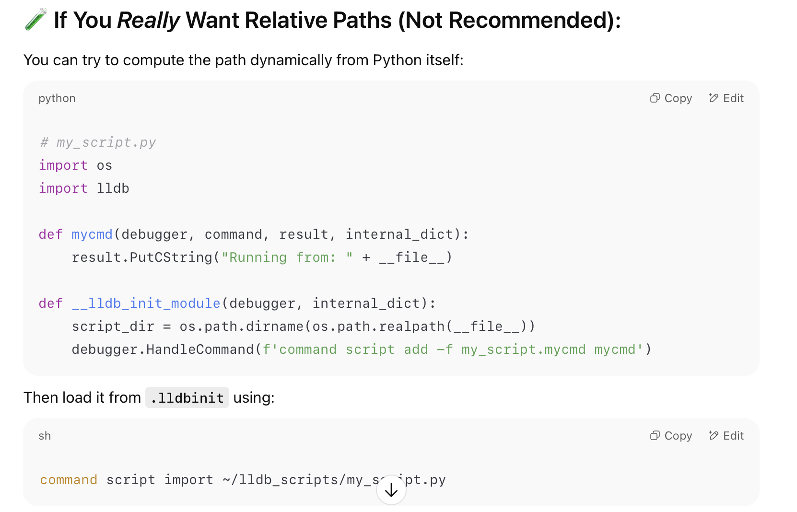

##### Having multiple scripts/functions in same file

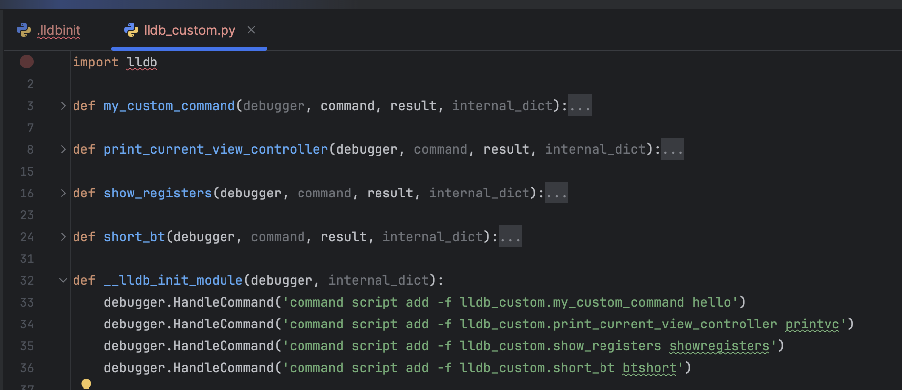

##### Printing a result in console

`result.PutCString()` is what seems to print in console. 

```swift
result.PutCString(f"{frame.GetFrameID()}: {function}")
```

#### Sample scripts

##### Cleaner backtrace

Print only function names from the stack trace of 1st/current thread.

```swift
def short_bt(debugger, command, result, internal_dict):
    thread = debugger.GetSelectedTarget().GetProcess().GetSelectedThread()
    for frame in thread:
        function = frame.GetFunctionName()
        if function:
            result.PutCString(f"{frame.GetFrameID()}: {function}")
    result.SetStatus(lldb.eReturnStatusSuccessFinishResult)

def __lldb_init_module(debugger, internal_dict):
    debugger.HandleCommand('command script add -f lldb_custom.short_bt btshort')
```

Prints like this

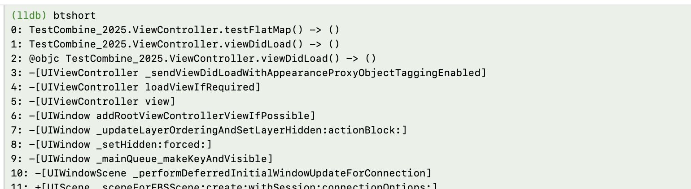

As opposed to the more verbose output from plain `bt`

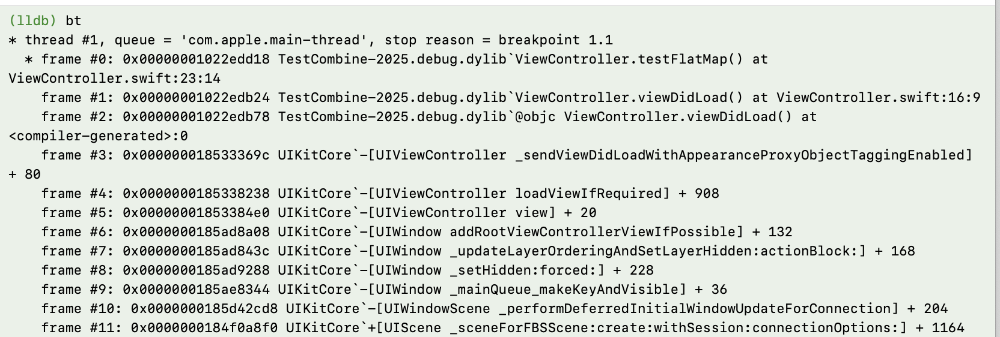

##### Show registers

```swift
def show_registers(debugger, command, result, internal_dict):
    ro = lldb.SBCommandReturnObject()
    debugger.GetCommandInterpreter().HandleCommand("register read", ro)
    if ro.Succeeded():
        result.PutCString(ro.GetOutput())
    else:
        result.PutCString("Error: " + ro.GetError())

def __lldb_init_module(debugger, internal_dict):
    debugger.HandleCommand('command script add -f lldb_custom.show_registers showregisters')
```


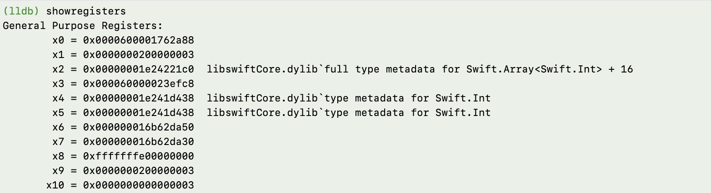

#### Misc.

There are some basic things like `SBCommandReturnObject`, `GetCommandInterpreter`, should understand those when I need to work more with LLDB.