> These are mainly from 'WWDC 2019: Getting the Most Out of Simulator' and 'WWDC 2020: Become a Simulator expert'.

`xcrun simctl` - Several simulator related tasks can be done using `xcrun simctl`.

##### Listing all possible simulators

`xcrun simctl list` - Returns device types, their runtimes, and identifiers, current state. These full identifiers should particularly be used when scripting.

`xcrun simctl list devices` - Returns just the list of available devices (without any OS versions)

`xcrun simctl list --json` - Returns the list in a json format.

##### Creating a simulator

`xcrun simctl create` - This probably creates an alaias for a given simulator which can then be used in scripts.

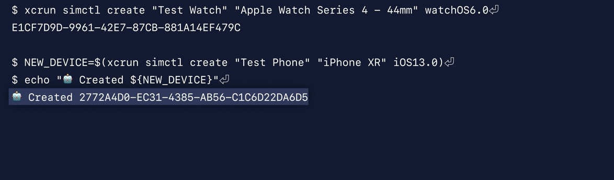

##### Start processes

`spawn` - Starts a process by executing a given executable on a device.

This can be used for various things.

In the below example, on the currently 'booted' simulator a certain user defaults value is changed. This can be useful for changing user default before running app.

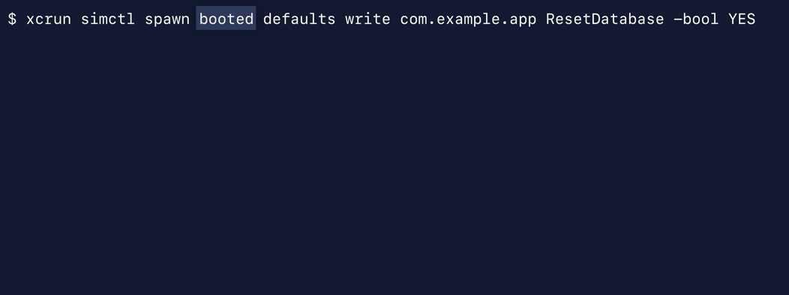

In the below example `log stream` utility is being used to stream log messages to the bash/zsh session.

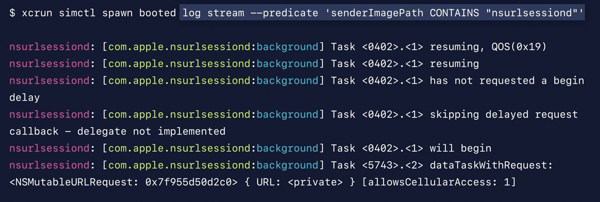

##### Searching through all logs on disk

`xcrun simctl diagnose` - This goes through and collects not just logs on disk, but ephemeral logging too. And it then dumps system state that can be useful in tracking down a problem. `-l` flag is to skip the privacy warning.

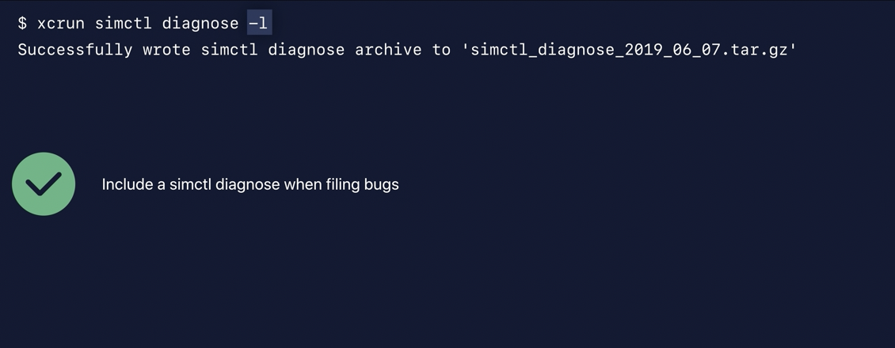

##### Installing an application

`install` installs an app.

##### Launch an application

`xcrun simctl launch` - Launches an application. launch politely asks the system, "Would you please start the application with this bundle ID?" This is equivalent to tapping on the icon on the Home screen. So if you actually want to launch an installed application, you'd need to use the launch command.

The defaults allow to override defaults that have been set as arguments from the command line.

If a `-- console-pty` flag is passed, launch connects the application's standard input, output and standard error to the terminal.

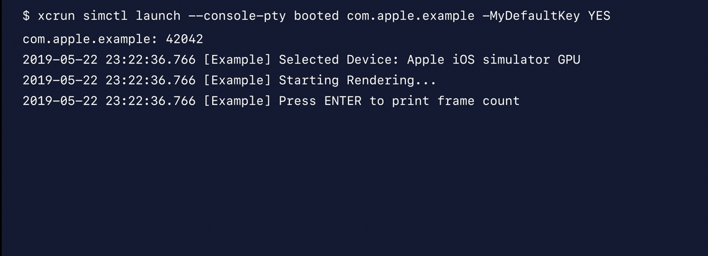

##### Booting, Shutting down, etc.

`boot` boots a device.

`shutdown` shuts down the device. It accepts special aliases - `all`, `unavailable`, `delete`, etc.

##### Setting up Watch pairings

`pair` allows to pair and unpair watches with iOS simulators. You can set up watch phone pairings from the command line.

##### Adding media

`addmedia` adds media. This too can be scripted.

##### Getting path to app sandbox on disk

`get_app_container` can give the path on disk to application's data container or even to a shared container that the app and app's extension are using.

##### io

`io` does many things, including taking screenshots.

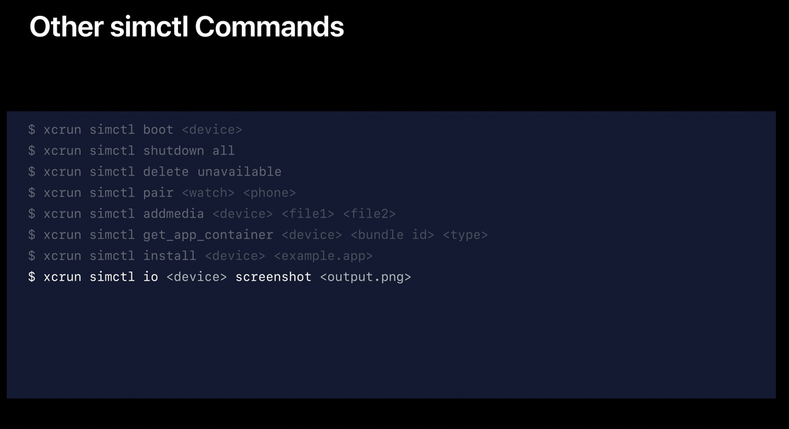

It can also take a video. There are also options to give a video file the HEVC codec with a black device mask.

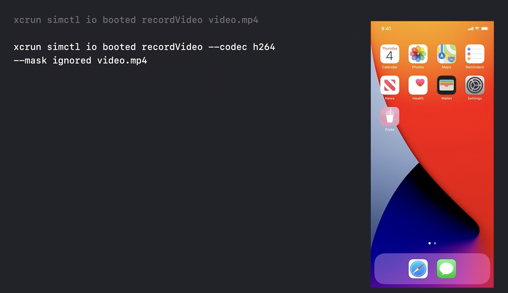

Its even possible to capture the video footage from a connected external display. In the below example, teh captured video is from external display (Photos app supports it).

Command to capture video from external display | Captured video
--- | ---
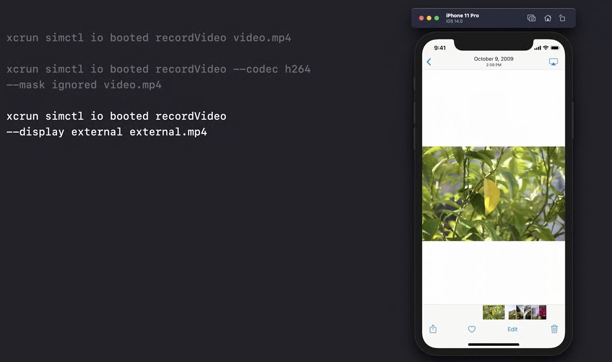 |  

##### cloning simulators

`clone` allows to set up a single simulator in a customized way. It installs the app, sets user defaults, and loads data. Then you can shut that simulator down and then make as many copies of it as you want.

##### Granting and removing access for apps to various resources

Thi controls access for various system resources that otherwise require explicit user permission, such as Calendar, Music, etc.

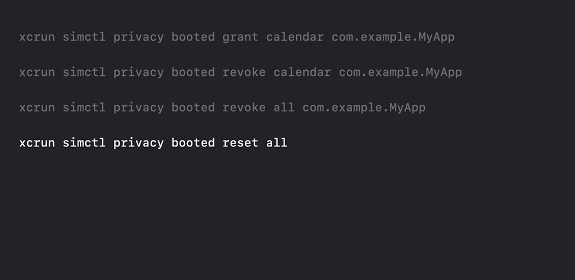

##### Dealing with Notifications

The apns file can have a special key named `Simulator Target Bundle` with the value being the bundleID of the app that should receive notification. If the file is dragged and dropped into the simulator then the bundle ID must be specified.

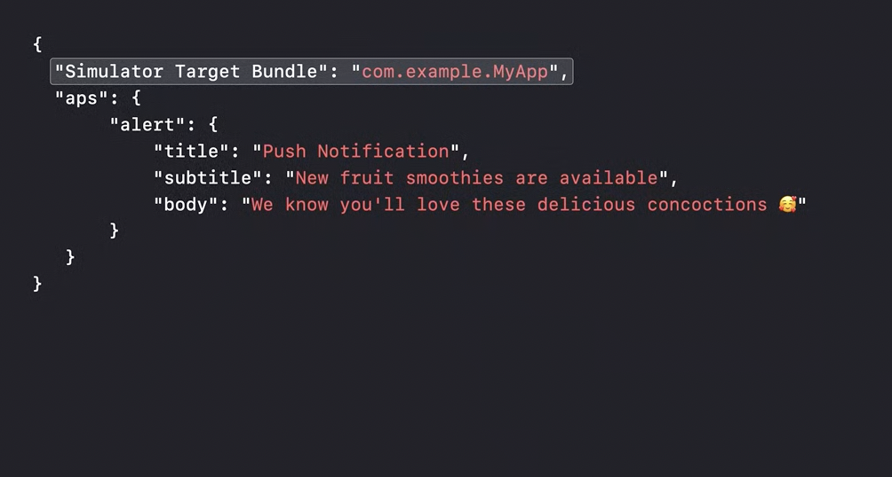

`xcrun simctl push` can be used to dispatch the notification. The receiving app's bundleID and the notification json file should be specified.

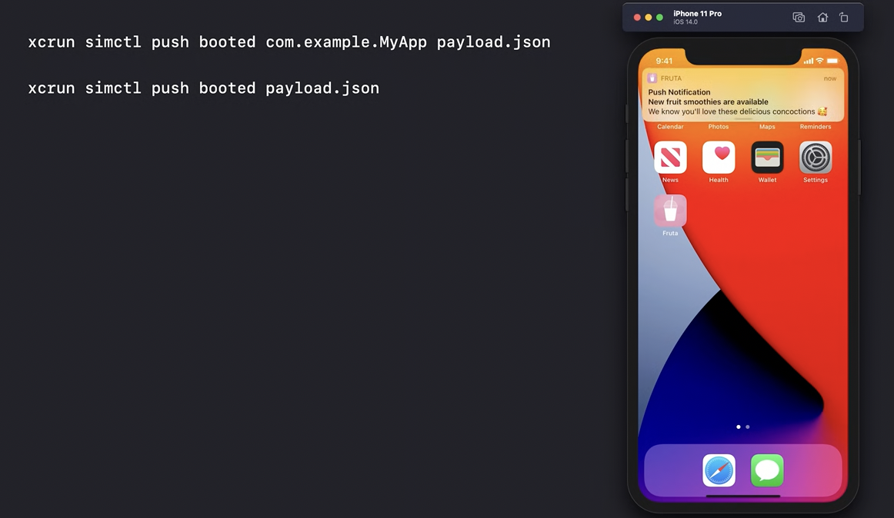

##### Status bar customization

Its possible to simulate status bar appearance for things like time, battery level, etc.

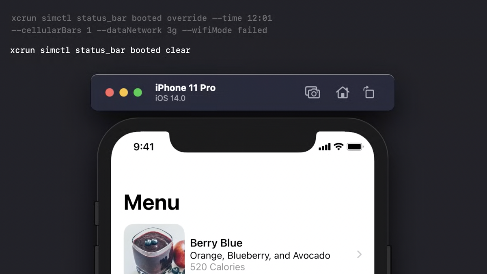

##### Keychain Management

Its possible to add CA certificates to the device's trusted root store. This can be done by `simctl` and also by dragging the the certificate onto the simulator. Note though that thereafter it should still be trusted manually by going into simulator's Settings app.

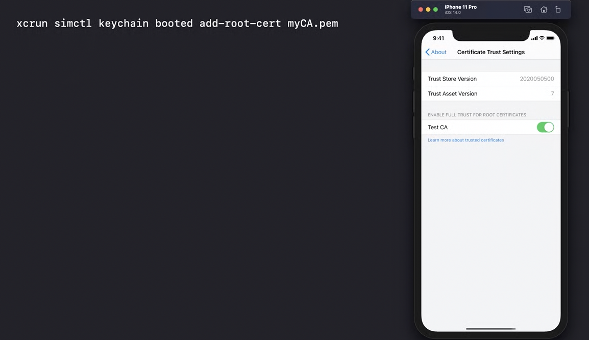

##### Opening URLs

This does not work if the URL ahs query parameters.

`xcrun simctl booted capitalone://paypal`

##### Misc.

There are several Metal specific tips in 'WWDC 2019: Getting the Most Out of Simulator 32:00' onwards.

[RY Blog link](https://suelan.github.io/2020/02/05/iOS-Simulator-from-the-Command-Line/)
