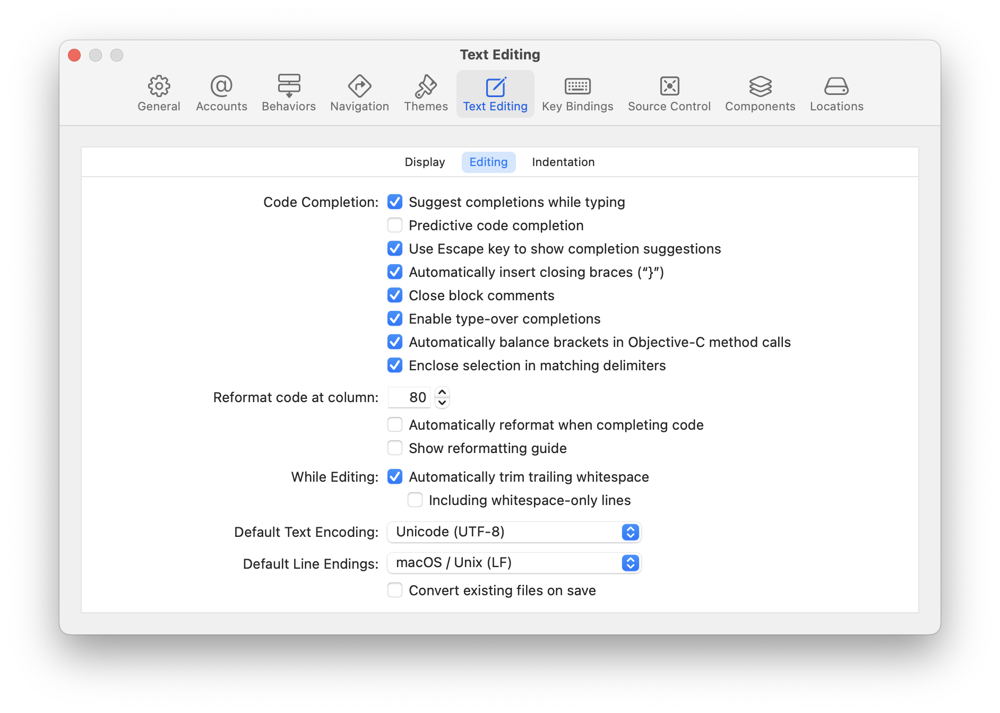
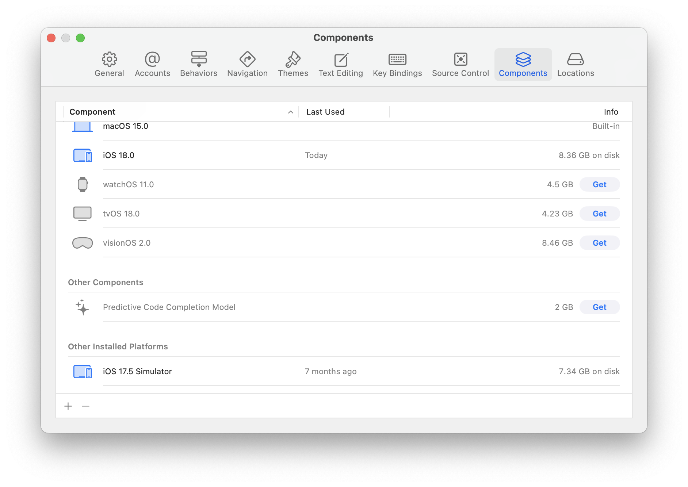

Xcode itself has offered basic **suggestion for code completion while typing** since long, i.e. where you start typing something and then Xcode offers a completion for that line. Since ~2021 **predictive code completion** too got introduced where there can be a local model be downloaded which in turn can suggest context-aware code.

| Text Editing > Editing > 'Completion While Typing' and 'Predictive Code Completion' | Components > Predictive Code Completion Model (Download)     |
| ------------------------------------------------------------ | ------------------------------------------------------------ |
|  |  |

2024 Lickability article on Xcode's predictive code completion ([link](https://lickability.com/blog/xcode-predictive-code-completion/))

> The good thing about Xcode's predictive code compeltion is that its local and totally embedded into Xcode, something which no other tool can do (Apple will not allow) as of mid-2025. All other tools need internet for offering any code suggestions.