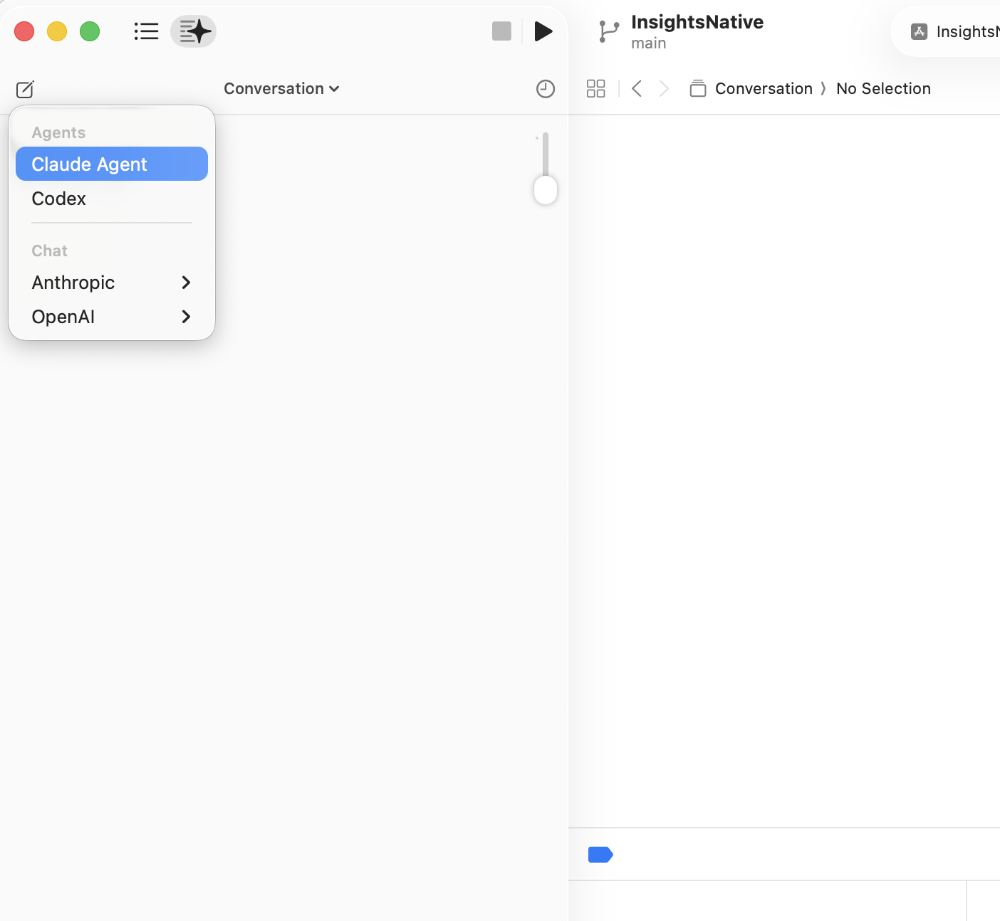
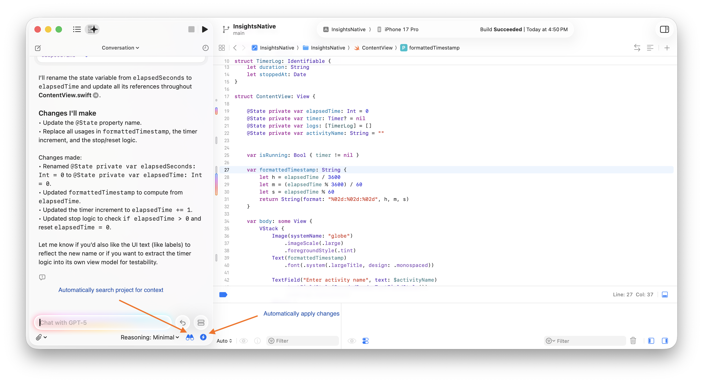
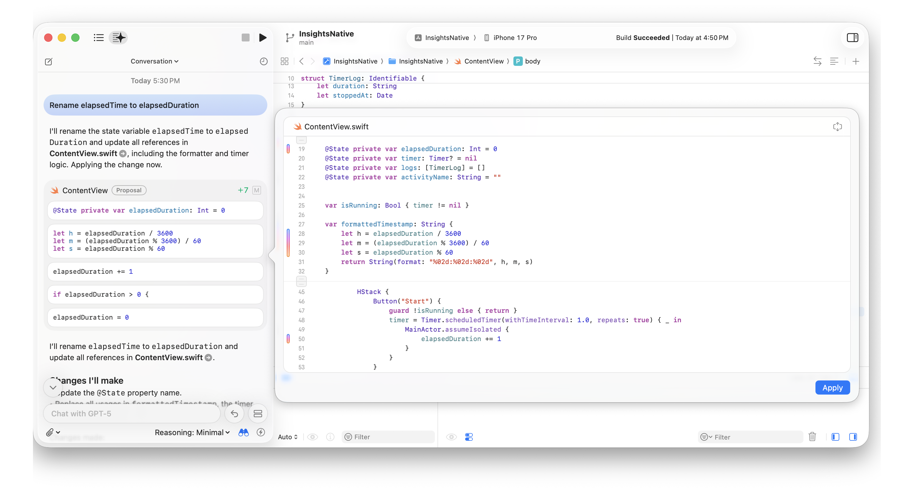
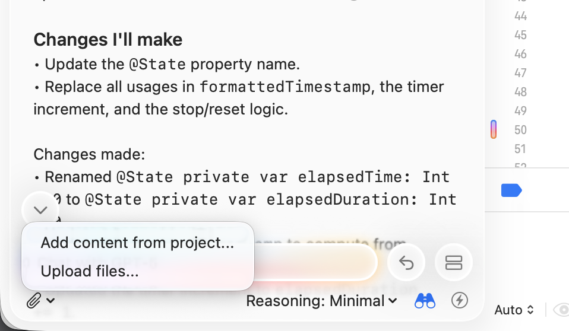
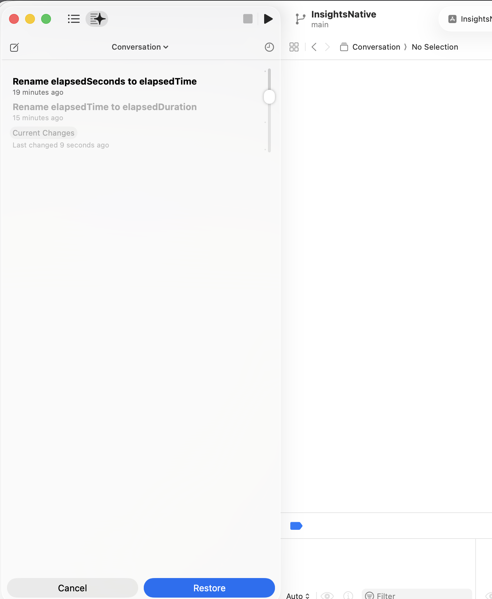
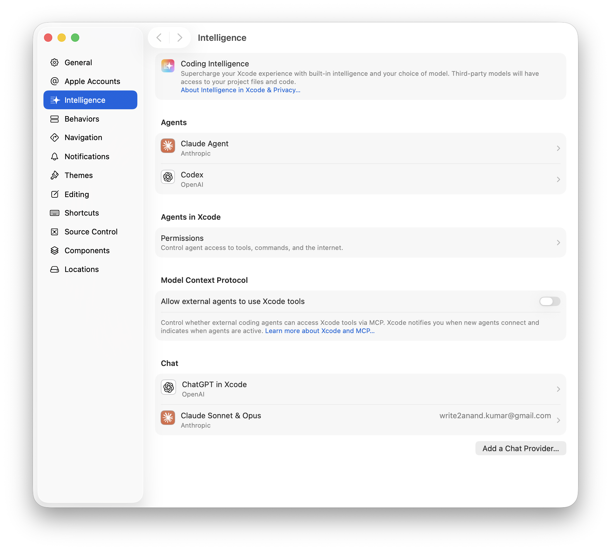

[toc]


##### High Level Capabilities

| Capability            | Description                                                  |
| --------------------- | ------------------------------------------------------------ |
| Chat                  | Chat with it and have it make changes on current file. Cannot build or run the app. |
| Xcode Agentic Coding  | Chat with it, have it make changes in multiple files, can run shell commands too. So build and run etc. can be done by it. |
| External Agent Access | Allows other AI systems to connect to Xcode which can act as MCP server for them. |

> Note that its basically launched using **Cmd 0** shortcut, and opens up in left pane. Breakpoint navigator, etc. has all become hidden one more level deep now.

##### Chat Mode basics

###### Selecting between Chat mode and Agentic coding mode

You either work in Chat mode or in Agentic coding mode, for either you can select the model to be used.



###### Settings: Automatically Search Project for Context + Automatically Apply Changes

There are two settings in Chat mode - 'Automatically search project for context', and 'Automatically apply changes'. The former probably decides whether context will be gathered across entire project or not, and the latter simply decides if it needs to prompt you before making changes.



If 'Automatically apply changes' is not selected, it proposes the changes and asks you to accept them.



##### Adding or Specifying Context

The attachment icon is probably for specifying particular files (like @references in other AI coding assistants) other for providing additional context through explicit files.



##### Accessing History and Restoration

The clock icon at top right of coding assistant can be used for viewing prompt history and restoring state (similar to snapshots in other tools).



##### Agent Permissions

You can specify what shell commands or tools the agent mode can run through Settings > Intelligence > Permissions

##### Setting up the Assistant

For setting up the asisstant, go to Settings > Intelligence and configure Chat, Agent, etc. You can sign in to your OpenAI, Claude, etc. account from there. Its also possible to specify a different chat provider if you have its URL, API key, etc.



For configuring precise model, making specific skills etc. available the config files need to be placed in below locations
```
~/Library/Developer/Xcode/CodingAssistant/ClaudeAgentConfig
~/Library/Developer/Xcode/CodingAssistant/codex
```

([Documentation](https://developer.apple.com/documentation/Xcode/setting-up-coding-intelligence#Customize-the-Claude-Agent-and-Codex-environments), also shown in [TwoStraws tutorial](https://www.youtube.com/watch?v=nKVZBKoB6P4) at ~6:00 mark)

##### Allowing other AI tools to use Xcode as an MCP server

This is configured through 'Settings > Intelligence > MCP'. Here are some of the commands.

```
codex mcp add xcode -- xcrun mcpbridge     # For Codex

claude mcp add --transport stdio xcode -- xcrun mcpbridge   # For Claude
```

[Documentation](https://developer.apple.com/documentation/xcode/giving-external-agents-access-to-xcode)

##### Timeline

Xcode Coding Assistant (i.e. Chat) was first introduced with Xcode 26 (mid 2025), and Xcode Agentic Coding + External Agent Access followed in Xcode 26.3 (~Mar 2026). <br>

##### Resources

[Official introductory documentation](https://developer.apple.com/documentation/Xcode/writing-code-with-intelligence-in-xcode) <br>[Setting up Coding Asssitant](https://developer.apple.com/documentation/xcode/setting-up-coding-intelligence) <br>[Setting up Xcode as MCP server for external agents](https://developer.apple.com/documentation/xcode/giving-external-agents-access-to-xcode) <br>

[TwoStraws tutorial on how to use a Claude skill from Xcode Coding Assistant](https://www.youtube.com/watch?v=nKVZBKoB6P4)