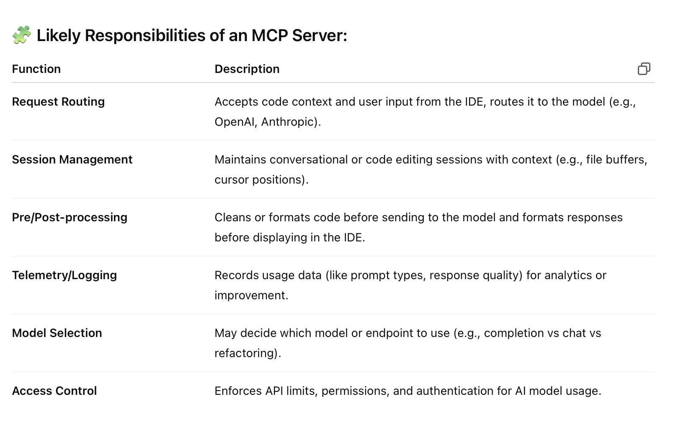
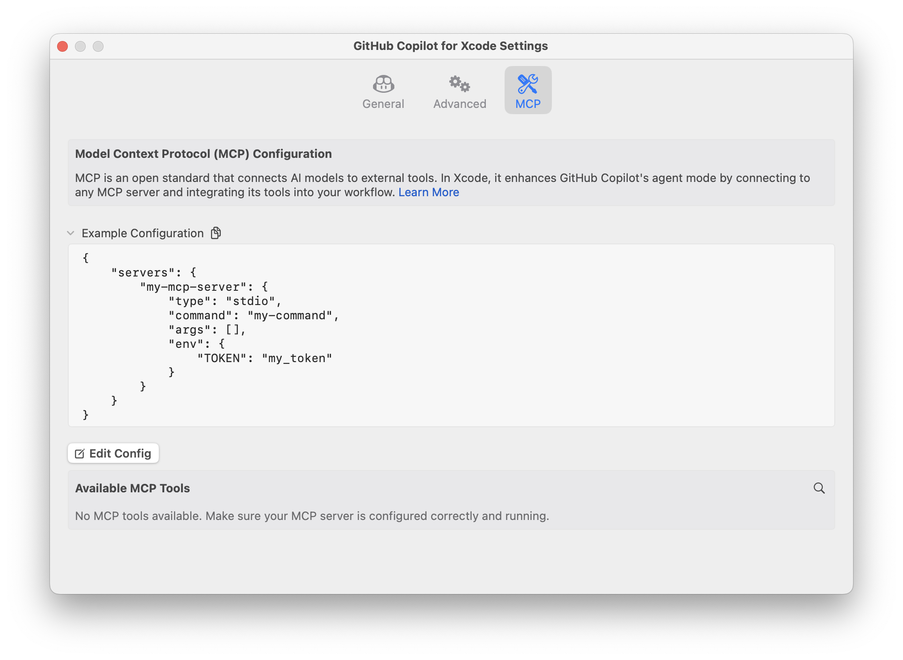

#### Various tools

GitHub Copilot  Cursor (esp. its '[Agent mode](https://docs.cursor.com/agent/modes#agent)')  Windsurf ([link](https://windsurf.com/pricing))  Claude CLI

Peter Steinberger's agent rules ([link](https://github.com/steipete/agent-rules/blob/main/README.md)) (the above agents can usually be given some general instructions in a markdown, so may be that)

A [blog post](https://www.indragie.com/blog/i-shipped-a-macos-app-built-entirely-by-claude-code) by Indragie on how someone built a macOS app from scratch using Claude CLI

#### MCP servers

**MCP servers (i.e. Model Communication Protocol servers)** are basically specialized servers used by coding assistants. They facilitate interaction between the coding assistant frontend (e.g., an IDE extension) and the AI model (e.g., GPT or Codex).

As per ChatGPT,

Usually, the MCP server used by an assistant can be changed. For example, here is the MCP server setting in Copilot for Xcode.

