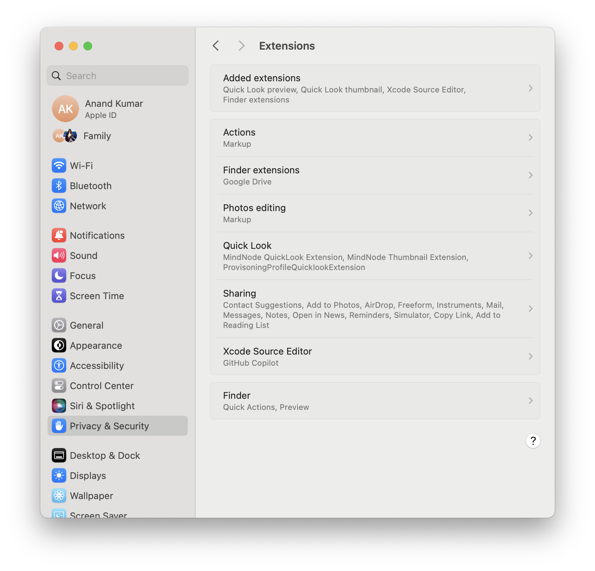
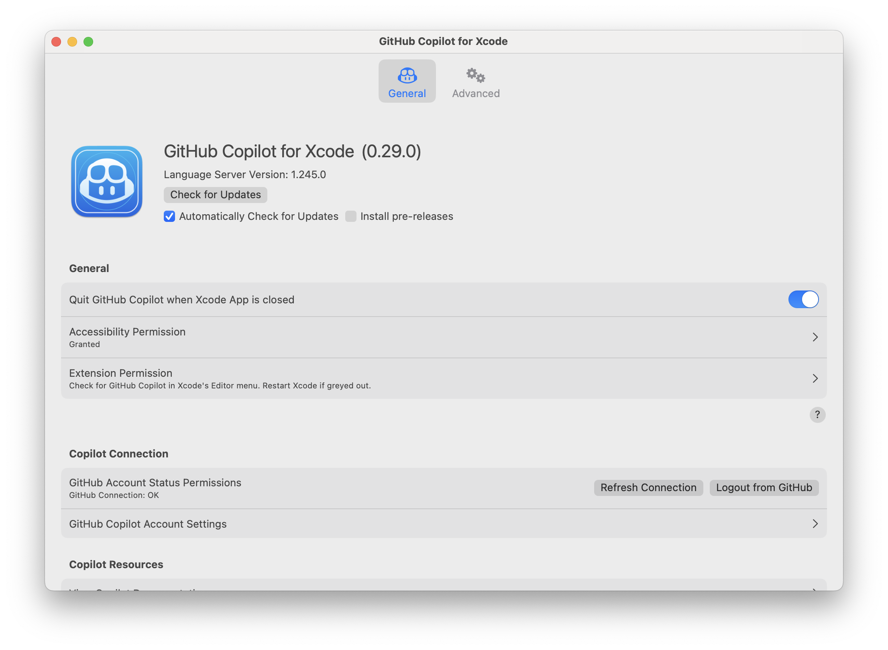
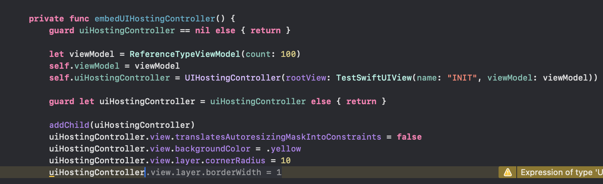
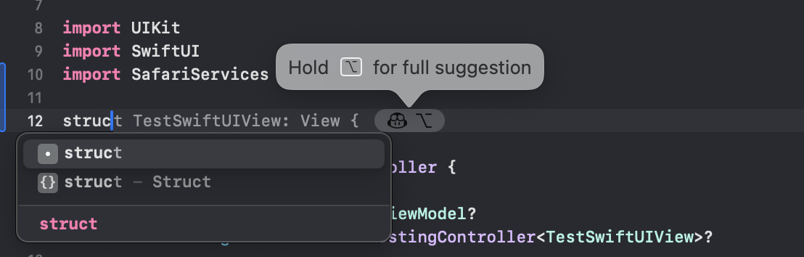

#### Installation steps

Can be installed through homebrew or by simply downloading the dmg ([Official steps](https://github.com/github/CopilotForXcode/blob/main/README.md#getting-started)).

The companion app needs to be run and three permissions configured for it in Settings.

| Needs to be able to run on background                        | Needs Accessibility permission                               | Needs Xcode Source Editor permission                         |
| ------------------------------------------------------------ | ------------------------------------------------------------ | ------------------------------------------------------------ |
|  |  |  |

The Companion app looks like this. Make sure that you have signed on to GH and enrolled for Copilot, if its all set up properly then the GH Connection below will show as 'ok'.

Whenever Xcode or the companion app is open, a 'status menu' for Copilot also shows up in the macOS Menu bar.

> Xcode's native AI assistant is usually turned on by default in 'Xcode > Preferences > Text Editing > Editing > Predictive code completion', and Copilot says it should be turned off to avoid confusion.

> There is also [this](https://github.com/intitni/CopilotForXcode) on the internet, but this looks like something else. Its not the official GH Copilot for Xcode. Confusingly, its available as 'copilot-for-xcode' in Homebrew and the official thing is available as 'github-copilot-for-xcode'.

#### How to use it

As of now (early 2025), all it seems to do is to provide some autocompletion and some suggestions based based on simple comments. It does not have a chat window.

Here is what it is doing, that is just suggest some code with auto-completion (no icon next to it, and nothing based on comments).

In some cases, a proper Copilot icon comes up with code suggestions.

#### Resources

[Medium article](https://dimillian.medium.com/github-copilot-for-xcode-62931a645173)  [YouTube video: Vincent Pradeilles](https://www.youtube.com/watch?v=M_jEDyDKHzU) [YouTube video: Sean Allen](https://youtu.be/Mj4X7BrGlME?si=T7-l6C7xP8Fp8lMg&t=34)