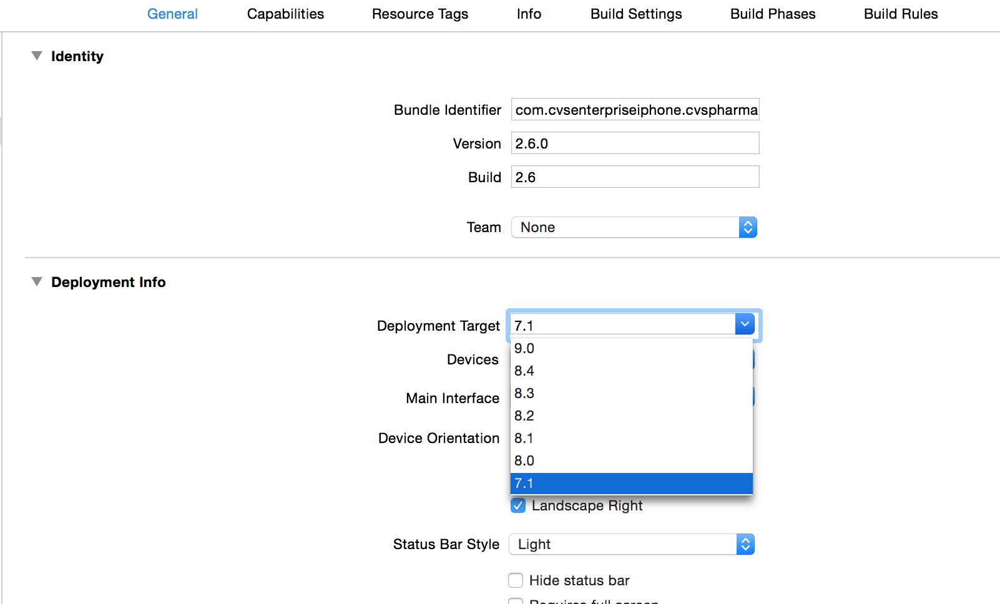
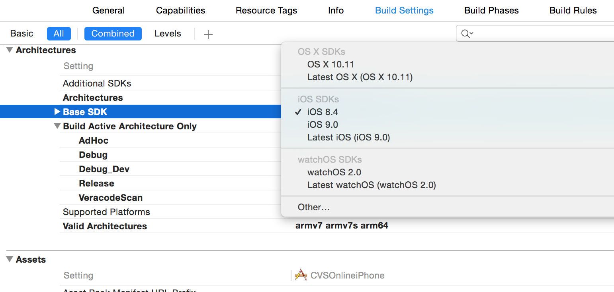
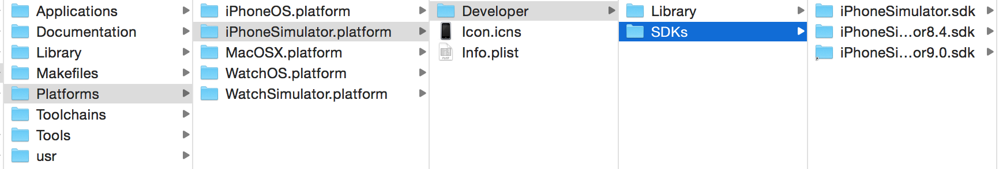
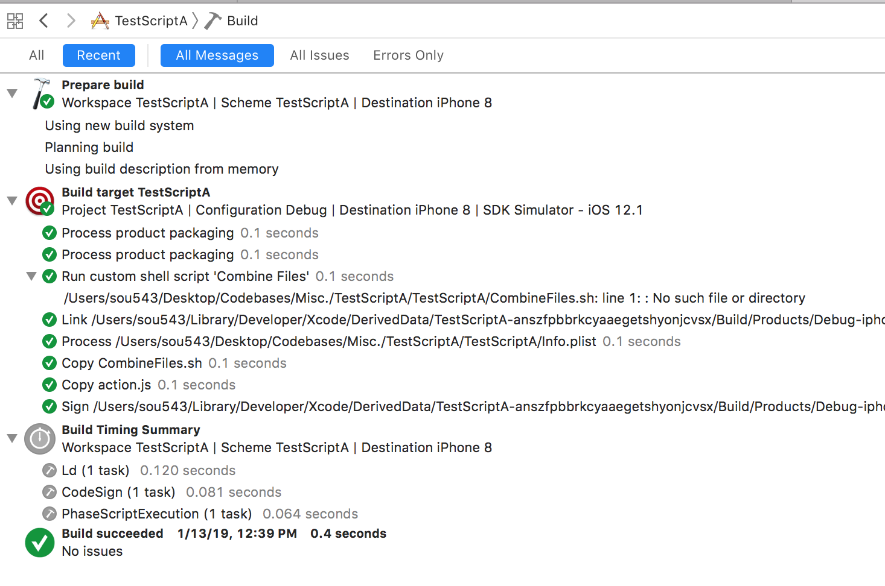
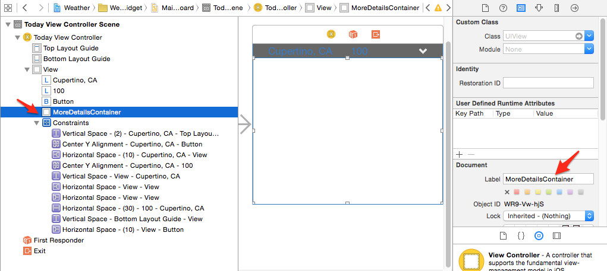
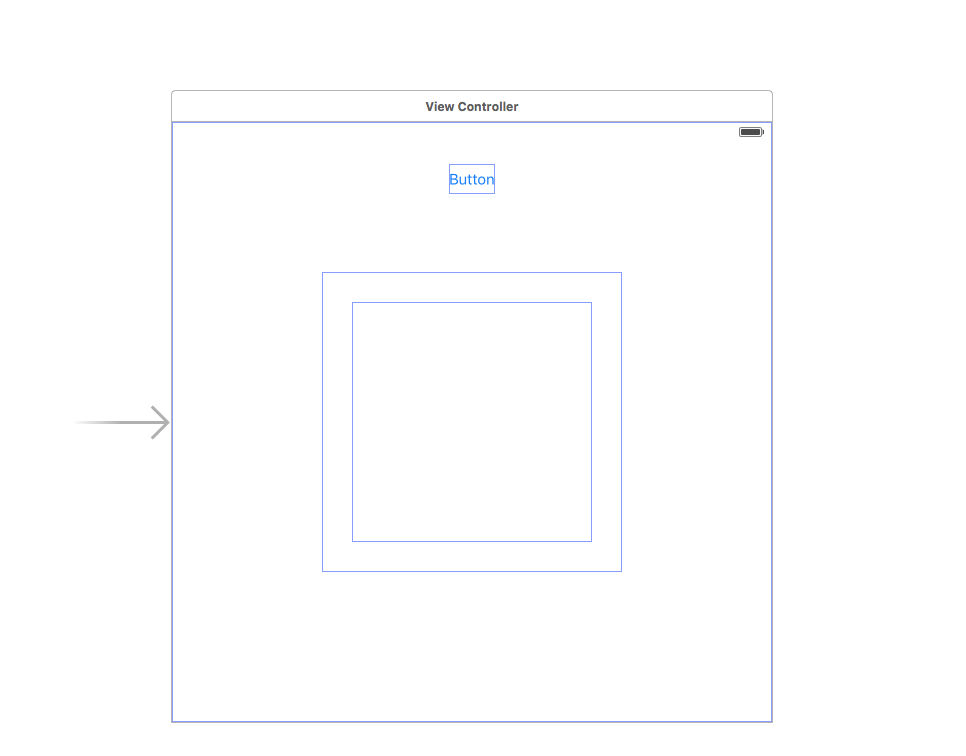
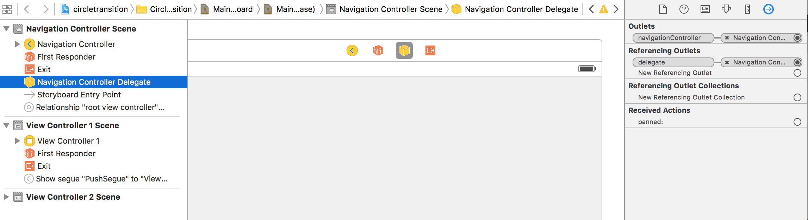

[toc]

#### Running on a newer iOS version from an older Xcode

For example running on an iOS11 device from Xcode 8.3.2

Install Xcode 9 beta. Navigate to `/Contents/Developer/Platforms/iPhoneOS.platform/DeviceSupport/11.0 (15A5327g)` and copy the folder to the same location in Xcode 8.3.2 package. That is all that is needed.

There will be similar folders for other platforms too, i.e. watchOS, etc. (need to try simulator as well).

All the iOS device support files are available in [this](https://github.com/filsv/iPhoneOSDeviceSupport) page, there are even links for downloading individual iOS versions'.

#### Tools

iOS Console - To view logs from debug console of devices (and probably the simulator too) real time. The good thing is that it can be used to filter logs real time using strings that you give.

Reveal - View debugging tool. Can see entire view hierarchy on the fly and change constraints and properties in real time.

FileMerge - It can't just be used to compare files, but to merge changes too. Navigate across differences using Cmd + Up/Down and select which file's content should be selected for that particular change.

DiffMerge - Another tool like FileMerge.

#### Info.plist keys

The key used in app names - <br>
`iOS target's info.plist: Bundle display name (CFBundleDisplayName)` -> iPhone home screen, notification on iPhone <br>
`iOS target's info.plist: Bundle name (CFBundleName)` -> Apple Watch app on iPhone, all notifications on Watch <br>
`Watch app target's info.plist: Bundle display name (CFBundleDisplayName)` -> Watch app in Apple Watch <br>
`Watch app target's info.plist: Bundle name (CFBundleName)` -> (Nowhere so far)

Getting the current version no. and build no. of the app.
```
[[NSBundle mainBundle] objectForInfoDictionaryKey:@"CFBundleShortVersionString”]; (version no.)
[[NSBundle mainBundle] objectForInfoDictionaryKey:@"CFBundleVersion”]; (bundle no.)
```

#### Base SDK and Deployment Target

`Base SDK` indicates the OS SDK whose SDK is used to build the ipa. By default it is the latest available version.
`Deployment target` indicates the minimum OS version on which the app can run.

An app with base SDK as iOS 9 and deployment target as iOS 8 will run on both iOS 9 and iOS 8. In iOS 9, it will use iOS 9 SDK and on iOS 8 it will use iOS 8 SDK. An app with both base SDK and deployment target as iOS 8 will also run on both iOS 9 and iOS 8. However it will use iOS 8 SDK in both.

By default, Xcode only has the latest base SDK available. If for any reason you need to specify an earlier version as base SDK then

1. That SDK needs to be copied and placed in `Xcode/Contents/Developer/Platforms/iPhoneSimulator.platform/Developer/SDKs`. The earlier base SDKs are not directly available in developer portal, instead you need to download an earlier version of Xcode, navigate to the same path in its installer (i.e. dmg) and then copy and paste the other base SDK from there. Hence, its often advisable to keep a copy of all base SDKs with you.

2. And now apparently another step is needed, the entry for `MinimumSDKVersion` in `/Contents/Developer/Platforms/iPhoneOS.platform/Info.plist` also needs to be modified accordingly to your older SDK version. (Also do it for `iPhoneSimulator` folder.)

When an Xcode update happens, all the base SDKs that were added later on are automatically removed and need to be added again manually.

> While manually adding other base SDKs care must also be taken to add it for all run destinations, i.e. iPhoneOS folder as well as iPhoneSimulator folder (and even the OS X folder if necessary). Also, copy the actual SDK folder (and not the shortcut folder), put it in an interim place, give it the appropriate name and then paste it in the required location.







Another way to do this in newer Xcode versions -  [link](https://stackoverflow.com/a/47438811/1135417)

#### Various

Build folder of a project can be seen from File -> Project Settings in Xcode 4. By default it is at the following location in Xcode 4 - `/Users/administrator/Library/Developer/Xcode/DerivedData`

`Clean` clears the folders for the currently selected target. <br>
`Clean Build Folder` clears the folders for all the targets.

`Clang` is a compiler front end for C, C++, Objective-C, Objective-C++. It uses `LLVM` as its back end. It is designed to offer a complete replacement for GNU compiler collection (GCC).

> How and when to use the ‘register read’ command in debugger? (need to find out)

If an OTA build (TestFairy, Applause, etc.) does not get installed and does not show any message either -
Check the message in console. If it is a message such as "LoadExternalDownloadManifestOperation: Ignore manifest download, already have bundleID:", then use iExplorer to remove all the files from Media - Downloads, restart the device and try again.

##### Checking physical location of frameworks.

Physical location of frameworks can always be checked by doing a 'Show in Finder' from the context menu that comes for them in Project Navigator or even in Xcode Build Phases -> Link Binary with Libraries.
If frameworks are mistakenly deleted from Finder, they can be put back in the Finder. (One more reason you should always keep a copy of your Xcode installation package.)

Frameworks are located at below location for Xcode 4.5.1 and Mountain Lion.
`/Applications/Xcode.app/Contents/Developer/Platforms/iPhoneOS.platform/Developer/SDKs/iPhoneOS6.0.sdk/System/Library/Frameworks`

`Dylib` files (such as `libxml2`) are located at below location for Xcode 4.5.1 and Mountain Lion.
`/Applications/Xcode.app/Contents/Developer/Platforms/iPhoneOS.platform/Developer/SDKs/iPhoneOS6.0.sdk/usr/lib`

> Dylib files are Xcode Dynamic link libraries.

##### Clearing up some space taken by Xcode

There are folders such as these which take up a lot of space and whose contents can be deleted without any issues. If needed, these folders are later automatically recreated. I could free up as much as 120 GB from these folders. (link)
```
/Users/akumar5/Library/Developer/Xcode/DerivedData
/Users/akumar5/Library/Developer/Xcode/iOS DeviceSupport
/Users/akumar5/Library/Developer/Xcode/Archives (this has the xcarchive/ipa files, so be a little careful)
```

##### Create an ipa from xcarchive (useful if Xcode just keeps on giving error) -

```
xcodebuild -exportArchive -archivePath xcarchivePath -exportPath $Omnicare ipa -exportProvisioningProfile ActualProvisioningProfileName"
```

##### Build with Time logs

With Xcode 10, time taken is always logged in build logs. If however, `Product > Perform Action > Build with Time Summary` is done a summary of time taken is also shown in Build Logs' Recent messages tab.



It probably can also be done from command line.
```
xcodebuild -showBuildTimingSummary
```

##### Inspecting entitlements in an ipa

Change the ipa's format to zip, extract it, do 'Show package contents' for the `.app` there, and then look for a file named `embedded.mobileprovision`. All the entitlements are listed there. In case of Ad-hoc build, that is also where all the allowed devices' UDIDs are listed.

##### Using `xcodebuild`

Build without code signing.
```
xcodebuild clean build CODE_SIGN_IDENTITY="" CODE_SIGNING_REQUIRED=NO
```
> Didn't see the time logs in console this way though.

Verify the command line tools version being used.
```
xcode-select -print-path
```

#### Storyboards and Interface Builder

Document label in identity inspector allows a custom name to be given to a control which then shows up in the documents outline.



The search bar at the bottom of document outline can then also be used to easily search in the document outline.

Interface builder - Editor -> Canvas -> Show bounds rectangle



In interface builder even an `NSObject` can be added and then a custom `NSObject` subclass set as its custom class. The outlets in this subclass then become available in interface builder. For example, a navigation controller’s delegate can be set to a custom object this way by first adding the object to the navigation controller scene and then creating a navigation controller delegate connection to this object in the scene.


