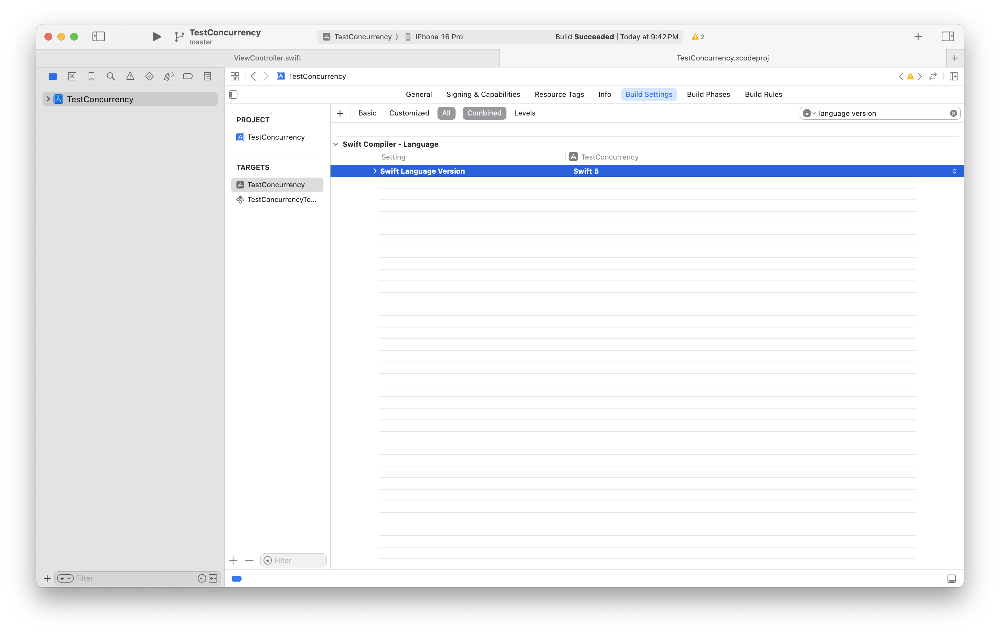
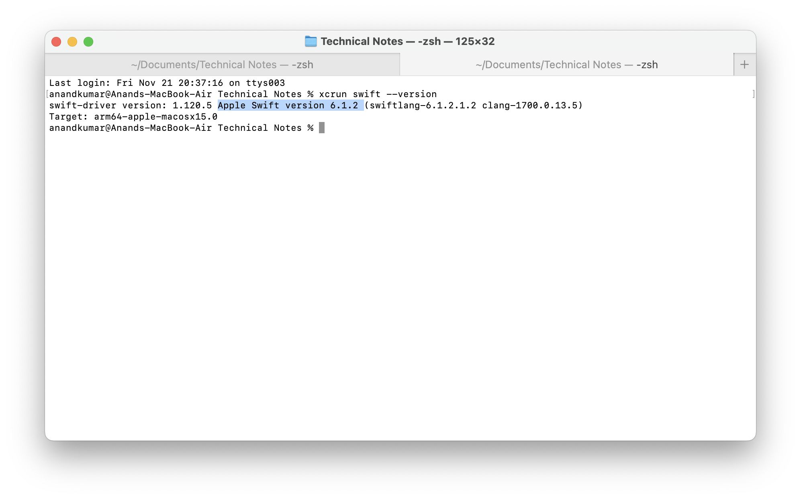
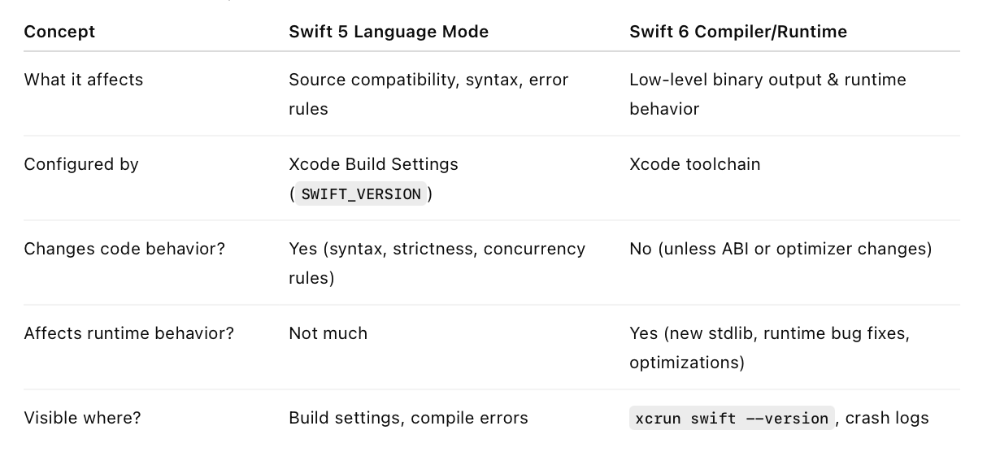

##### Xcode toolchains

Toolchain is the language, environment, etc. that Xcode uses. By default Xcode has one toolchain (with same name as Xcode and its version number). To try out things from a newer feature of say a language which is still in beta, its corresponding toolchain can be installed.

###### How to install -

New swift version toolchains can be installed from the official Swift page ([link](https://swift.org/download/#releases)). Swift 4.0 toolchain for instance was available as a link named Xcode when I tried. It downloads a package installer which can then be used to install the toolchain.

###### How to switch between toolchains -

It can be done from Xcode preferences -> components as well as menu option. Typically there is no need to restart Xcode after changing the toolchain.

> Seeing if it works.  
I tried a Swift 4 playground page On Xcode 8.3.2 with the default toolchain, it gave errors. When I switched to Swift 4 toolchain (called Swift development snapshot), it worked. So yes, it works.

###### How to check the exact Swift version 

`xcrun swift -version` - This gives an exact Swift version (like `swift-driver version: 1.90.11.1 Apple Swift version 5.10`), and this probably corresponds to the latest Swift version of the default Xcode in the system.

##### Swift language version vs Swift compiler/runtimer version

There is a Swift language version and a Swift compiler/runtimer version.

A project built on Xcode 26 toolchain will actually be built only using Swift 6, but its technically possible to have a lower Swift version in project's build setting and that lower version is what developers will be used to show any compile time issues in the IDE (compiler front-end will use Swift 5). The runtime will use Swift 6 stdlib inside the app bundle.

Strange, but this is what happens. Almost as if the developer can opt to stay on Swift 5 for easier migration, but the compiled thing used in the binary will still be on Swift 6 as far as possible.

> Keep in mind that in a modern language like Swift, the language version somehow matters even after compilation. Its not textbook like where once compilation is done, the language version is immaterial after that.

| Swift language version (Target build settings)               | Swift  compiler/runtime  version from Toolchain              |
| ------------------------------------------------------------ | ------------------------------------------------------------ |
|  |  |

> Until Swift 2, there was only 1 language version, 1 compiler bersion, and 1 runtime version. These multiple modes of support started happening from from Swift 3 and became really apparent with  Xcode 26 (i.e. 2026).

[ChatGPT link on the history](https://chatgpt.com/c/6923cdf3-252c-8328-9542-26d6e6fe966c)
