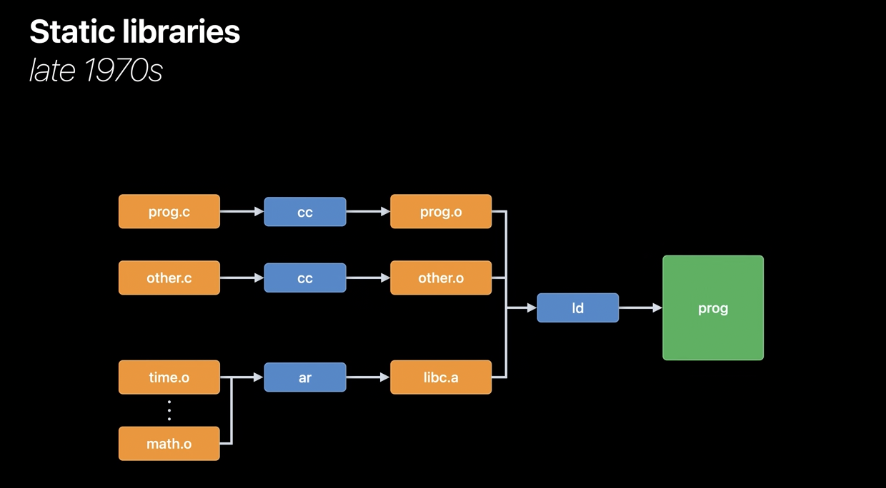
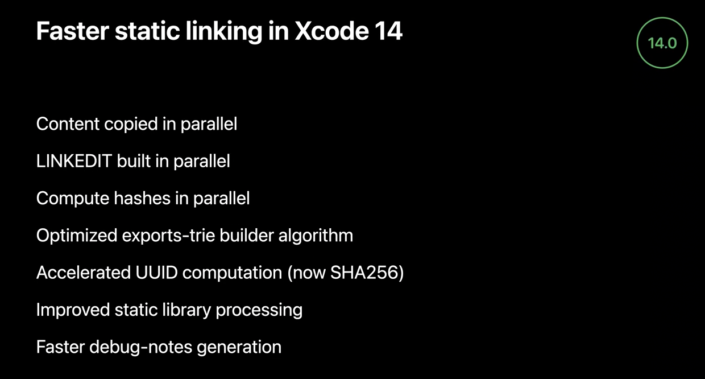
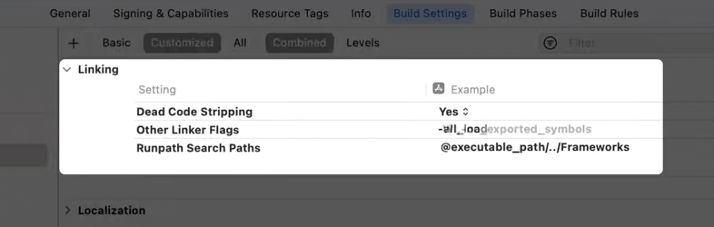
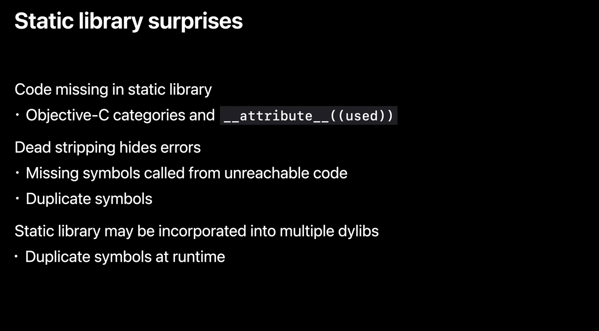
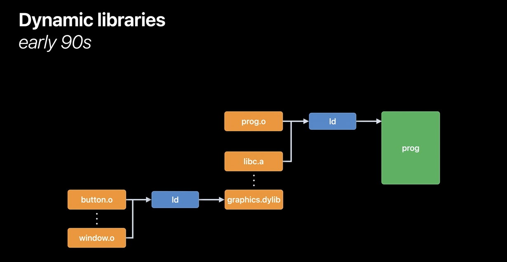
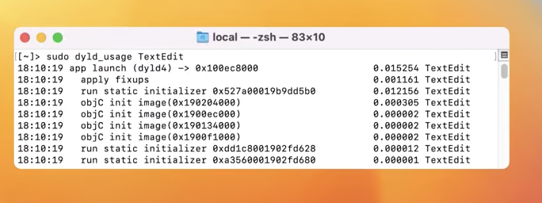

[toc]

> These notes are mostly from 'WWDC 2022: Link fast - Improve build and launch times'.

#### Important Terms

`ld64` - Apple's static linker `dyld` - Apple's dynamic linker

`ld` - Command line tool for static linking?

#### Static linking - What is it and how it came to be

Initially all the code used to be in one file, and that entire file used to be compiled and built into the executable program. But that was a problem not just because a single file becomes too unwieldy to read, but also because this made it impossible to intelligently re-compile only that part of the code which had changed since the last compilation. 

The compile process was then split into parts. The first part compiles source code to a intermediate `relocatable object (.o) file`. The second part reads all the .o files and produces an `executable program`. This second part is now what is known as `ld, i.e. the static linker`.

With time people were passing around .o files. A set of .o files got packaged together in a `static library`. This was done using `archives` (done with the archiving tool `ar`). You could 'ar' up multiple .o files into an archive, and the linker was enhanced to know how to read .o files directly out of an archive file. Library/archives meant the same thing, this is now known as static library (`.a` being the extension for static libs may well mean archive from those days).

The final program was getting big because thousands of functions from these libraries were copied into it, even if only a few of those functions were used. So an optimization was added. Instead of having the linker use all the .o files from the static library, the linker would only pull .o files from a static library if doing so would resolve some undefined symbol. And we still have that model today. Static libs make sense for stable code, i.e. where the code is not being actively changed as anytime a file in the static lib changes the entire lib has to otherwise be rebuilt.

So that is what static linking is, i.e. combining all the various .o files and also the .a libraries (pulling the used symbols alone from the library) and combining them to produce a single program. It copies all the necessary code. And all this happens during build process.

> **Static lib** - Collection of .o files   **Static linking (ld)** - Collection of .o files and intelligently extracting things from .a files to make a single program

#### Improvements made to static linking with Xcode 14 (2022)

Several things were changed to make better use of multiple cores on development machines.

#### Ways to improve static linking time

> Note that each of these ways can also be counter-productive, they should be used wisely.

##### Other linker flags `-all_load`, Link setting  `-dead_strip`

> `all_load` brings in all the code in the static lib, making thigs faster as intelligent extraction is not needed.  
>
> `dead-strip` can later remove code for unused symbols.

Static linker historically needs to process static libs in a fixed serial order, that means the parallelization capabilities of static linker ld64 can't be used. This can be altered with `-all_load` option.  

If the app does clever tricks where it has multiple static libraries implementing the same symbols, and depends on the command line order of the static libraries to drive which implementation is used, then this option should not be used. 

The other downside of `-all_load` is that it may makes the program bigger because "unused" code too is now being added in (i.e. by default it does not let intelligently extract those symbols that are needed). To compensate for that, the linker option `-dead_strip` can be employed. That option will cause the linker to remove unreachable code and data. Now, the dead stripping algorithm is fast and usually pays for itself by reducing the size of the output file. But if you are interested in using -all_load and -dead_strip, you should time the linker with and without those options to see if it is a win for your particular case. 

##### Other linker flag `-no_exported_symbols`

>`no_exported_symbols` skips having to generate exports trie ij the LINKEDIT segment.

One part of the Mach-O `LINKEDIT` segment that the linker generates is an `exports trie` (pronounced 'exports try'), which is a prefix tree (a type of data structure) that encodes all the exported symbol names, addresses, and flags. 

All dylibs need to have exported symbols, but a main app binary usually does not need any exported symbols. So you can use `-no_exported_symbols` for the app target to skip the creation of the trie data structure in LINKEDIT, which in turn will improve link time. 

If however the app loads plugins which link back to the main executable, or you use xctest with your app as the host environment to run xctest bundles, your app must have all its exports, which means you cannot use `-no_exported_symbols` for that configuration. 

Also, it only makes sense to try to suppress the exports trie if it is large. You can run the `dyld_info` command shown here to count the number of exported symbols.

##### Other linker flag `-no-deduplicate`

>`no-deduplicate` allows to skip optimization time needed in copying similar functions just once..

Apple's static linker has a step to merge functions that have the same instructions but different names. It turns out, with C++ template expansions its very common. But this is an expensive algorithm. As de-dup is a size optimization and Debug builds are about fast builds, and not about size, so by default Xcode disables the de-dup optimization by passing `-no_deduplicate` to the linker for Debug configurations. If you use C++ and have a custom build, that is, either you use a non-standard configuration in Xcode, or you use some other build system, you should ensure your debug builds add -no_deduplicate to improve link time.

#### Static library surpirses

Typically surprising things happen if multiple libs have methods with same signature and dead stripping has been eomployed. If there is missing symbol is from an unreachable code, the linker will suppress the missing symbol error. Similarly, if there are duplicate symbols from static libraries, the linker will pick the first and not error. 

The last big surprise with using static libraries, is when a static library is incorporated into multiple frameworks. Each of those frameworks runs fine in isolation, but then at some point, some app uses both frameworks, and boom, you get weird runtime issues because of the multiple definitions. The most common case you will see is the Objective-C runtime warning about multiple instances of the same class name.

#### Dynamic libraries - What are they and how they came to be

> Dynamic libraries are also known as dylibs (DSO, DLL in other platforms).

If `ld` is used instead of `ar` for grouping together many .o files into a library, it becomes a dynamic lib instead of a static lib. The static linker treats linking with a dynamic library differently. Instead of copying code out of the library into the final program, the linker just records a kind of promise. This promise is resolved only during runtime (rather app launch time?). The app's static link time then does not depend much upon the number of dylibs used in the app anymore.

Dyylibs are also losely referred to as frameworks in Apple ecosystem. Any frameworks not in the Apple SDK must be embedded into the app bundle. 

##### Gotchas with using dylibs

While dylibs make builds faster, they make the app launch slower.

Also, a dynamic library based program will have more dirty pages. In the static library case, the linker would co-locate all globals from all static libraries into the same `DATA` pages in the main executable. But with dylibs, each library has its DATA page.

And finally using dylibs does mean that a dynamic linker (aka `dyld`) will be later needed for the dynamic linking during runtime.

#### How dynamic linking works during runtime

> Lot more interesting theory here in 'WWDC 2022: Link fast - Improve build and launch times' beginning at 18:50. Introduces concepts like `fixups`, and `binds`.

#### Best practices for dynamic linking

Have less dylibs, the lesser dylibs there are the lesser work dyld has to do. Don't do i/O or networking in any static initializer pre-main (what functions are that?). 

The trick is always to have a sweet spot between static libs and dynamic libs, a balance between build time and app launch time. 

Also, having a higher deployment target always helps in reducing app binary size and improving app launch time.

#### Tools for inspecting the linking process

`dyld_usage` - Gives a trace of what dyld is doing. The tool is only on macOS, but can be used it to trace the app launching in the simulator, or the app built for Mac Catalyst. Here is an example run against TextEdit on macOS.

`dyld_info` - Can be used it to inspect binaries, both on disk and in the current dyld cache. Has several options. The `-fixup` option shows all the fixup locations dyld will process and their targets. The` -exports` option will show all the exported symbols in the dylib.

> Explained in 'WWDC 2022: Link fast - Improve build and launch times' at 28:46.
