[toc]

> WWDC 2023: Meet mergeable libraries

#### What are Mergeable Libraries

Mergeable libraries unlock the best of static and dynamic linking strategies. The newly implemented static linker (as of 2023) is what enables this.

Basically, several libraries can be combined into one. In debug config its linked during runtime, and in release condig its built dring compilation. So faster build times in debug, and faster launch time in release.

The initial library and the metadata are not needed after the merged library has been created and are hence not included in the merged library. Further, when merging the linker can de-duplicate content (such as strings, across all libraries) and remove redundant symbol references. This results in a smaller overall app bundle.

#### Usual Steps

Any dynamic library can be built as mergeable. In doing so, the static linker also generates some special metadata while building the library. This metadata later on allows users of the library to have the choice to either statically link them as normal dynamic libraries or as merged libraries. The merged binary output can be an executable, like an app, or another dynamic library, like a framework. 

The libraries to merge are built with the option `-make_mergeable`.  

To create the merged binary, the linker then needs the options `-merge_library` or `-merge_framework`.  

There are essentially two ways to enable library merging in Xcode. Automatic, and manual.

##### Automatic Merging

Automatic merging informs the build system to merge all direct dependencies that are embedded framework targets (so multiple dylib frameworks are automatically merged into one).

Done using the build setting 'Create Merged Binary' (`MERGED_BINARY_TYPE`).

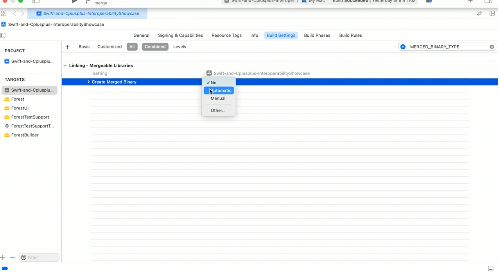

Simply using the above option however still preserves the exports of the actual mergeable libraries in the app. These exports are usually not needed by apps and if so can be removed by the 'Other linker Flags' options `-Wl, -no_exported_symbols`  (this reduces app size).

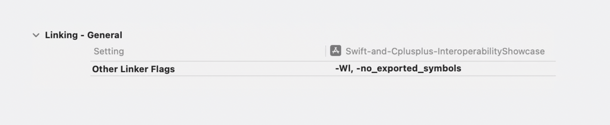

If there are app extensions, export lists can be used tightly control what symbols get used. This can be set under the same General Linking options using Exported Symbols File. 

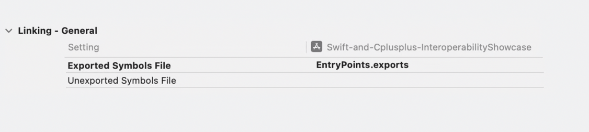

> What really is 'Exported Symbols File', try it.

##### Manual Merging

Manual merging is a fine-grained approach to specifying the libraries to merge. This is useful when some dependencies still need to stay in the app bundle. 

It is enabled by setting `MERGED_BINARY_TYPE` = manual on the overarching target. The libraries that should make up the final merged product are recognized by setting `MERGEABLE_LIBRARY` to YES.

First manually create a new framework, and add the libs it needs to include in the 'Link Binary with Libraries' section. And then go to every included lib and click Build Mergeable Library. This option is mapped to the build setting MERGEABLE_LIBRARY, and update this value to Yes.

| 1. Create new framework for merged binary                    | 2. Specify modules to include                                |
| ------------------------------------------------------------ | ------------------------------------------------------------ |
| 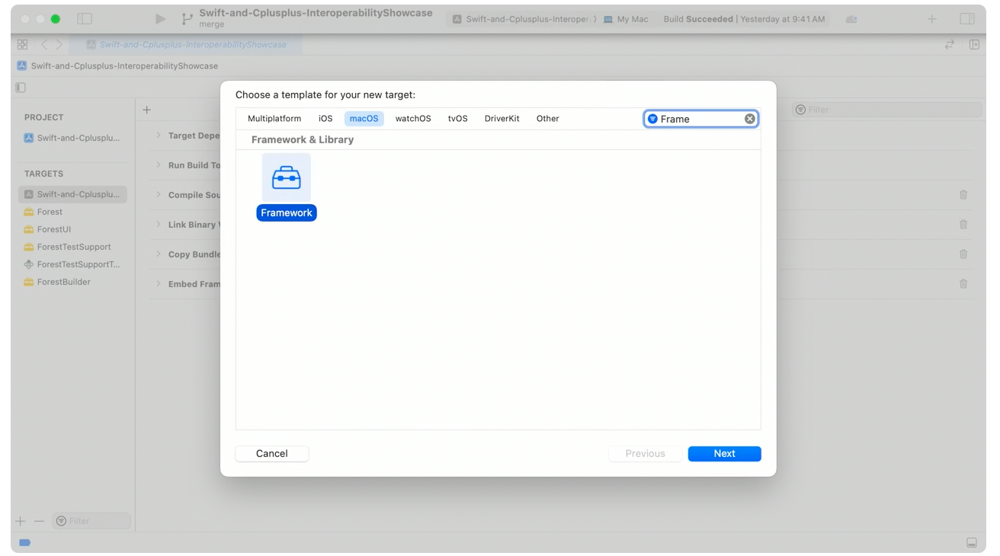 | 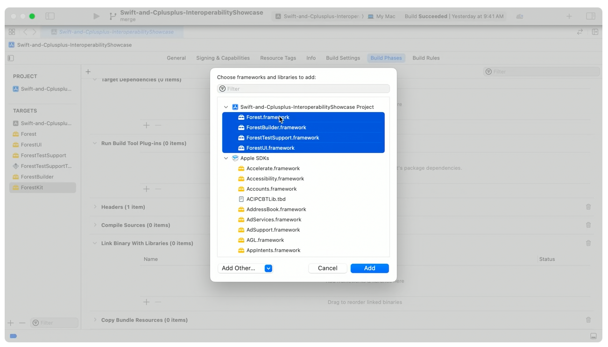 |

| 3. Set 'Create Merged Binary' for new framework              | 4.Set 'Build Mergeable Library' for member libraries         |
| ------------------------------------------------------------ | ------------------------------------------------------------ |
| 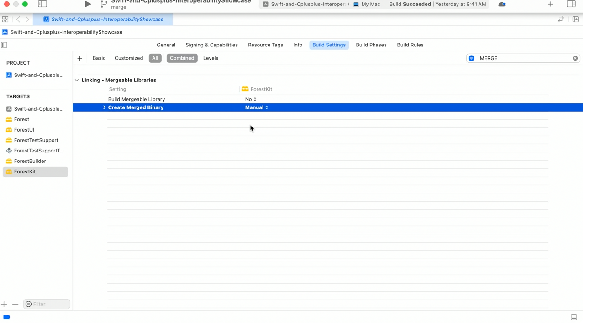 | 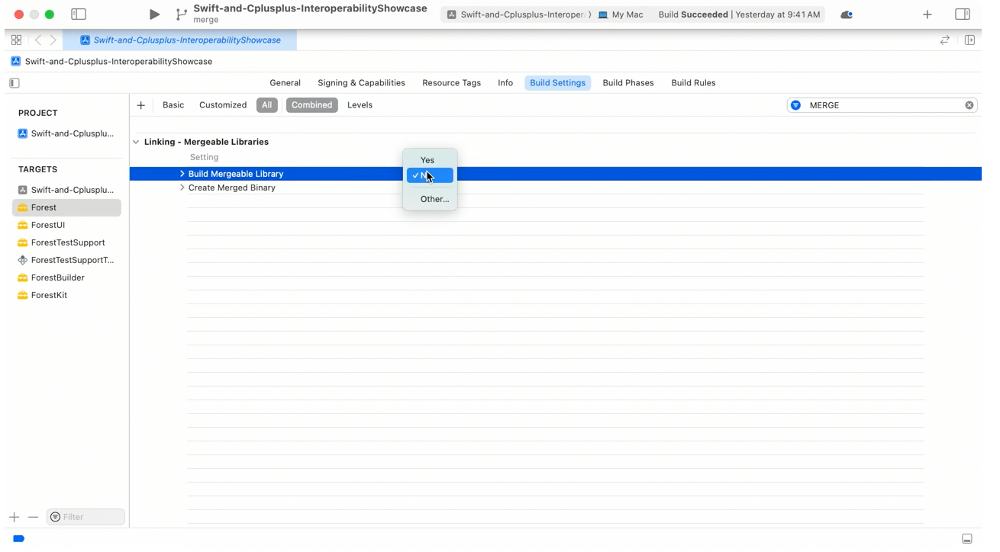 |

#### Some more things

##### Merging of libraries happens only in release config

Libraries are actually mergeable only in release config. To support iterative development in Xcode, the linker will not merge in debug mode. The build system tells the linker to reexport the libraries instead. Reexporting is a linker option that allows the implementation of code to live in one dynamic library but has it show up as if it's implemented in another. This results in a similar build time benefit as with dynamic libraries. At launch, `dyld` redirects any references to the reexported libraries instead of expecting them to come directly from the merged binary. That does mean in the debug case, the mergeable libraries stay on disk.

##### Symbolication

When you enable merging, source location information is still preserved from the original library. But keep in mind, when library information is displayed, like for stack traces, it will show the path to the merged binary.

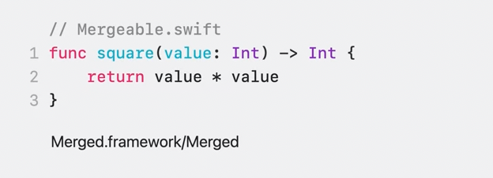

##### Have mergeable libs dependents link to merged lib instead

Mergeable libs are removed from disk, hence anything that depended on those libs should be reconfigured to depend on the merged framework instead. Another way this can come up is when an app relies on autolinking. `Autolinking` is a compiler option that's on by default. When the compiler finds module imports in source code, it detects framework dependencies to then pass to the linker. So do link to the merged framework.

##### If using dynamic linking APIs, point to merged framework

If you are using dynamic linking APIs like dlopen those input paths will also need to point to the merged framework target.

| If not using meregeable lib                                  | If using merged lib                                          |
| ------------------------------------------------------------ | ------------------------------------------------------------ |
| 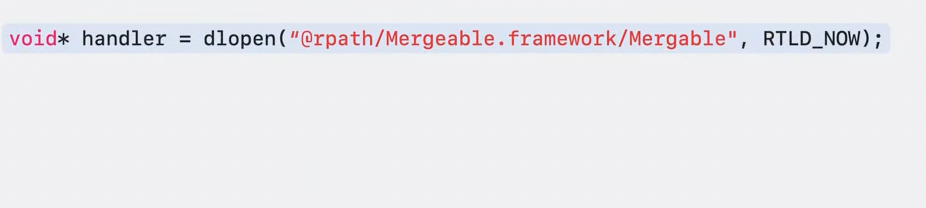 | 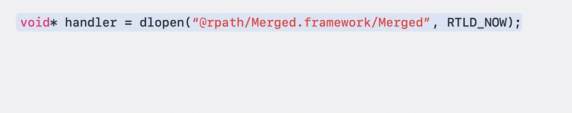 |

Similarly, resource lookup could be impacted by library merging. They too should point to the merged framework target.

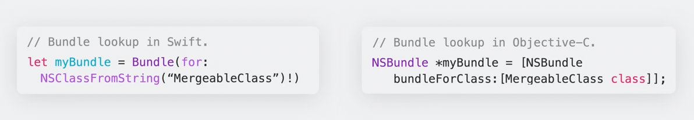

##### Shipping mergeable libraries for others to consume

if you want to ship a mergeable library for others to use, you can do that by creating an XCFramework in the Swift Package Manager or in Xcode. This allows you to build the framework including its metadata for distribution. When other developers use the framework, they can decide whether to enable merging. Mergeable metadata roughly doubles the size of the dylib. This doesn't impact the size of an app because metadata is discarded along with the mergeable library after building the app.