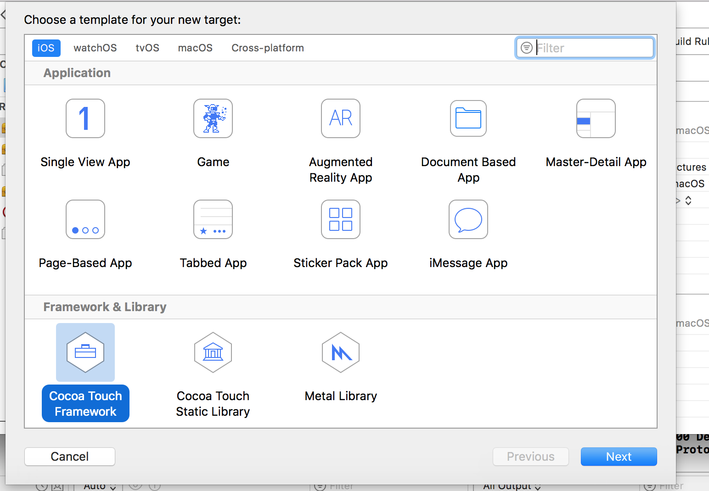
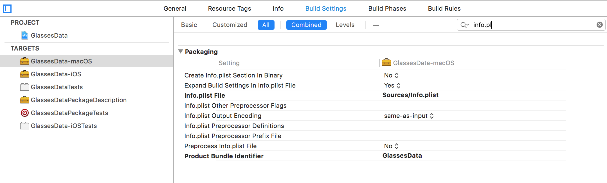
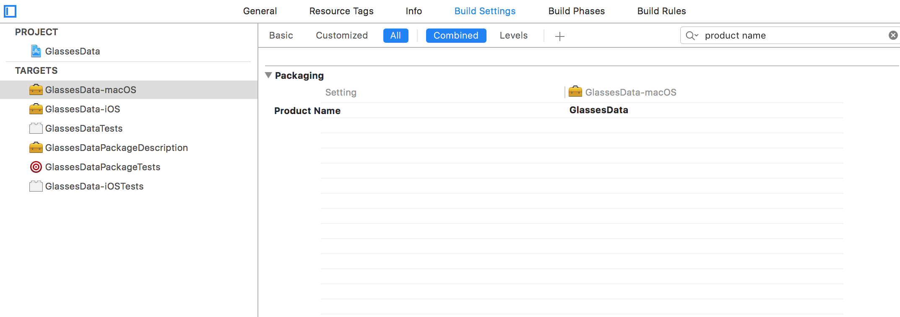
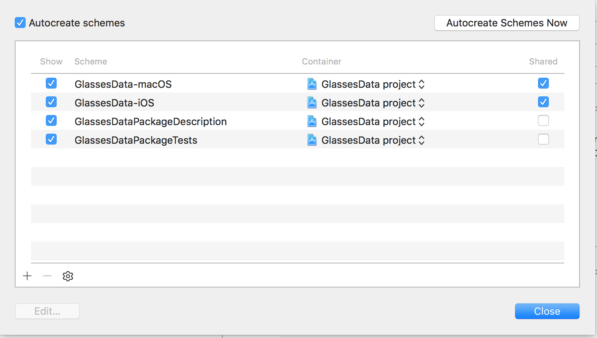
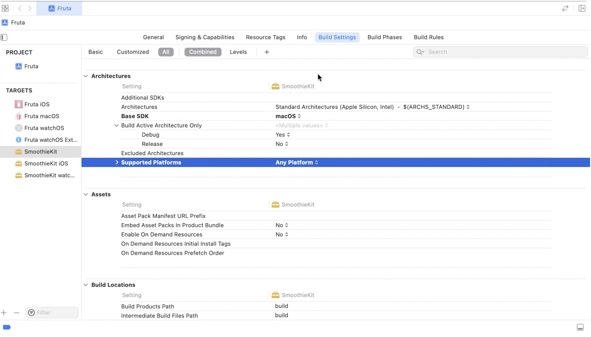

[toc]

##### Creating framework

So for an existing library that already had an macOS target, I had to do the following to support iOS as well.

	1. Add a new iOS target of type 'Cocoa Touch Framework'. Then change its name to reflect its an iOS target.

	2. So that both macOS and iOS targets share the same info.plist, have the info.plist in a common location and specify that location in each target's settings.

3. Also specify the same name in each target's settings' product name.

4. Finally so that these libraries can be used with Carthage mark the scheme as Shared.

*********

Framework has the extension .framework and static library has the extension .a. they have different icons too in Xcode.

Also keep in mind that in the consumer project, you may still need to include these frameworks explicitly in 'Linked Frameworks and Libraries' section of its concerned target's Build phases by manually adding them. But why was this needed, shouldn't it happen automatically if the consumer app is using Carthage, Cocoapods, etc.

A utility to quickly create framework - Framework [Cookiecutter](https://github.com/RahulKatariya/FrameworkTemplate)

##### Multiplatform framework

'Multiplatform frameworks' (i.e. frameworks that build for all platforms i.e. macOS, iOS, watchOS, etc.) have the Build Setting `Supported Platforms` set as `Any Platform`.

Doing this also automatically sets `Allow Multi-platform Builds` to Yes. This informs the build system to build this target once for each of its supported platforms, as necessary.

For the source files in a Multiplatform framework target if there are some files which should be compiled only for selected platforms, that can be configured through `Build Phases > Compile Sources > Filters`.

