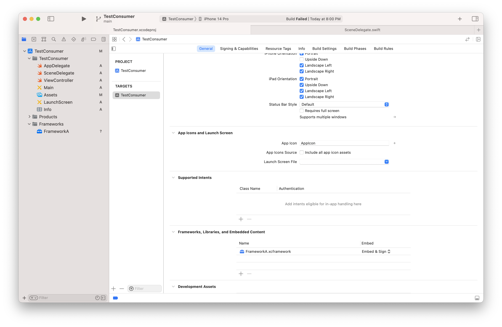
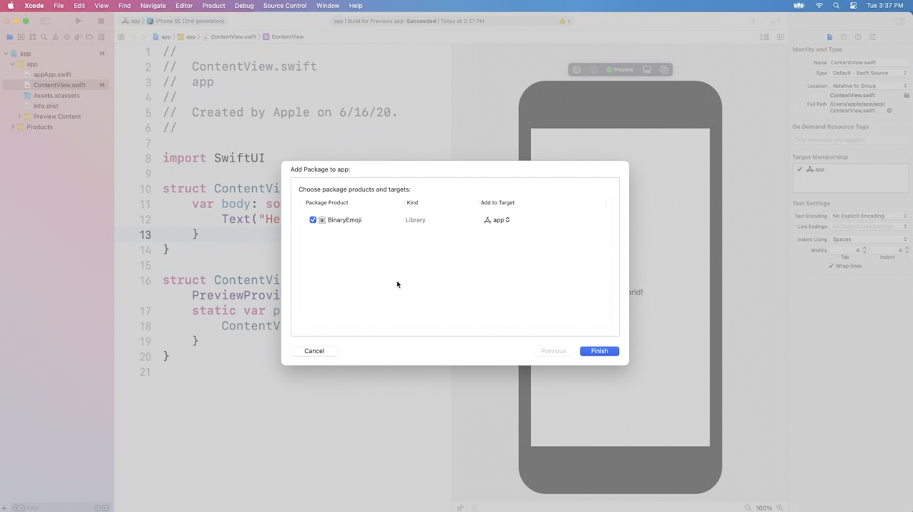
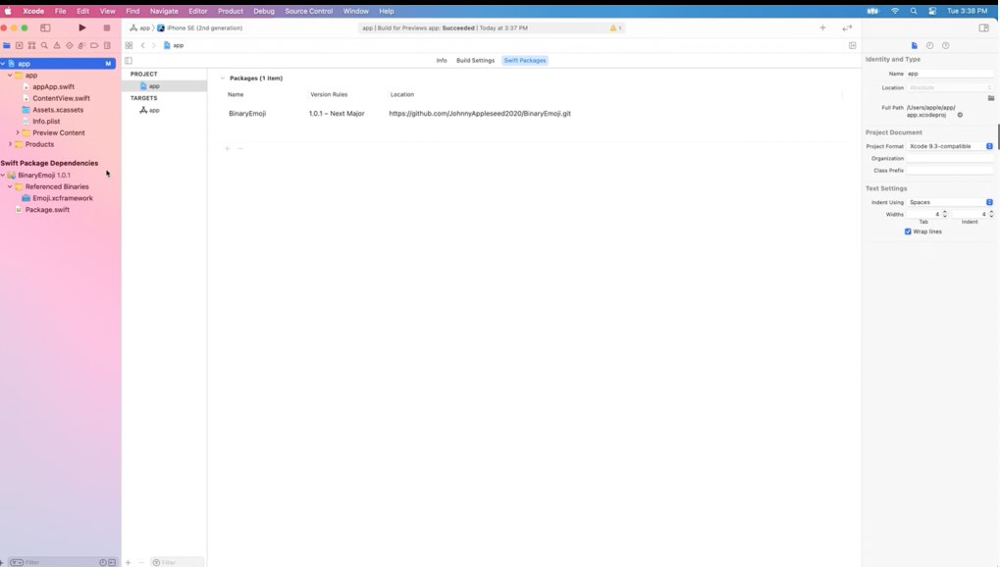
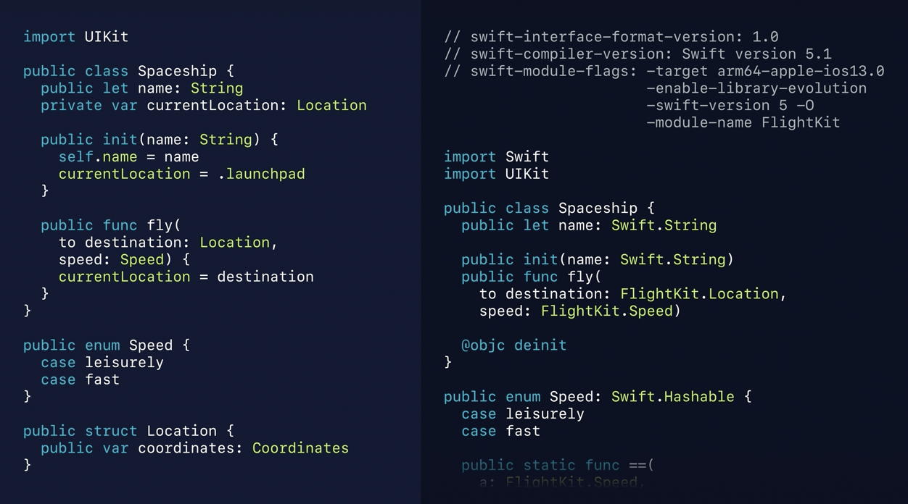
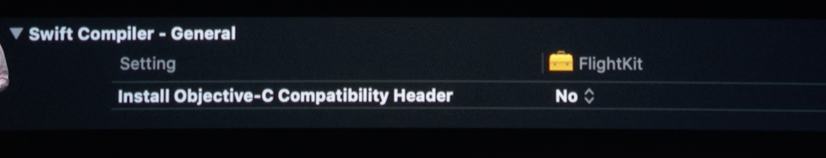
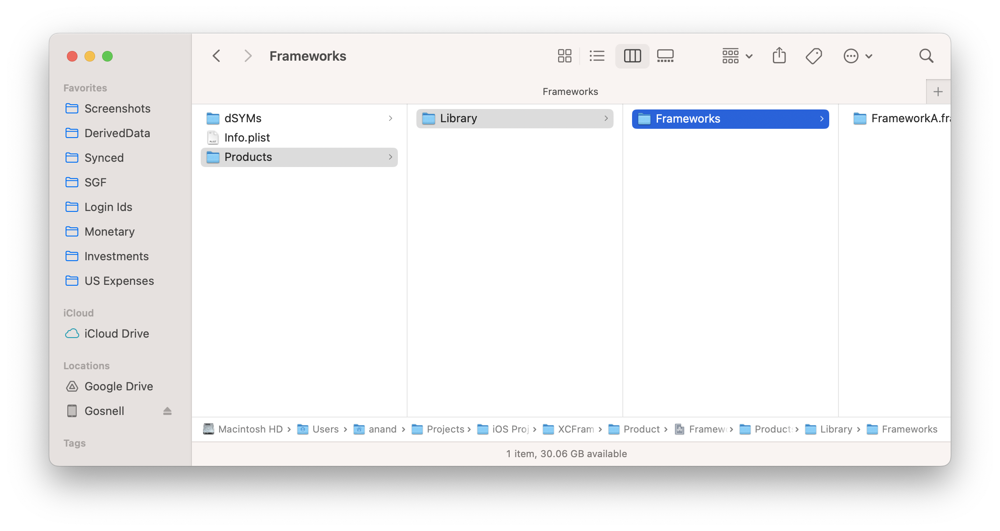
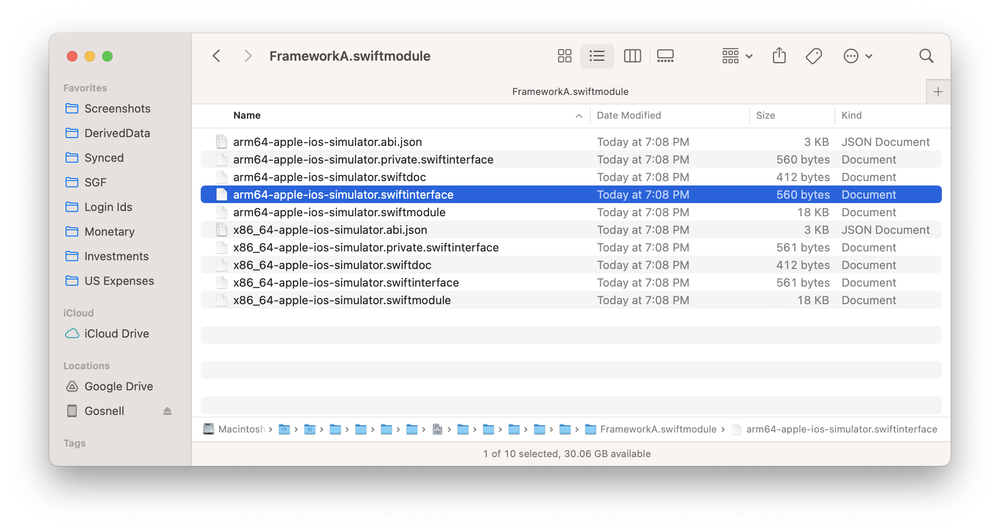
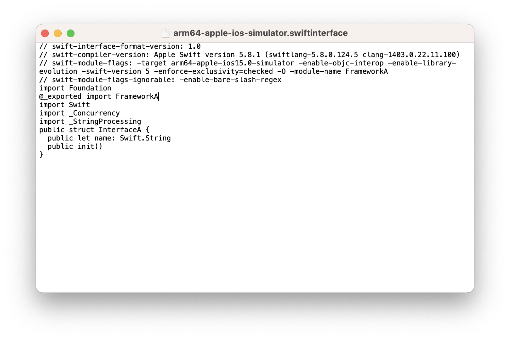
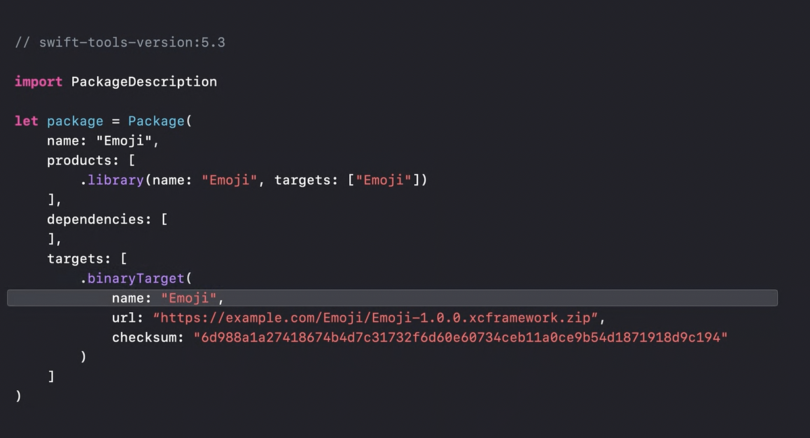

[toc]

#### What is it

Introduced with Xcode 11 (in 2019), gives a new native way to create and distribute libraries such that the entire source code is not visible to the consumers. Unlike plain vanilla libs and frameworks, its USP is that it automatically takes care of stripping required things before submitting to App Store (so no need of fat libraries where the library meant for simulator had to be stripped out).

A single XCFramework can contain a variant for any of the OS platforms (and versions) that Xcode supports. While distributing automatically the required platform support files alone are downloaded.

XCFrameworks can be used to bundle up static libraries, and their corresponding headers. 

> xcframeworks are probably also known as binary frameworks. And that's because the source code is not visible, its shipped as binary code.

#### How to use it

It can be used simply by adding it in consumer project's Frameworks, Libraries, and Embedded Content.' 



Alternatively an xcFramework can also be distributed using Swift Package Manager, and then added in a consumer app as a usual Swift Package Dependency (and in case of being used in another SPM lib, it can simply be added in the package manifest file).





#### Important Build settings

##### BLDO and swiftmodule file

In Xcode 11, there's a new Build setting called `Build Libraries for Distribution`. It turns on all the features that are necessary to build the library in such a way that it can be distributed.

Previously there used to be an error while building Swift framework that used to say - 'Compiled module was created by a newer version of the compiler'. When the Swift compiler goes to import a module, it looks for a file called the 'Compiled Module' for that library. If it finds one of these files, it reads off the manifest of public APIs that can be called into. Now, this Compiled Module format is a binary format that basically contains internal compiler data structures. And since they're just internal data structures, they're subject to change with every version of the Swift Compiler. So what this means is that if one person tries to import a module using one version of Swift, and that module was created by another version of Swift, their compiler can't understand it, and they won't be able to use it. Well, in order to solve this version lock, Xcode 11 introduces a new format for Swift Modules, called Swift Module Interfaces (i.e. `.swiftmodule`). And since they behave like source code, then future versions of the Swift Compiler will be able to import module interfaces created with older versions.

 And when you enable `Build Libraries for Distribution`, you're telling the compiler to generate one of these stable interfaces whenever it builds your framework. it actually looks exactly like an interface file.



So this includes the version of the compiler that produced this interface, but it also contains the subset of command line flags that the Swift Compiler needs to import this as a module.

> Note that all the dependencies too have to be built with the `Build Libraries for Distribution` build setting in order to get that binary compatibility guarantee.

##### SKIP_INSTALL

When the archive is being created, `SKIP_INSTALL=NO` tells Xcode to install the framework in the resulting archive. By doing this,  archives are built for each variant of the framework, and those will be available in the Archives directory in the Xcode Locations tab, in the Preferences window. 

##### Install Objective-C Compatibility Header

Swift framework authors have an Objective-C Interface, most likely, because Xcode's default template is set up for a mixed source framework that has both an Objective-C Umbrella Header, and a generated header containing the Objective-C parts of the Swift in your framework. But if your Swift code doesn't have any Objective-C API that it's trying to publish, well, you don't need to install that second header at all. There's an Install Objective-C Compatibility Header build setting that you can just turn off using the build setting `Install Objective-C Compatibility Header`.



> Need to understand this better. Explained in 2019 WWDC video.

#### How to build an xcFramework

Well, the first step to building your framework is by building an archive. Archiving the Framework builds it in Release Mode, and it will package it up for distribution and that can be seen in the Organizer window. this archive will also contain the debug information that corresponds to that build of your framework.

However to archive your framework,  the easiest way is to use the `xcodebuild archive` command.

```
xcbuild archive 
	-scheme FlightKit 
	-destination ...
	-destination ...
	SKIP_INSTALL=NO
```

Once archives have been built for desired platforms, the frameworks can be extracted , and bundled up together in one XCFramework. And to do this,  the `xcodebuild -create-xcframework` command is used..

```
xcodebuild -create-xcframework
```

```
xcodebuild archive -scheme FrameworkA -destination "generic/platform=iOS" -archivePath ../Product/FrameworkA-iOS SKIP_INSTALL=NO BUILD_LIBRARY_FOR_DISTRIBUTION=YES 

xcodebuild archive -scheme FrameworkA -destination "generic/platform=iOS Simulator" -archivePath ../Product/FrameworkA-iOS-Simulator SKIP_INSTALL=NO BUILD_LIBRARY_FOR_DISTRIBUTION=YES

xcodebuild -create-xcframework -framework ./FrameworkA-iOS.xcarchive/Products/Library/Frameworks/FrameworkA.framework -framework ./FrameworkA-iOS-Simulator.xcarchive/Products/Library/Frameworks/FrameworkA.framework -output ./FrameworkA.xcframework

xcframework successfully written out to: /Users/anand/Projects/iOS Projects/XCFramework/Product/FrameworkA.xcframework
```

> If the xcframework project's build setting already has BLDO and SKIP_INSTALL properly set, then they need not be sepcified in the command line.

#### Things to keep in mind while creating frameworks.

Specify version numbers with care in Info.plist, use semantic versioning. If there is a breaking change, increment major version. If there is backward compatibility being offered, incrementing minor versions is enough.

If the framework has certain Entitlements that it needs to get its job done, document them. Document dependencies too.

##### Ways to improve framework's performance

BLDO has has multiple effects in addition to generating the Module Interface file. and one of those effects is to set the default to the Flexibility side when faced with flexibility-optimizability compromise. Explained in 2019 WWDC video.

Its also possible to improve performance using inlinable functions, frozen enums, and frozen structs. are used. (what they are, explained from 28:38 in WWDC 2019 video)

#### Misc.

##### swiftinterface file

The xcarchive file eventually has swiftinterface files. This file has the interface of the xcframework.

| Immediately inside xcarchive                                 | swiftinterfce file eventually                                |
| ------------------------------------------------------------ | ------------------------------------------------------------ |
|  |  |

Here is what the `swiftinterface` file actually looks like.

##### implemetationOnly imports

`@__implemetationOnly import` is a private API to import a library B (as of 2019) in library A, such that library A's eventual xcframework will not include any symbols of  library B publicly. ([Link](https://forums.swift.org/t/update-on-implementation-only-imports/26996))

> Used it in presto source code in 2020.

##### Use with Cocoapods

Its possible for a Cocoapods based repo to use  xcFramework, and also for the underlying wrap to be Cocoapods based.

> Used in in presto source code in 2020.

##### Use with Swift Package Manager

> Explained in WWDC 2020: Distribute binary frameworks as Swift packages ([Link](https://developer.apple.com/videos/play/wwdc2020/10147/))  <br>Official documentation ([link](https://developer.apple.com/documentation/xcode/distributing-binary-frameworks-as-swift-packages#))

SPM can distribute xcFrameworks too, which can then be used in consumer project just as a normal Swift Package Dependency.

To dustribute an xcframework using SPM, 

Xcode 12 tools-version:5.3 brought a new package manifest API, and has a new target type `binaryTarget` for xcFramework. There's also an option to point to an XCFramework by path, that's meant for development. 



A checksum has to be specified too. To generate the checksum of a binary framework, use the `swift package compute-checksum` command. When your package is being used, Xcode will compute the checksum of the downloaded file and reject it if it does not match the manifest. This ensures that your clients use the exact binary you expect.

#### Useful Links

WWDC 2019: Binary Frameworks in Swift ([Link](https://developer.apple.com/videos/play/wwdc2019/416/)) <br>WWDC 2020: Distribute binary frameworks as Swift packages ([Link](https://developer.apple.com/videos/play/wwdc2020/10147/)) <br>Creating a multiplatform binary framework bundle ([Apple article](https://developer.apple.com/documentation/xcode/creating-a-multi-platform-binary-framework-bundle)) <br>