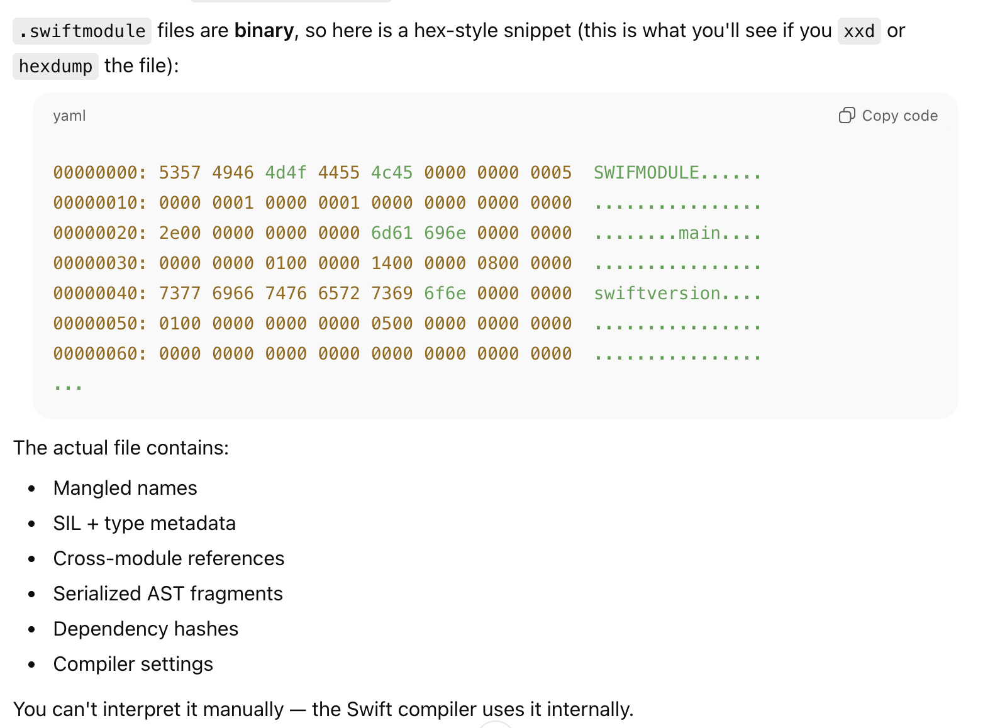
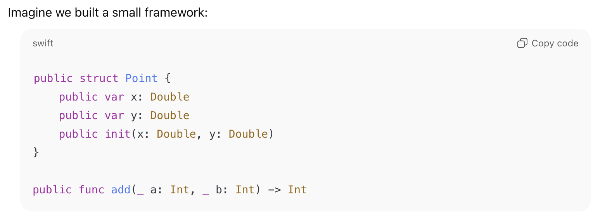
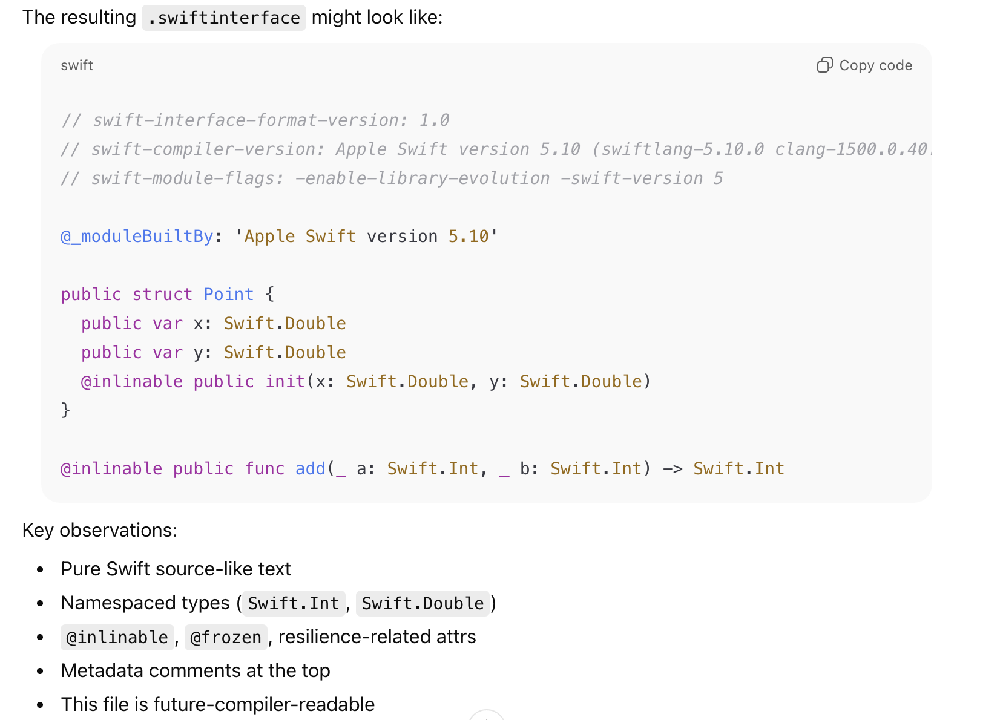
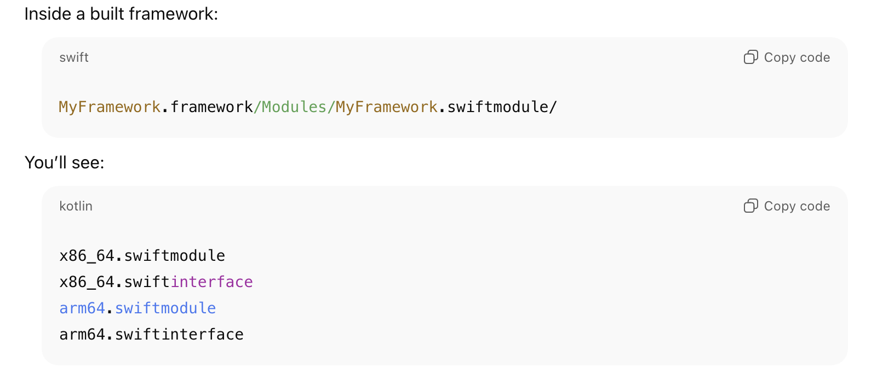
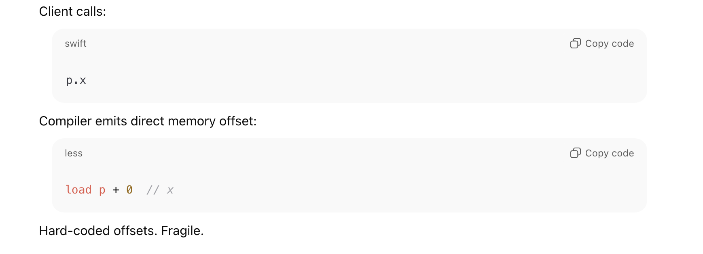
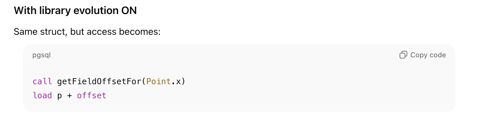
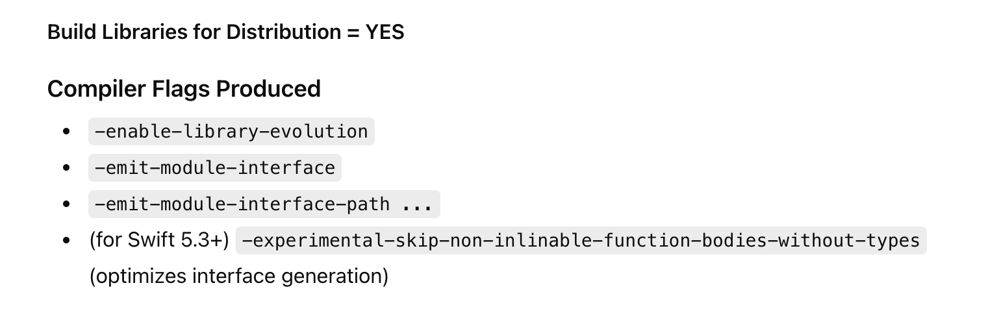
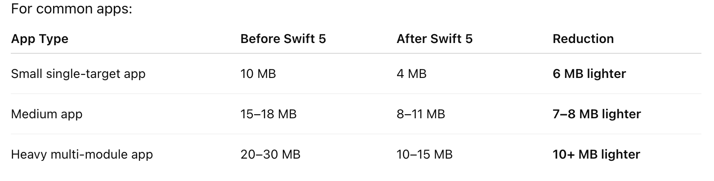
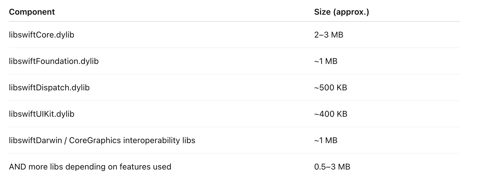

[toc]

#### Module Stability

##### What is swiftmodule

When a module is compiled and the framework created, the framework eventually has a **swiftmodule** file. Its in binary format, and is subject to change across different compiler versions.

##### What is swiftinterface and why was it needed

The trouble with consuming a framework that only has swiftmodule was that the consumer had to be on the same compiler version that generated the framework, otherwise the framework became not unintelligible to the consumer (swiftmodule format is compiler version dependent). That is where **swiftinterface** came in, its a human readable and is nearly identical to the public interface of the files in the framework. It represents what is there in the accompanying swiftmodule. 

A consumer with a newer compiler version will always be able to understand the module's swiftinterface (even if it was created using an older compiler version), and then generate a swiftmodule from it. This is known as **Module Stability**.

> swiftinterface also includes several annotations (such as `@inlinable`, `@_spi`, etc.) that the compiler uses.

##### Physical Location

swiftmodule and swiftinterface are both physically located inside .framework

##### How to ensure swiftinterface is generated (`-emit-module-interface`)

**-emit-module-interface** is the compiler flag that has to be there to ensure a swiftinterface file is generated while building a framework. Its automatically included if **Build Libraries for Distribution** build setting in Xcode is used though. 

> The BLDO setting does more things than just generating a swiftinterface, explained later.

#### Library Evolution

##### Frozen types in compilers

By default, public types are **frozen** (leave Swift frozen enums aside, that is something else). What that means is that their stored properties and memory layout are fixed and even gets emitted into the binary which the client then actually uses. 

The trouble with that is when a framework is handed to client, then the client integrates the framework making some particular memory layout assumptions. Those memory layout based assumptions break if a newer version of the framework is generated and handed to client, client will have to recompile and re-integrate the new library. And that is a problem on macOS as there frameworks can be dynamically downloaded and integrated at runtime and also for iOS libs as those are integrated at runtime

##### Resilient (aka nonfrozen) types (`-enable-library-evolution`)

If however **-enable-library-evolution** flag is not used, then memory layout is not emitted and client uses it accordingly. In such a case those library types become **nonfrozen**, and technically its termed as becoming a **resilient type**.

> So basically the `-enable-library-evolution` compiler flag makes public types *'resilient to possibility of causing breaking changes for its clients if the type itself has to change in the future'*. However, it also disallows client code from peeking into library's storage for optimizations.

> Also, The ABI JSON file is emitted (what is that)

#### 'Build Libraries for Distribution' Build Setting in Xcode

If Build Settings → Build Libraries for Distribution = YES is set, then it does each of these (enables 3 different compiler flags). It makes the public types resilient and also generates swiftinterface.

#### ABI Stability

Compiled client code A uses compiled library B. They have to be mutually intelligible. If A's compiler version is different from B and there isn't a gurantee that B will be understandable to A things will not work. 

**ABI stability** (achieved in 2019 with Swift 5) ensured that for standard Swift libraries any version compiled with a newer Swift compiler version will always be intelligible by an app that was first shipped by building an older version of librray (that used an older Swift compiler version) . Certain standards and agreements were set and pledged. Until then every app had to ship with its own copies of standard Swift libraries it was originally built with. Now they don't have to, and they simply use the standard Swift library in OS.

It significantly reduced app sizes, especially starting in iOS 12.2 (when Swift 5 officially stabilized the ABI) as 3rd party apps didn't need to bundle system dylibs anymore.

#### Summary

| Flag                        | What does it apply to                                        | Example of what it solves                                    |
| --------------------------- | ------------------------------------------------------------ | ------------------------------------------------------------ |
| `-emit-module-interface`    | Consumer app upgrading its compiler version but using a library compiled with an older version | libV1 built with compilerV1 and handed to clients, if clientApp later uses compilerV2 the previously handed libV1 will still build for clientApp. (aka **Module Stability**)  Solves by generating `swiftinterface`. |
| `-enable-library-evolution` | Library changing its interface and getting released to be updated in a consumer app that is already live and had first shipped with an older interface of the library | libV1 handed to clients and client integrates. If later libV2 with new interface is handed to client, the older app works without needing to recompile.  This is a real situation in macOS, as well as in iOS for Apple libs as there libs can change on the fly after the consuming app has shipped.  Solves by making public types resilient/nonfrozen, so that their memory layout is more intelligently used. |
| N/A                         | Library upgrading its compiler version and getting released to be updated in a consumer app that is already live and had first shipped with an older version of library which used another compiler version | libV1 compiled with compilerV1 handed to clients, which also built with compilerV1 and it ships. If later libV1 is compiled with compilerV2, the app will still be able to work with it. (aka **ABI stability**)  Relevant for Swift standard libraries.  Solved by promising to always uphold some standards in system libraries going forward. |

#### Resources

[ChatGPT link](https://chatgpt.com/g/g-p-69279ccb2f608191ad229eb13fec17aa-current/c/692f8565-b740-8325-b252-121874d70f99)  [swift.org 2019 post announcing ABI stability](https://www.swift.org/blog/abi-stability-and-more/)