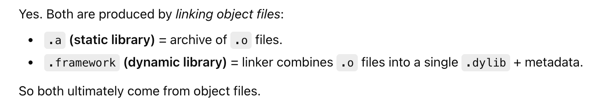
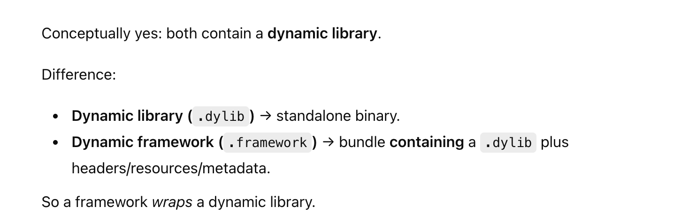
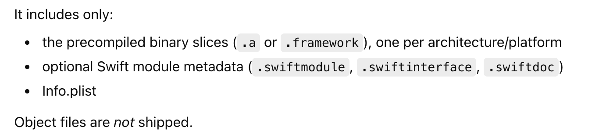

[toc]

##### Static lib (.a) vs Dynamic framework (.framework) composition

Libraries are collections of object files in an archive created by the program `ar`, indexed by a program `ranlib`.

All libraries link object files.

##### Dynamic library vs Dynamic framework

##### xcFramework composition

> Incremental builds in Xcode do reuse object files though

