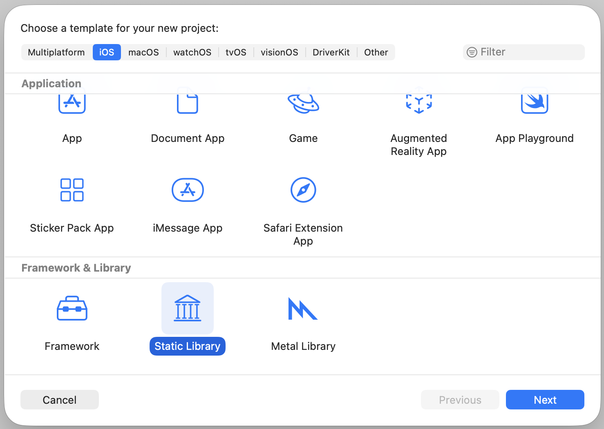
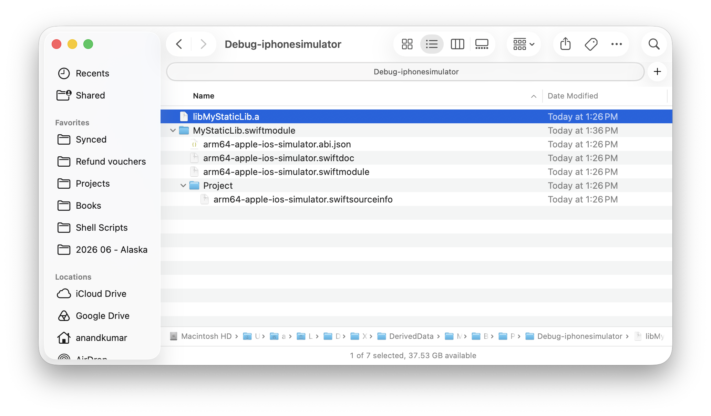
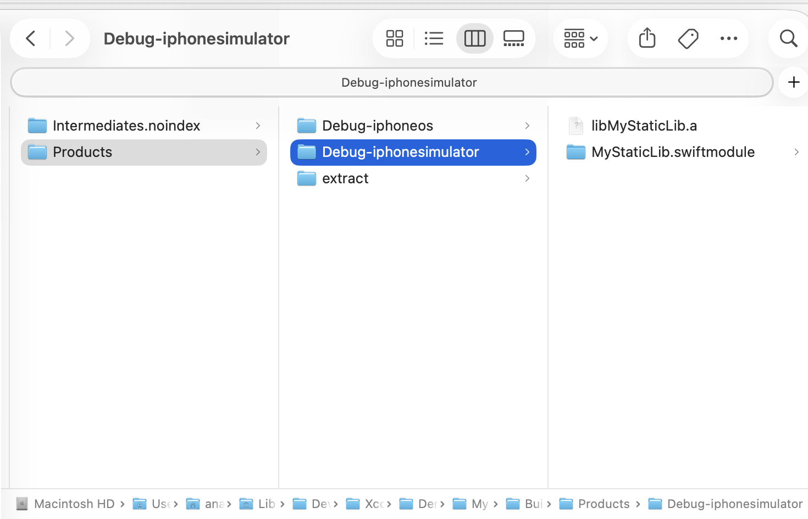
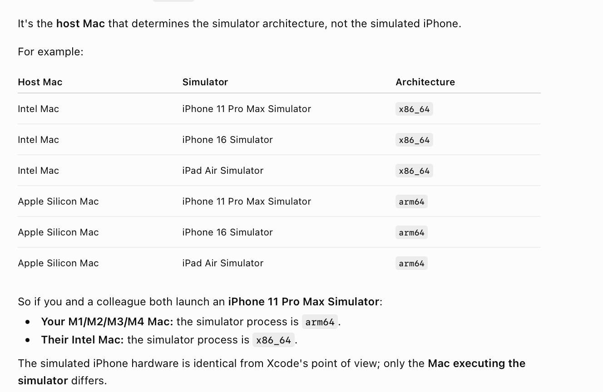
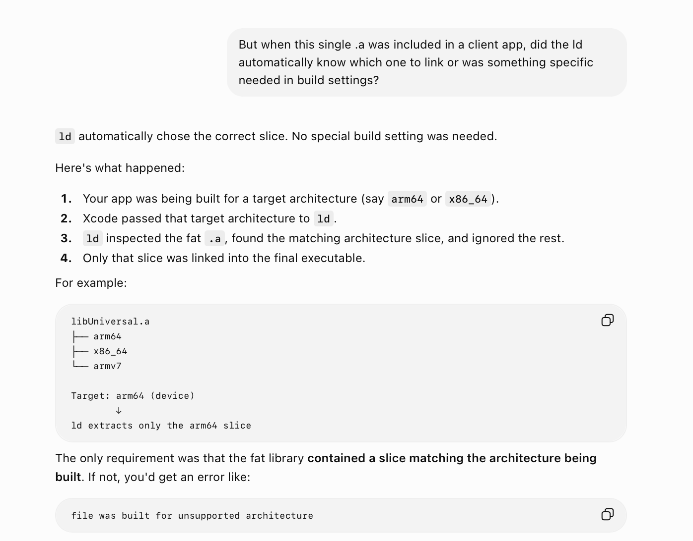
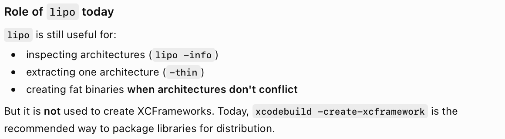

[toc]

##### Creating the lib

Using Xcode 26, the process is as simple as 'New Project > Framework & Lib > Static Lib'.




The created project is basically just a swift file, and you need to build it. 

##### Locating the output lib

Once the build is completed, the generated lib is not shown in Project Navigator anymore like it used to be before. You actually need to locate the project in Derived Data yourself, and the lib will be there.



##### Inspecting the lib

The simple lib has this basic structure. There is the **.a** and also the **.swiftmodule**.

```
/Users/anandkumar/Library/Developer/Xcode/DerivedData/MyStaticLib-gnbbnsmbpewwbrbrcrvfpzymfgtt/Build/Products/Debug-iphonesimulator
├── libMyStaticLib.a
└── MyStaticLib.swiftmodule
    ├── arm64-apple-ios-simulator.abi.json
    ├── arm64-apple-ios-simulator.swiftdoc
    ├── arm64-apple-ios-simulator.swiftmodule
    └── Project
        └── arm64-apple-ios-simulator.swiftsourceinfo
```

You can then use **ar** to grab the object files from inside the lib, and then use **otool** and **nm** to look inside the object files.

```
ar -t libMyStaticLib.a       // Use ar to inspect the .a
nm libMyStaticLib.a         // Use nm to look at the symbols inside the lib
mkdir extract; cd extract; ar -x ../libMyStaticLib.a    // Extract object files from the lib
otool -hV *.o; nm *.o				// Use otool to inspect the object files
```

> **swiftmodule** is basically like a public interface file for the lib that consumers read when importing the lib. Its been round since 2014 and is effectively mandatory for Swift libraries because the Swift compiler needs it to compile code that imports your library..

##### Build for multiple architectures

Do build for both simulator and device separately, they will both be needed later on while importing the lib. They are saved in different locations.




Note that the Run Destiation 'Any iOS Simulator Device (arm64, x86_64)' is actually different, its includes both arm64 and x86_64 simulators anyway. Now which one might actually be used depends on the Mac, i.e. Intel or Apple Silicon.



To generate a static lib that works for both kind of simulators, I think some build settings are needed in the lib project ('Build Active Architecture Only' No, etc.). Explained in [this](https://chatgpt.com/c/6a53e018-0b8c-83ea-9836-9a5e43043726) chat.

##### Fat library and lipo

A **fat library** (also called a **universal library**) is a single `.a` file that contains **multiple static libraries**, one for each CPU architecture.

```
libMath.a
├── arm64          (real iPhones)
├── x86_64         (Intel Simulator)
└── arm64-simulator (Apple Silicon Simulator)
```

It existed and was in fashion before XCFrameworks. Developers had to distribute libraries that worked on multiple architectures.
Instead of sending two different .a, they preferred to combine them into a single .a. That packaging into one .a was done using **lipo** command.

```
lipo -create \
    libDevice.a \
    libSimulator.a \
    -output libUniversal.a
```

The linker (ld) would open the fat library, detect the target architecture being built, and automatically pick the matching slice.



It became obsolete when Apple Silicon came in, as with that simulator too started using arm64 (in addition to iPhones) and they were actually different platforms inspite of having same architecture. A fat library can distinguish only by CPU architecture, not by platform.



##### Resources

Creating a static lib ([ChatGPT link](https://chatgpt.com/g/g-p-6934bcdfcafc819182baa9435e044320-swift-programs/c/6a53cd55-1a98-83ea-8288-928a2ade742e)) <br>Fat library ([ChatGPT link](https://chatgpt.com/g/g-p-6934bcdfcafc819182baa9435e044320-swift-programs/c/6a545354-5e6c-83ea-8bcd-7f17e951f3af)) <br>lipo ([ChatGPT link](https://chatgpt.com/g/g-p-6934bcdfcafc819182baa9435e044320-swift-programs/c/6a55898b-158c-83ea-b37b-fd3b714d5535))
