[toc]

The important thing is to have .a and .swiftmodule for all required CPU architectures (simulator + device) and conditionally specify both of them in the build settings, etc. 

##### For only simulator

Add the lib to the project and do use 'Create groups' and 'Copy files if needed', it will copy the .a and .swiftmodule to the project root.

| Project Navigator                                            | File System                                                  |
| ------------------------------------------------------------ | ------------------------------------------------------------ |
| 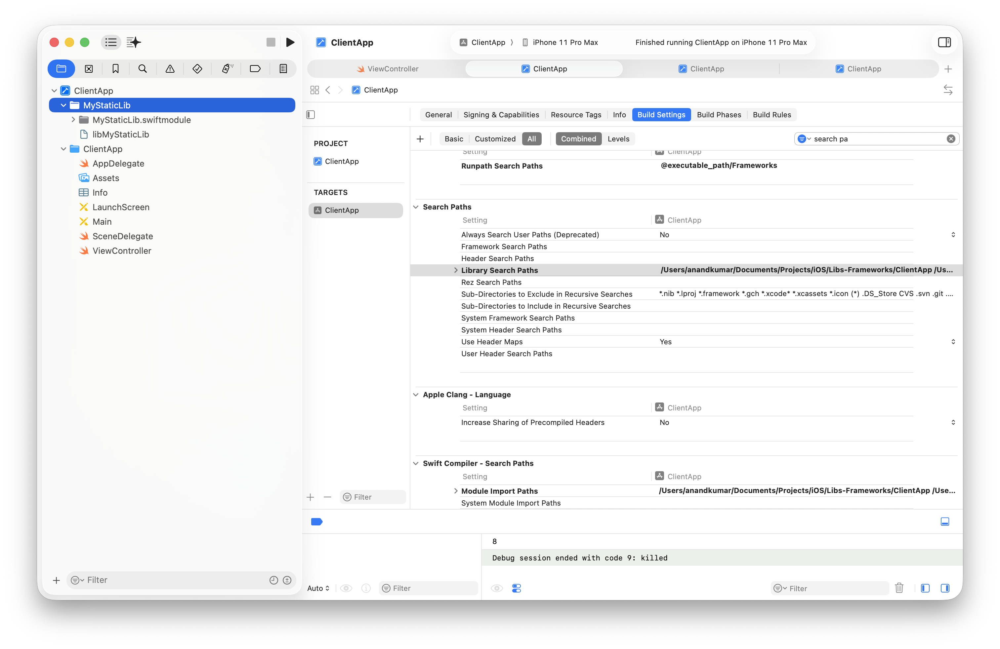 | 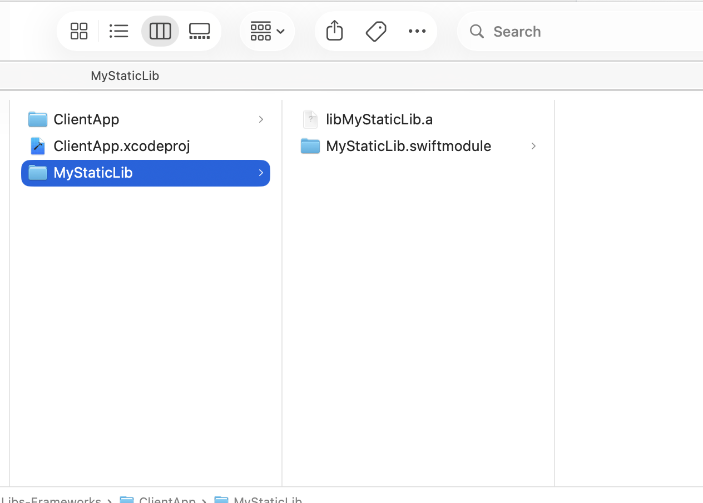 |

Ensure the .a is actually in 'General > Frameworks, Libraries, and Embedded Content' and also in 'Build Phases > Link Binary with Libraries'.

| General > Frameworks, Libraries, and Embedded Content (Do not mark as 'Embed' yes) | Link Binary with Libraries                                   |
| ------------------------------------------------------------ | ------------------------------------------------------------ |
| 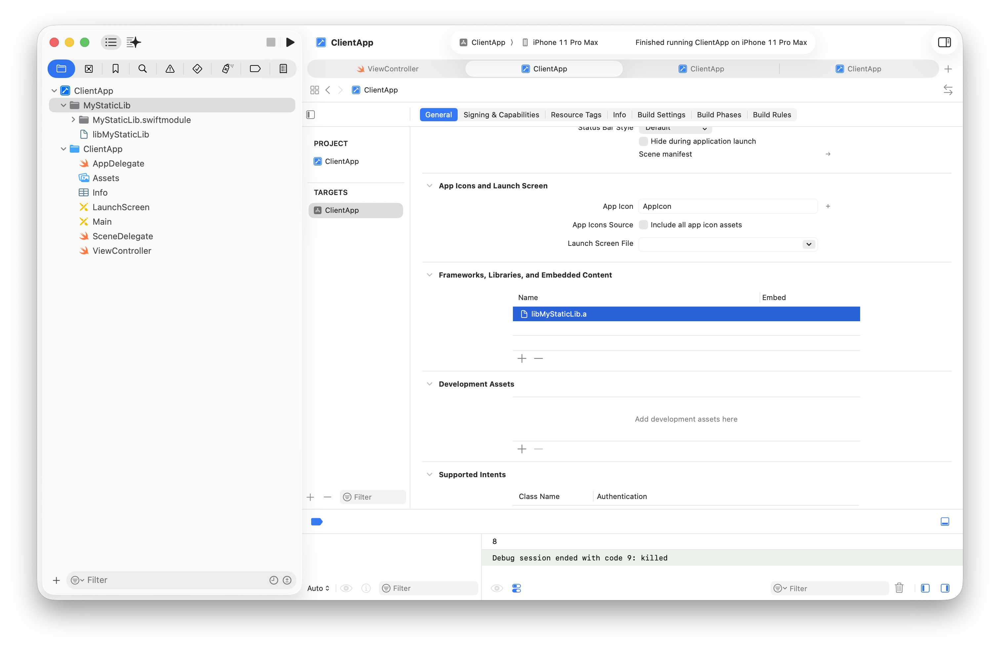 | 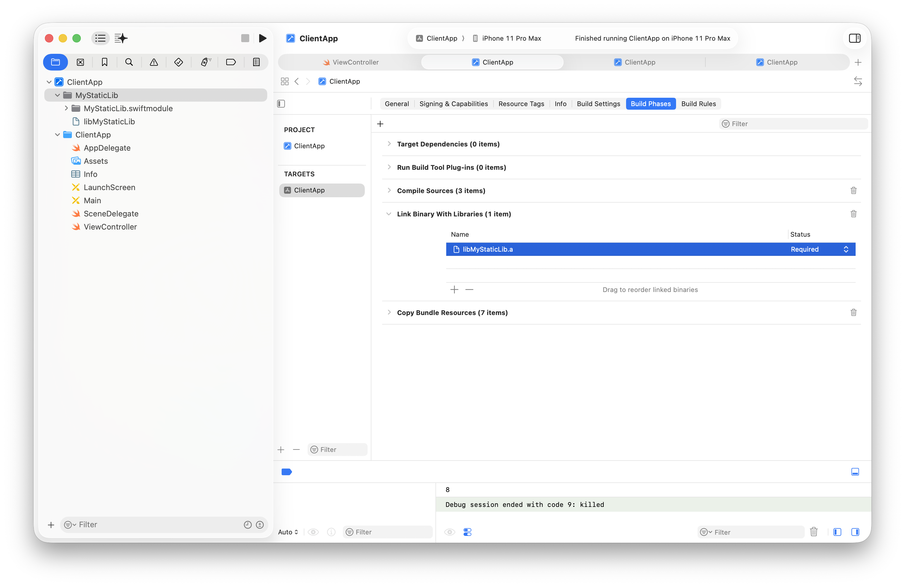 |

And then the various Search Paths need to be specified too. Swift module import path as well as Library Search Paths.

| Module Import Paths                                          | Library Search Paths                                         |
| ------------------------------------------------------------ | ------------------------------------------------------------ |
| 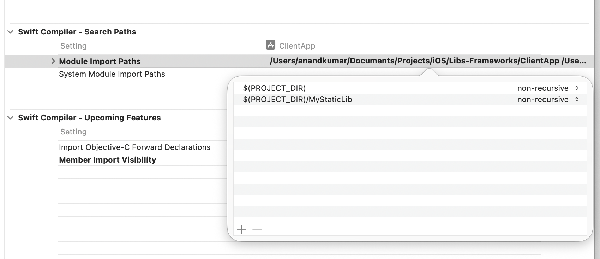 | 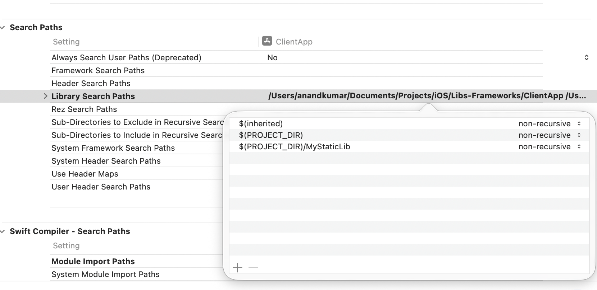 |

It should also be ensured that the swiftmodule is indeed for the intended platform. arm64-apple-ios-simulator.swiftmodule indicates Simulator and arm64-apple-ios for physical devices.

The import path is used by compiler (i.e. swiftc) and it looks for swiftmodule. The library search path whereas is needed during linking (i.e. ld) and actually needs the .a.

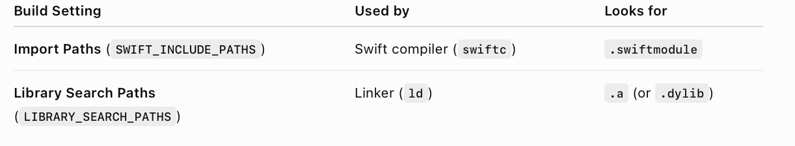

##### Conditionally for simulator and device

This is where it gets interesting. The correct folder needs to be specified under Any iOS SDK and Any iOS Simulator SDK. Be sure to have the static lib for both architectures.

| Module Import Paths                                          | Library Search Paths                                         |
| ------------------------------------------------------------ | ------------------------------------------------------------ |
| 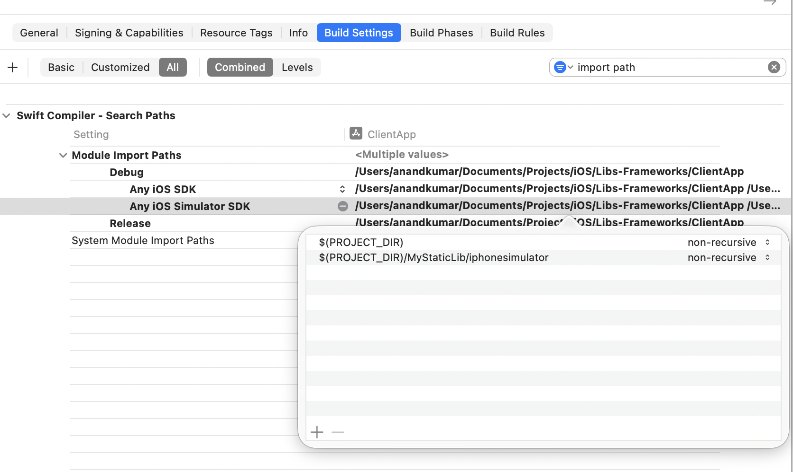 | 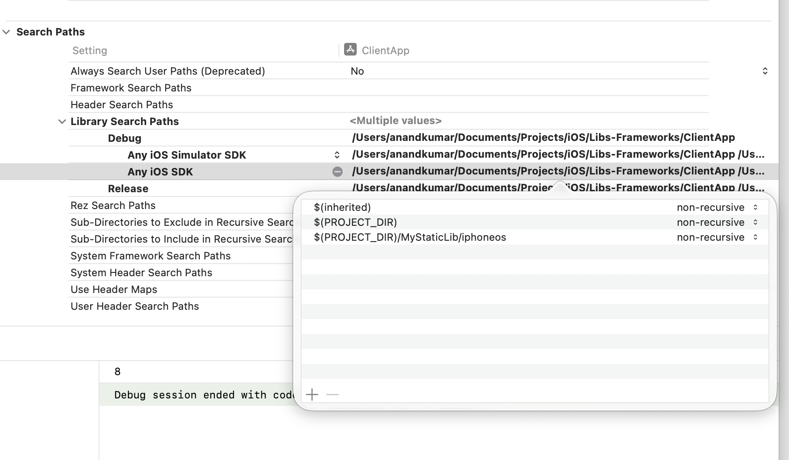 |

In other linker flags simply specify the lib name as '-l<LIB_NAME>', and no need to have the lib in 'Link Binary with Libraries'.

| Other Linker Flags                                           | Link Binary with Libraries (nothing)                         |
| ------------------------------------------------------------ | ------------------------------------------------------------ |
| 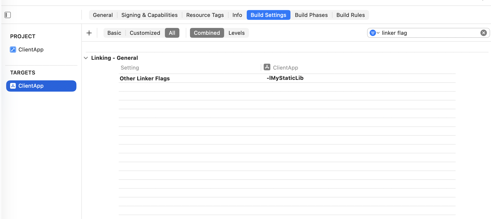 | 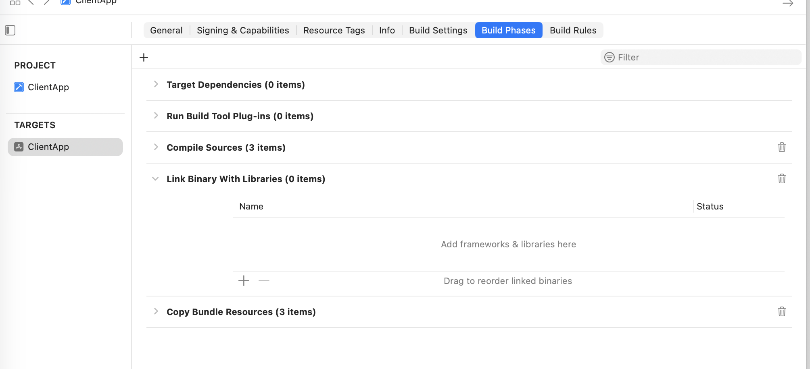 |

##### Resources

Importing a static lib ([ChatGPT link](https://chatgpt.com/c/6a53e018-0b8c-83ea-9836-9a5e43043726))