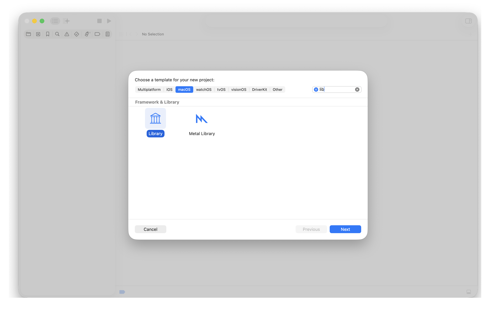
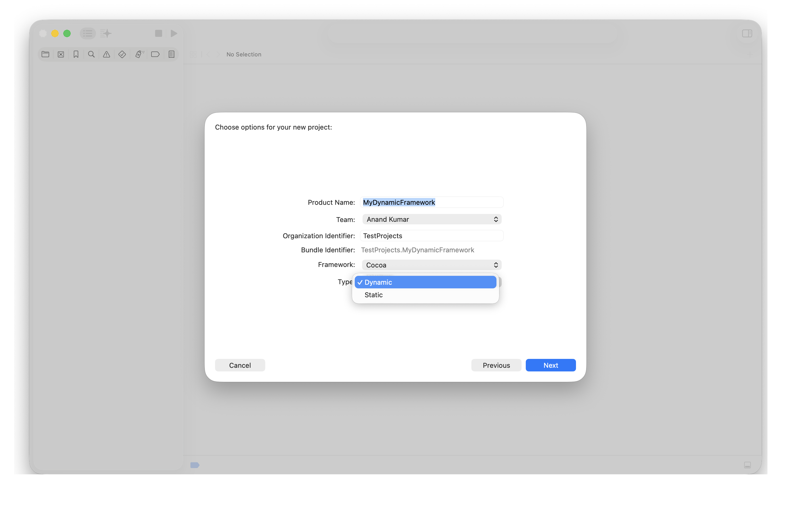
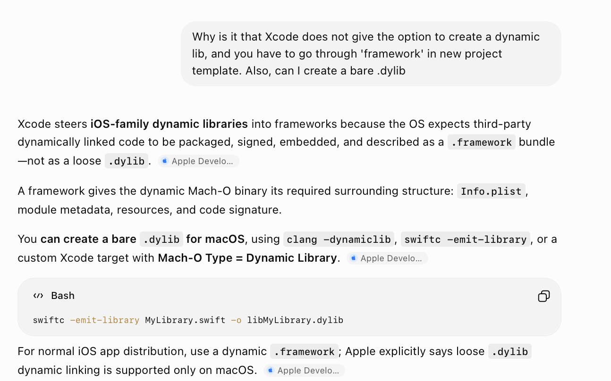
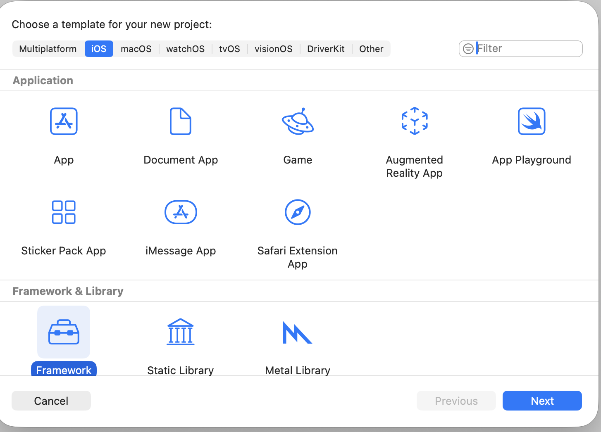
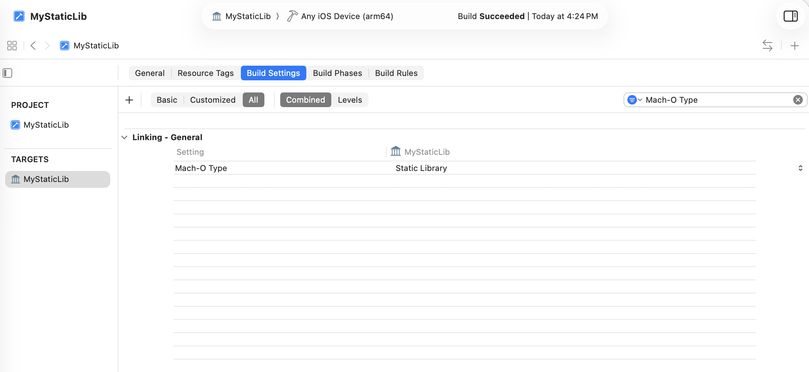
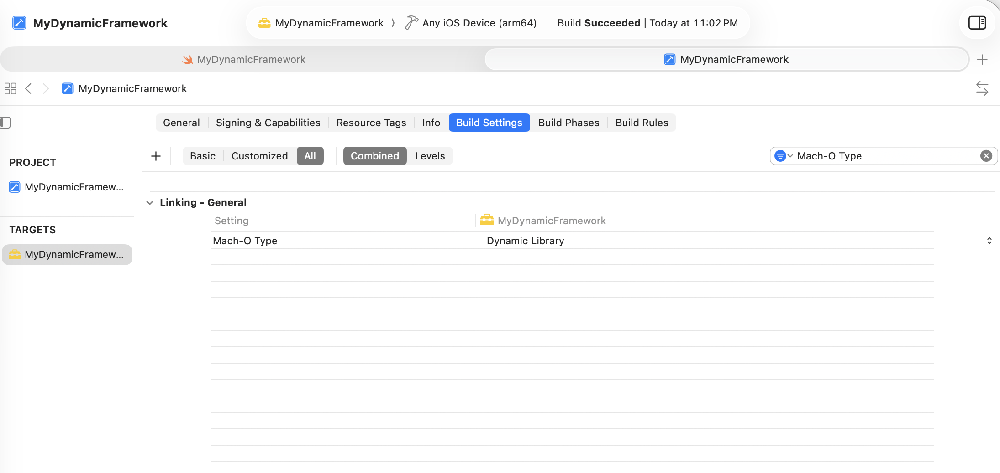
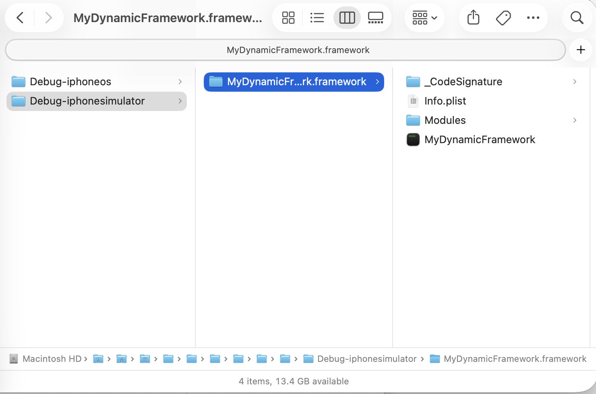
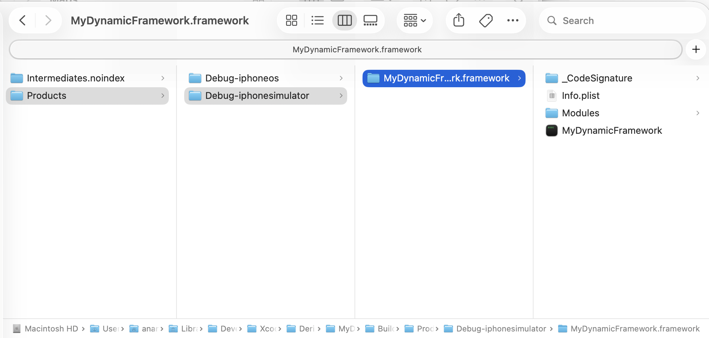
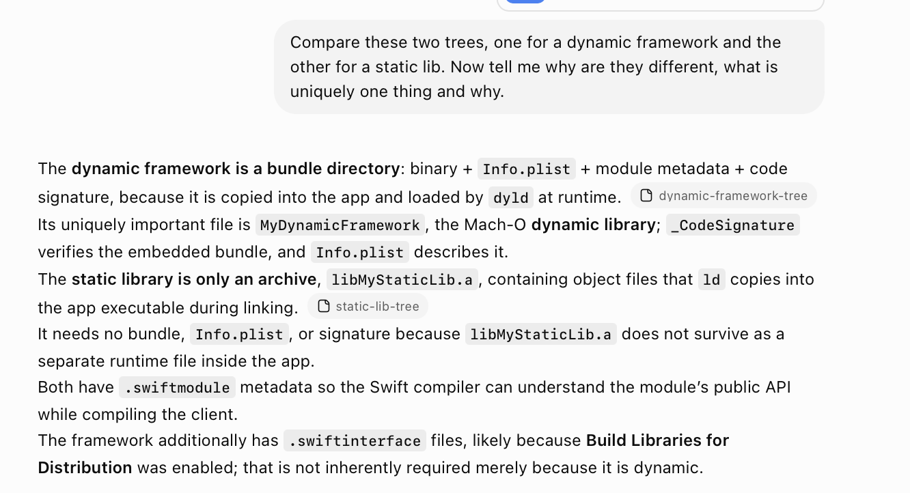

[toc]

##### No dynamic lib in iOS, Has to be a .framework

While macOS template lets you choose between static/dynamic after selecting Library, iOS template does not let you do that. 

| Step 1 - macOS Lib                                           | Step 2 - Type Static/Dynamic (iOS template does not give this option) |
| ------------------------------------------------------------ | ------------------------------------------------------------ |
|  |  |

The reason for this is that Apple requires you to package a .dylib with other necessary artifacts such as code signature and Info.plist. This package bundle is basically what a .framework is. Even if you were to create a bare dylib through other means it will not allow that to be consumed in an iOS project.



##### Creating the dynamic framework

Using Xcode 26, the process is as simple as 'New Project > Framework & Lib > Dynamic Framework'.




The created project is basically just a swift file, and you need to build it. 

Keep in mind that there is build setting named Mach-O type which very clearly says whether something is a static lib or dynamic lib.

| Mach-O Type for static lib                                   | Mach-O Type for dynamic framework                            |
| ------------------------------------------------------------ | ------------------------------------------------------------ |
|  |  |


##### Locating the output framework

Once the build is completed, the generated lib is not shown in Project Navigator anymore like it used to be before. You actually need to locate the project in Derived Data yourself, and the framework will be there.

(Both Debug-iphoneos and Debug-iphonesimulator are shown here as I did build the framework twice, once for simulator and the next time for device.)



##### Build for multiple architectures

Do build for both simulator and device separately, they will both be needed later on while importing the lib. They are saved in different locations.



##### Inspecting the framework

The simple framework has this basic structure. There is the **.framework** inside which there is a binary, an swiftmodule, and an Info.plist (That binary is exactly the same thing as the .dylib that would have bene produced if allowed, the .dylib is just a naming convention.).

```
/Users/anandkumar/Library/Developer/Xcode/DerivedData/MyDynamicFramework-axdotcezqiczjmaqvepzmcwnkppp/Build/Products/Debug-iphonesimulator/MyDynamicFramework.framework
├── _CodeSignature
│   └── CodeResources
├── Info.plist
├── Modules
│   └── MyDynamicFramework.swiftmodule
│       ├── arm64-apple-ios-simulator.abi.json
│       ├── arm64-apple-ios-simulator.private.swiftinterface
│       ├── arm64-apple-ios-simulator.swiftdoc
│       ├── arm64-apple-ios-simulator.swiftinterface
│       ├── arm64-apple-ios-simulator.swiftmodule
│       └── Project
│           └── arm64-apple-ios-simulator.swiftsourceinfo
└── MyDynamicFramework
```

Also, static lib tee for reference

```
/Users/anandkumar/Library/Developer/Xcode/DerivedData/MyStaticLib-gnbbnsmbpewwbrbrcrvfpzymfgtt/Build/Products/Debug-iphonesimulator
├── libMyStaticLib.a
└── MyStaticLib.swiftmodule
    ├── arm64-apple-ios-simulator.abi.json
    ├── arm64-apple-ios-simulator.swiftdoc
    ├── arm64-apple-ios-simulator.swiftmodule
    └── Project
        └── arm64-apple-ios-simulator.swiftsourceinfo
```

You can then use regular otool and nm to inspect the Mach-O binary.

```
otool -hvlL MyDynamicFramework.framework/MyDynamicFramework
nm MyDynamicFramework.frameawork/MyDynamicFramework
```

##### file command

**file** is a handy command which looks at the magic bytes and tells what the file actually is. Here is what it says when pointed to the Mach-O of a .a, or to an object file inside a static lib .a produced by archiver,  or the Mach-O of a .framework containing a dynamic lib respectively.

```
Static Lib: /DerivedData/MyStaticLib-..../Build/Products/Debug-iphoneos/libMyStaticLib.a: current ar archive random library

Object file of a Static Lib: /DerivedData/MyStaticLib-..../Build/Products/extract/MyStaticLib.o: Mach-O 64-bit object arm64

Dynamic Framework: /DerivedData/MyDynamicFramework-..../Build/Products/Debug-iphonesimulator/MyDynamicFramework.framework/MyDynamicFramework: Mach-O 64-bit dynamically linked shared library arm64
```

##### Why the structures of static and dynamic libs are different

Essentially its this - As something that has to ship with an app ipa, it needs to have 'code signature' and info.plist files too, in addition to the usual Mach-O binary and swiftmodule. So all of these get packaged together in a .framework (i.e. a bundle directory) in case of dynamic libs.



##### Resources

Creating dynamic lib, file command - [ChatGPT link](https://chatgpt.com/g/g-p-6934bcdfcafc819182baa9435e044320-swift-programs/c/6a55a525-10b8-83ea-b8c4-80c2133873b0)
