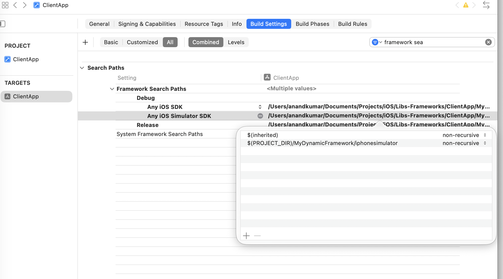
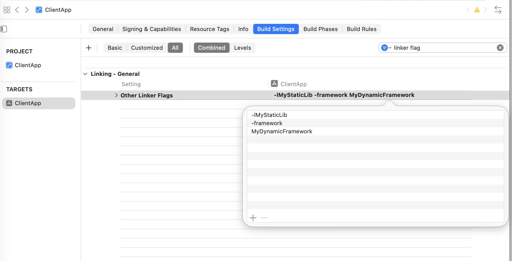
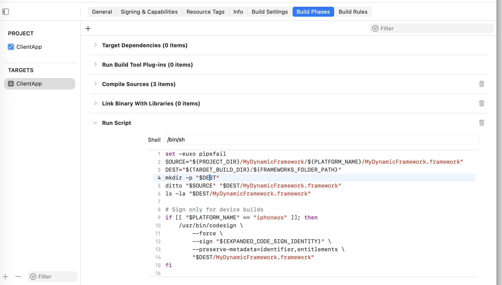
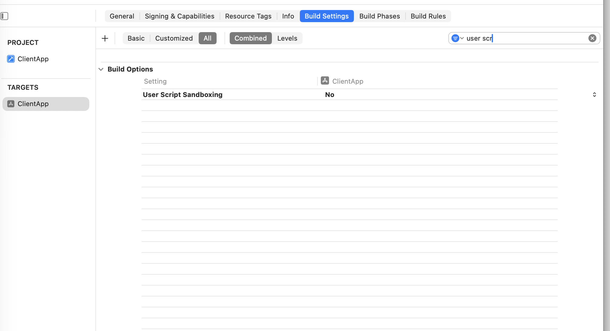
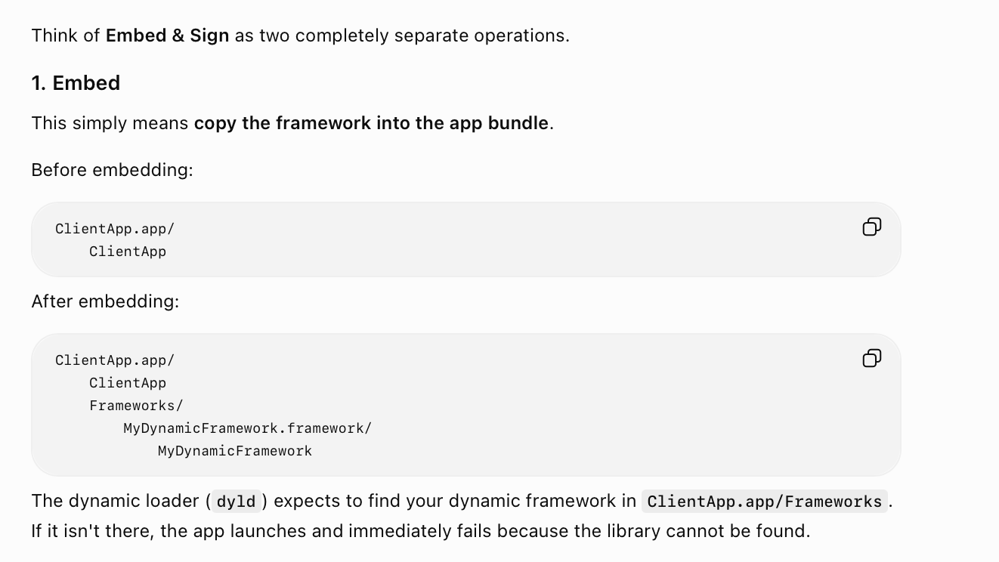
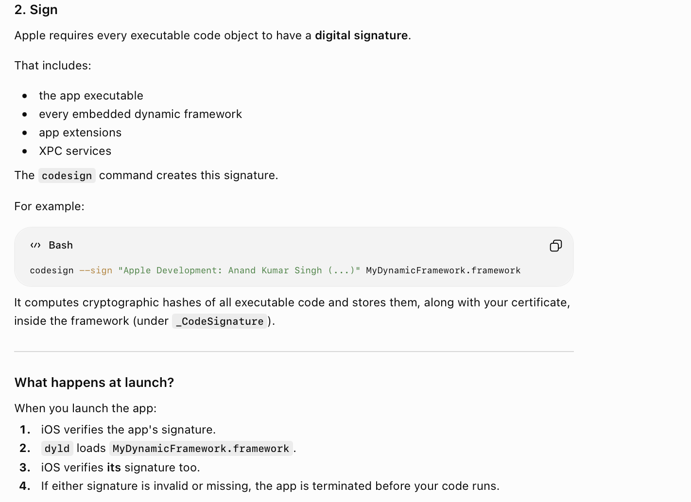
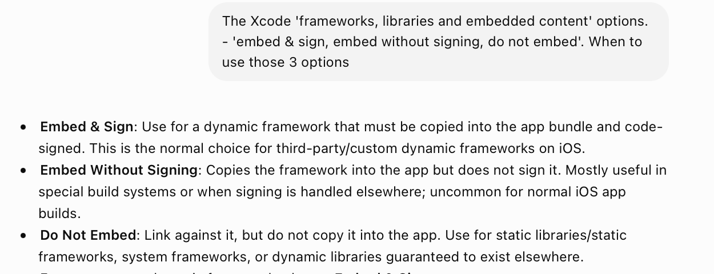

[toc]

##### Steps I could make it work with

> 👇 The below is what I did to have the two different architecture frameworks together, it disables 'user sandboxing' and it worked. That is not something that can be done for release builds, but this gave good insights into the process. For a single architecture, I think simply adding the framework to 'Link Binary with Libs' would have been sufficient. If I keep at it, I will find a solid release build approach too but its unnecessary as this has now been replaced by xcframeworks.

1. I have two .frameworks, one built for simulator and another for device. Place them in workspace file system.

2. (Probably missed mentioning but - The framework might also need to be added in Link Binary with Libraries and embed and sign. May be, I have not mentioned this is that this was giving issues for sim + device and the subsequent Run Script Phase below does the same thing manually.)

3. Set conditional paths in Build Settings → **Framework Search Paths** pointing to them. <br>

   ```
   FRAMEWORK_SEARCH_PATHS[sdk=iphoneos*] = $(PROJECT_DIR)/MyDynamicFramework/iphoneos
   FRAMEWORK_SEARCH_PATHS[sdk=iphonesimulator*] = $(PROJECT_DIR)/MyDynamicFramework/iphonesimulator
   ```

   

4. Add '-framework MyDynamicFramework' to Build Settings → **Other Linker Flags**. <br><br>

5. Create a **Run Script** phase that itself does the **Embed & Sign** steps for the framework <br>

   ```
   set -euxo pipefail
   SOURCE="${PROJECT_DIR}/MyDynamicFramework/${PLATFORM_NAME}/MyDynamicFramework.framework"
   DEST="${TARGET_BUILD_DIR}/${FRAMEWORKS_FOLDER_PATH}"
   mkdir -p "$DEST"
   ditto "$SOURCE" "$DEST/MyDynamicFramework.framework"
   ls -la "$DEST/MyDynamicFramework.framework"
   
   # Sign only for device builds
   if [[ "$PLATFORM_NAME" == "iphoneos" ]]; then
       /usr/bin/codesign \
           --force \
           --sign "${EXPANDED_CODE_SIGN_IDENTITY}" \
           --preserve-metadata=identifier,entitlements \
           "$DEST/MyDynamicFramework.framework"
   fi
   ```

   <br>

6. Turn off **User Script Sandboxing** which otherwise blocks certain steps in above script. <br>


##### Misc. - Other Linker Flags syntax

Its interesting, it looks like the syntax is that any static lib has to be mentioned as `l<STATIC_LIB_NAME>` and any dynamic framework has to be mentioned as `-framework <DYNAMIC_FRAMEWORK_NAME>` and it should not be mentioned in one row but instead in consecutive rows.


##### What really is 'Embed & Sign'

**Embed** basically means copying the framework into app's bundle (i.e. .app) and **Sign** means giving a digital signature. Its a required step for frameworks. This can be done through a script as well FWIW (done in above script).





##### Embedding options - 'Embed & Sign', 'Embed without Signing', 'Do not Embed'



##### What does a dynamic framework look like in a .app

It looks like this

```
├── __preview.dylib
├── _CodeSignature
│   └── CodeResources
├── Base.lproj
│   ├── LaunchScreen.storyboardc
│   │   ├── 01J-lp-oVM-view-Ze5-6b-2t3.nib
│   │   ├── Info.plist
│   │   └── UIViewController-01J-lp-oVM.nib
│   └── Main.storyboardc
│       ├── BYZ-38-t0r-view-8bC-Xf-vdC.nib
│       ├── Info.plist
│       └── UIViewController-BYZ-38-t0r.nib
├── ClientApp
├── ClientApp.debug.dylib
├── Frameworks
│   └── MyDynamicFramework.framework     <-------- The .framework will be there in a Frameworks folder
│       ├── _CodeSignature
│       │   └── CodeResources
│       ├── Info.plist
│       ├── Modules
│       │   └── MyDynamicFramework.swiftmodule
│       │       ├── arm64-apple-ios-simulator.abi.json
│       │       ├── arm64-apple-ios-simulator.private.swiftinterface
│       │       ├── arm64-apple-ios-simulator.swiftdoc
│       │       ├── arm64-apple-ios-simulator.swiftinterface
│       │       ├── arm64-apple-ios-simulator.swiftmodule
│       │       └── Project
│       │           └── arm64-apple-ios-simulator.swiftsourceinfo
│       └── MyDynamicFramework
├── Info.plist
└── PkgInfo
```

Also, inspecting the app executable will list something like list something like `@rpath/<FRAMEWORK_NAME>.framework/<FRAMEWORK_NAME>`.

##### Resources

Importing a dynamic framework ([ChatGPT link](https://chatgpt.com/g/g-p-6934bcdfcafc819182baa9435e044320-swift-programs/c/6a56c854-703c-83ea-9f42-231e029f0825)) <br>Dynamic framework inside a .app ([ChatGPT link](https://chatgpt.com/g/g-p-6934bcdfcafc819182baa9435e044320-swift-programs/c/6a5985fb-f178-83ea-a43e-3c741402838a))