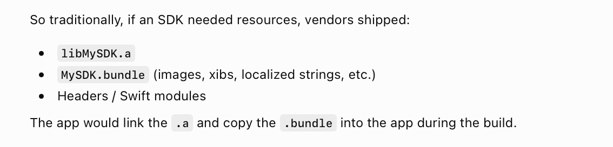
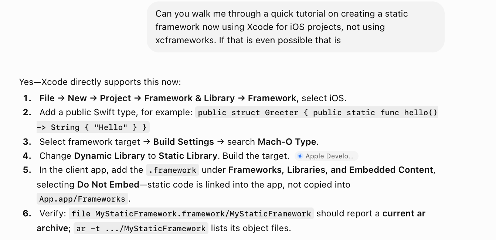

Didn't really try creating, but here is the gist and history.

- Apple didn't initially want people to be creating static frameworks, there reasoning what that it looks very similar to Dynamic frameworks and can be confusing for developers (and the build systems too).
- If people did want a static lib but also wanted images along with it, the recommended approach was to create a static lib, and then another .bundle for the resources and consuming apps would link the .a and copy the .bundle into the app during the build.   
- When xcFrameworks were introduced in ~2019, putting static framework inside them has become lot more standardized.
- However you can still create a static framework if you want to, you'd have to create a dynamic framework in usual way and then change the Mach-O Type in Build Settings to Static Library. And then while using it, make sure to have the .framework as 'Do Not Embed'.   

[ChatGPT link](https://chatgpt.com/g/g-p-6934bcdfcafc819182baa9435e044320-swift-programs/c/6a585191-91bc-83ea-bcfb-21bc6f695884)