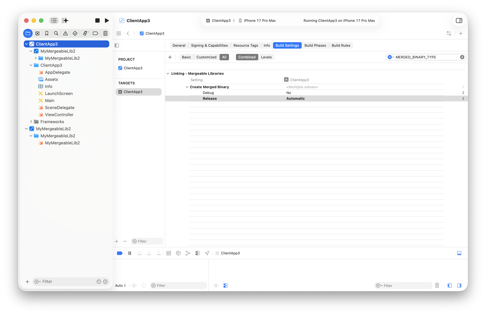
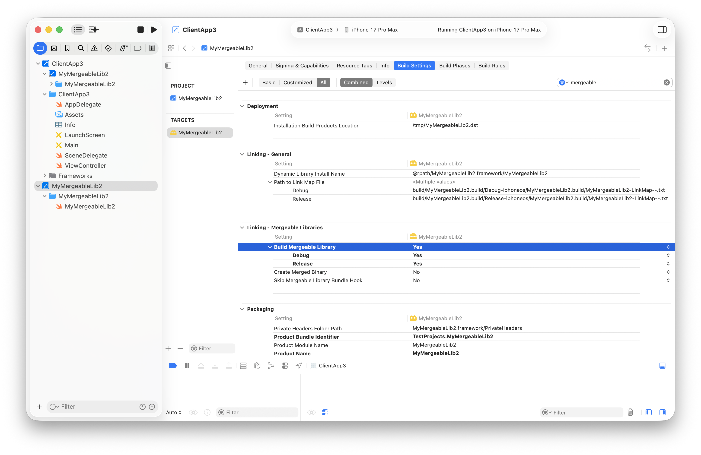
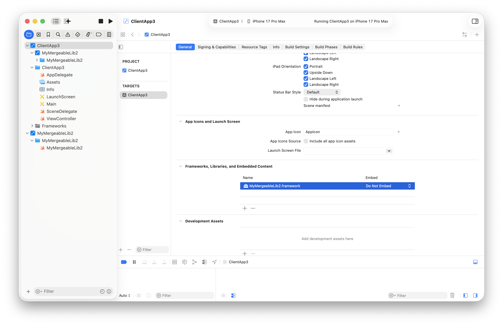
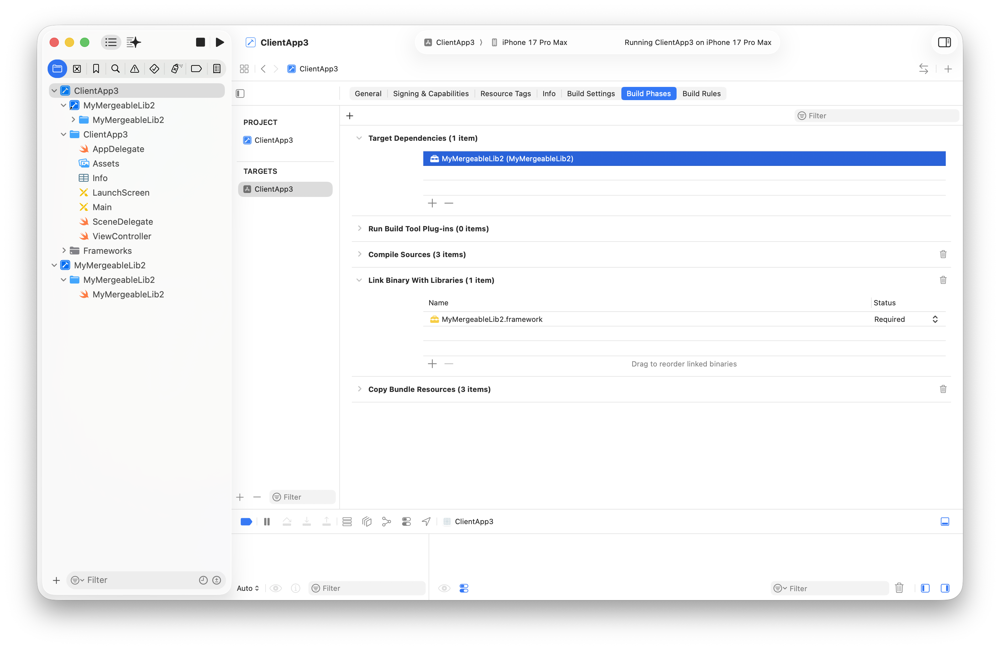
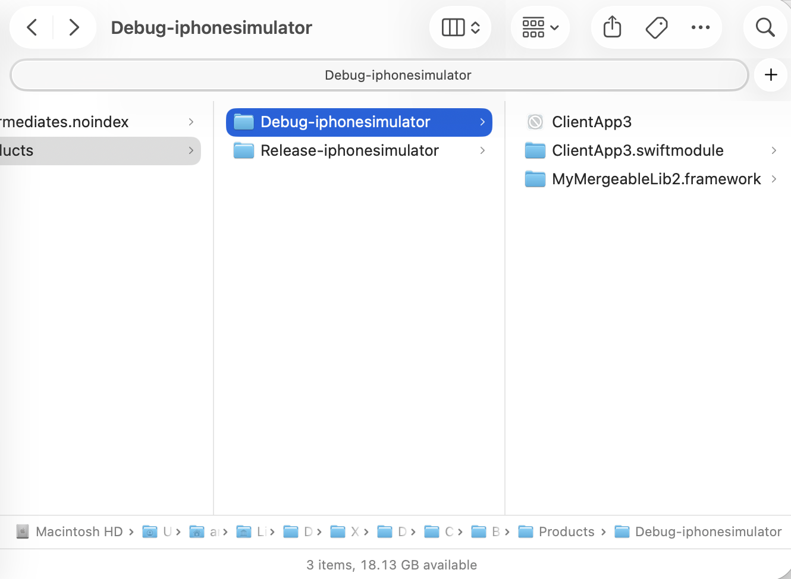
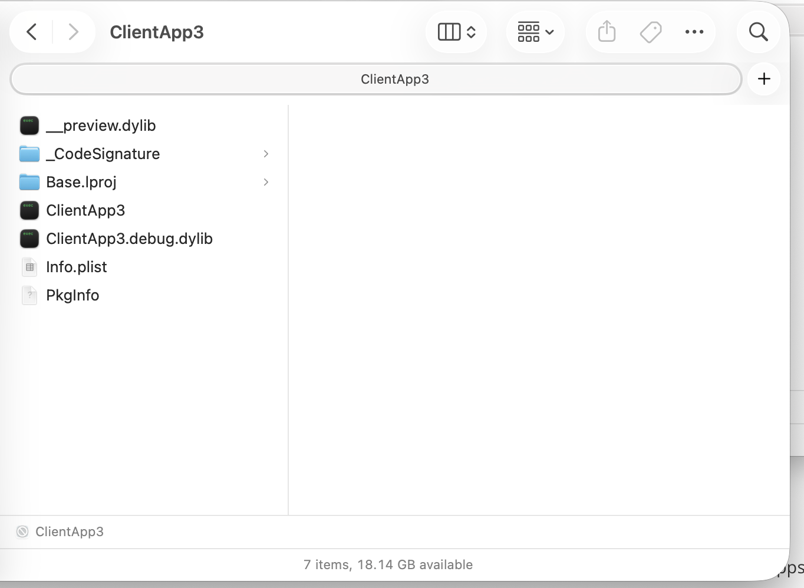
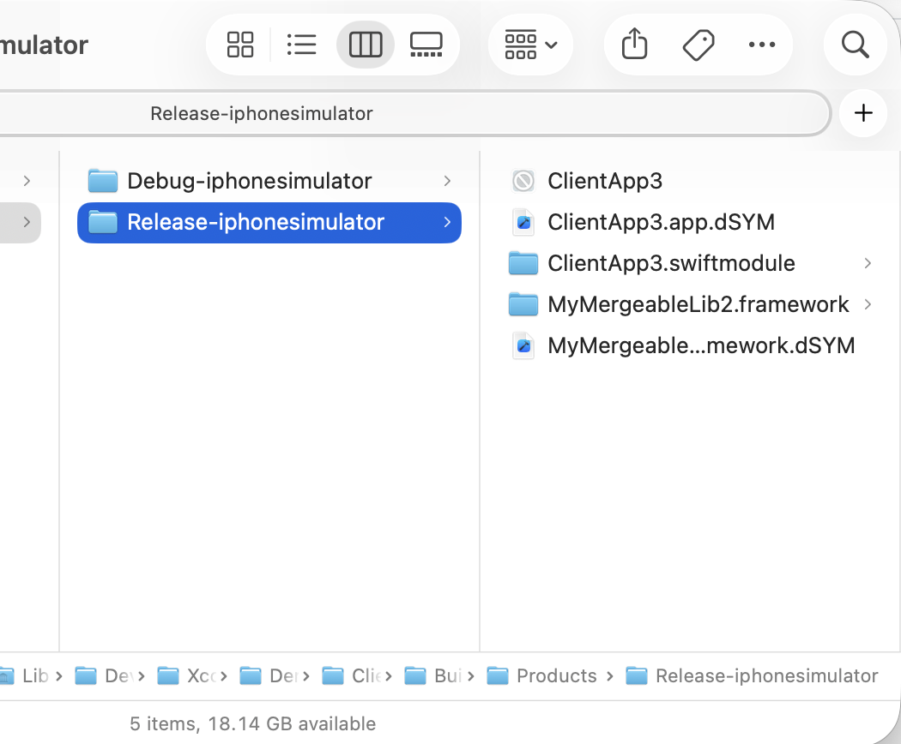
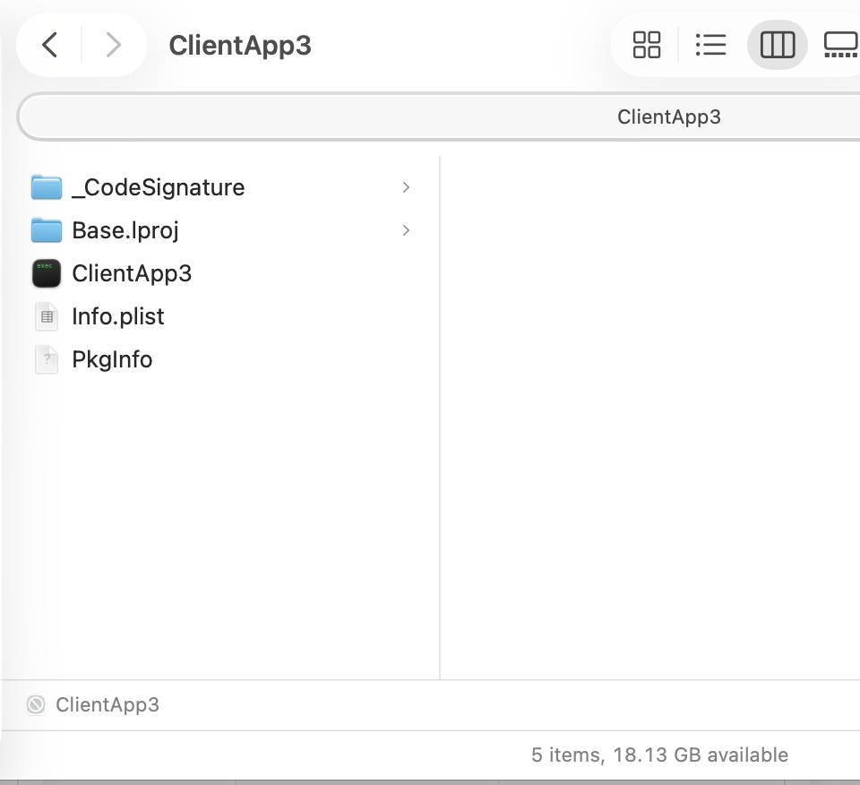
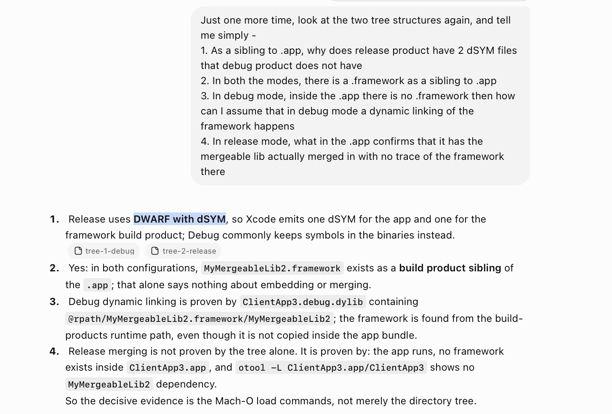

[toc]

##### What are Mergeable Libs

The idea with **Mergeable Libraries** is that its built like a dynamic framework (with some special flags enabled) but then the consuming app will have the ability to use it as a static lib for release builds. 

Meaning in debug config it will indeed be included as a dynamic framework (implying faster compilation) but in release config it will be include as a static lib (implying faster app launches).

So the USP is that this can be really useful if a workspace has multiple extensions which use the same library. You 'would' want to have a quick compilation time by using dynamic linking in dev but then also a quick 'launch' time in production by obviating static linking in release.

> 👉 The catch though seems to be that based on what I have seen this actually works only if the framework is actually included in the same workspace as the client app and also included as a target dependency for the client app.

##### Creating and Using Mergeable Lib

1. Create a workspace

2. Create an iOS app and add it to that workspace. Set its to **Build Setting > Create Merged Binary** to **Automatic**.  

3. Create a dynamic framework, add the  framework to the workspace. Set its '**Build Setting > Build Mergeable Library**' to Yes.   

4. Add the dynamic framework to the iOS app under **Frameworks, Libraries, and Embedded Content**, mark as **Do Not Embed**, and also add it as a **Target Dependency**. 

   | Do Not Embed                                                 | Target Dependency                                            |
   | ------------------------------------------------------------ | ------------------------------------------------------------ |
   |  |  |

   

##### Inspecting the .app

With the above setup run the app in debug mode first and then in release mode. Their two .apps will have these structures.

For Debug .app

| .app siblings                                                | Inside .app                                                  |
| ------------------------------------------------------------ | ------------------------------------------------------------ |
|  |  |

For Release .app

|                                                              |                                                              |
| ------------------------------------------------------------ | ------------------------------------------------------------ |
|  |  |

Notice how the debug mode .app has a .dylib in it, where as the release mode .app doesn't. That itself is an indication that the mergeable lib is working the way its supposed to. The surest verification is done through otool on the binary though.

##### Resources

Creating and using Mergeable Lib in same workspace - [ChatGPT link](https://chatgpt.com/g/g-p-6934bcdfcafc819182baa9435e044320-swift-programs/c/6a5bbb3c-8180-83ea-be8c-37e48f7b37e9)  Earlier attempt using separate workspace that didn't work - [ChatGPT link1](https://chatgpt.com/g/g-p-6934bcdfcafc819182baa9435e044320-swift-programs/c/6a59995a-7c7c-83ea-9c2c-70d1bf1dffe5), [ChatGPT link2](https://chatgpt.com/g/g-p-6934bcdfcafc819182baa9435e044320-swift-programs/c/6a5bb1cb-0cdc-83ea-84a5-ce3f21435f91)

Test workspace - MergeableLibDemo/ClientApp3.xcworkspace