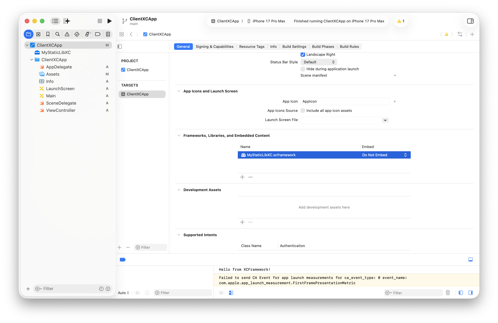
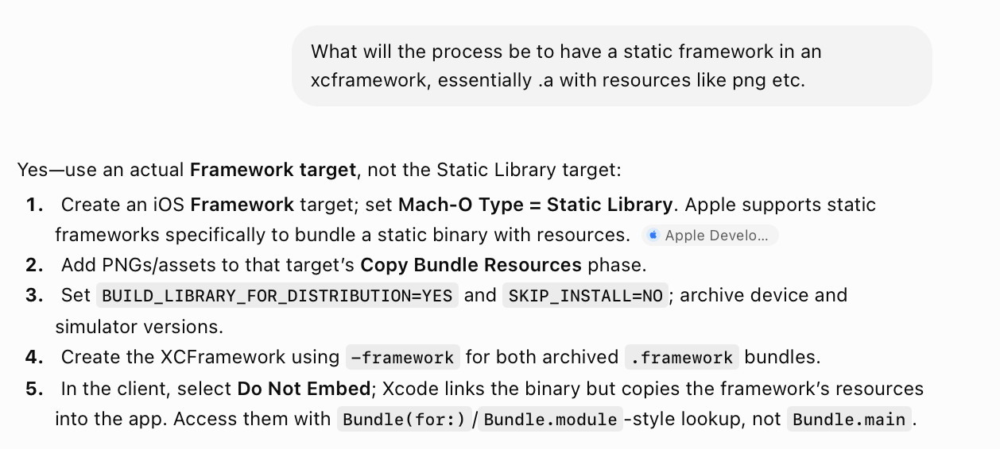
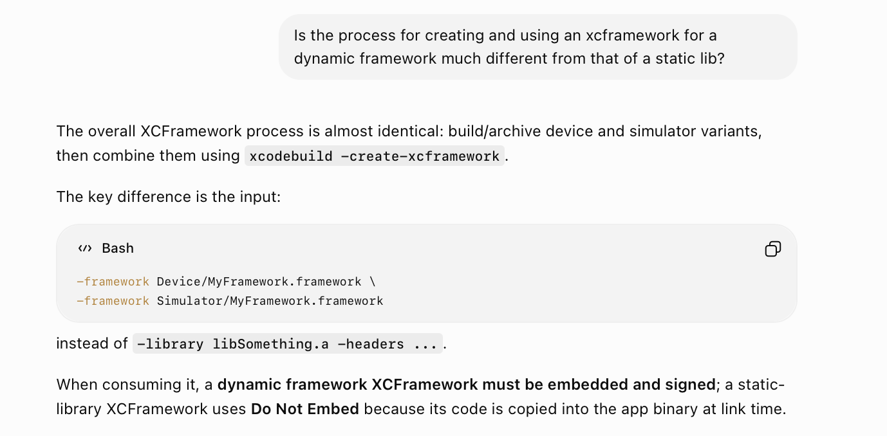
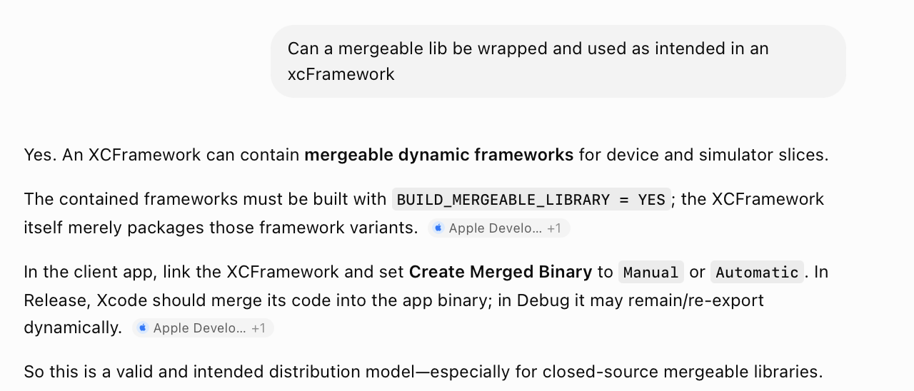
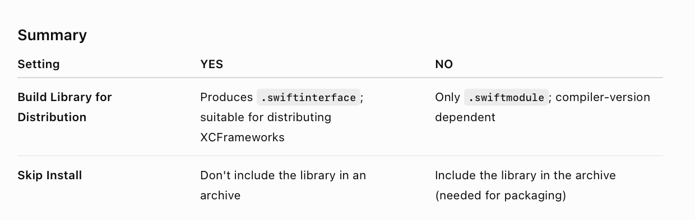

The basic idea with xcframeworks is simple. It allows you to easily combine together a lib/framework's multiple architecture slices without needing a fat library through lipo etc. And using it is easy too.

##### Generating and using static lib xcFramework

Basically, when working with static lib.

First have the static lib project, and then create **xcarchives** from it for both platforms (you could also do a build for both platforms and then get hold of the generated .a from 'Derived Data', it is just that xcarchive is more clean as you don't need to look up Derived Data)

```
xcodebuild archive -project MyStaticLibXC.xcodeproj -scheme MyStaticLibXC \                               
-destination "generic/platform=iOS Simulator" \
-archivePath "./archives/Simulator" \        
SKIP_INSTALL=NO BUILD_LIBRARY_FOR_DISTRIBUTION=YES
```

```
xcodebuild archive -project MyStaticLibXC.xcodeproj -scheme MyStaticLibXC \                               
-destination "generic/platform=iOS" \
-archivePath "./archives/iOS" \        
SKIP_INSTALL=NO BUILD_LIBRARY_FOR_DISTRIBUTION=YES  
```

And then generate the xcframework using -library option.

```
xcodebuild -create-xcframework \
-library "./archives/iOS.xcarchive/Products/usr/local/lib/libMyStaticLibXC.a" \
-library "./archives/Simulator.xcarchive/Products/usr/local/lib/libMyStaticLibXC.a" \
-output "./MyStaticLibXC.xcframework"
```

Then using the xcframework in a client project is simply a matter of dragging it in there (have it as 'Do not embed' as that is what is needed for a static lib anyway, dynamic framework would have required 'Embed & Sign')



##### Generating and using static framework xcFramework

Will be the obvious process. Create a static framework (using dynamic framework template and changing its Mach-O type to Static Library), add assets in Copy Bundle Resources phase, and then create and use xcFramework the usual way.



##### Generating and using dynamic framework xcFramework

Its actually pretty similar to that of static lib. The option will obviously be **-framework** and then while using it should be **& Sign**.



##### Generating and using mergeable lib xcFramework

So this too looks like is usual and will work as expected.



##### Build Settings - 'Build Library for Distribution' and 'Skip Install'

'Build Library for Distribution' being on generates a **.swiftinterface** too in xcframeworks and ensures that same xcframework will work across clients with different Swift compiler version. 

'Skip Install' being off ensures that while making xcarchive the library/framework is indeed generated in the expected location in '.xcarchive/Products/...' (although why would it ever not I don't know).



> 👉 Always ensure that the generated xcFramework has .swiftinterface too, otherwise there will likely be errors in using later on (esp. when wrapped in a Swift package).

##### Resources

Static Lib xcFramework ([ChatGPT link](https://chatgpt.com/g/g-p-6934bcdfcafc819182baa9435e044320-swift-programs/c/6a5bec05-644c-83ea-aea7-24763d0f546d)) <br>Dynamic Lib xcFramework ([ChatGPT link](https://chatgpt.com/g/g-p-6934bcdfcafc819182baa9435e044320-swift-programs/c/6a5c38cf-4ac4-83ea-a158-85595d17755d)) <br>'Build Library for Distribution' and 'Skip Install' ([ChatGPT link](https://chatgpt.com/g/g-p-6934bcdfcafc819182baa9435e044320-swift-programs/c/6a5c3a69-a954-83ea-8e21-94d3192b8103))