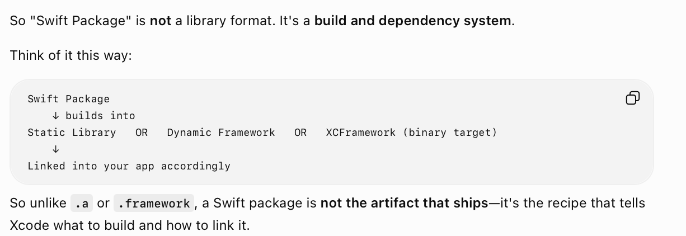
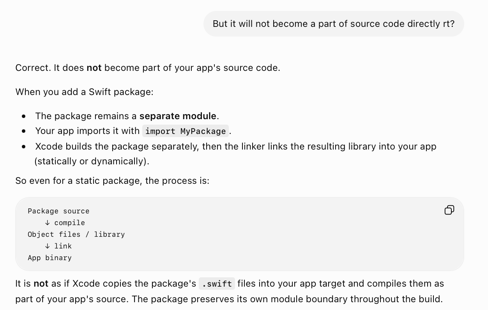
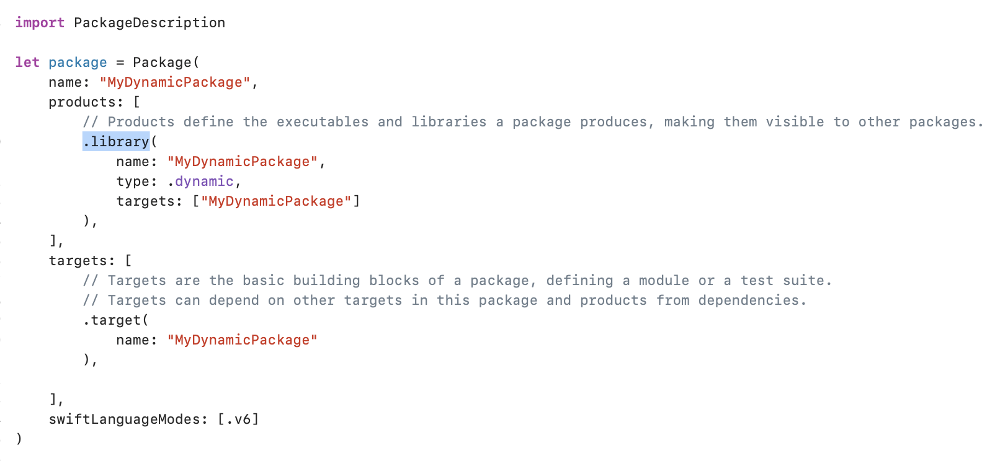
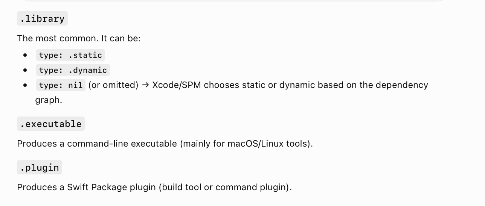

[toc]

##### What is it basically

Essentially its a Cocoapods replacement, a dependency management system that is.

It resolves dependencies itself, downloads their source code, and depending on how its configured, makes them available as static lib or dynamic framework in client app. It can package wrap pre-built xcframework wrapped binaries (i.e. direct .a, or .framework) and make them available in client app.

It does not directly become a part of client codebase, the packages are still wrapped into a lib or dynamic framework and then used in client app, but (unless the package is an xcframework itself) the source code is available to see.

> Mergeable Libs are likely not supported by Swift packages as of ~2026.

##### Package.swift - Output specified in it

The output eventually generated by a Swift package in a client app (i.e. static lib, dynamic framework, or xcframework) is decided by the package provider, and not the client app. The **products** key in Package.swift is what decides it.

##### Package.swift - Allowed products

It can produce static library, dynamic framework, and (outside iOS binaries) executables and Swift Package plugins. It can also produce a librray based on xcFrameworks but that part is declared in Package.swift's targets (and not type in products).

##### Resources

SPM idea overview ([ChatGPT link](https://chatgpt.com/g/g-p-6934bcdfcafc819182baa9435e044320-swift-programs/c/6a5c3d66-8734-83ea-ac2c-58482b77d7d8))  