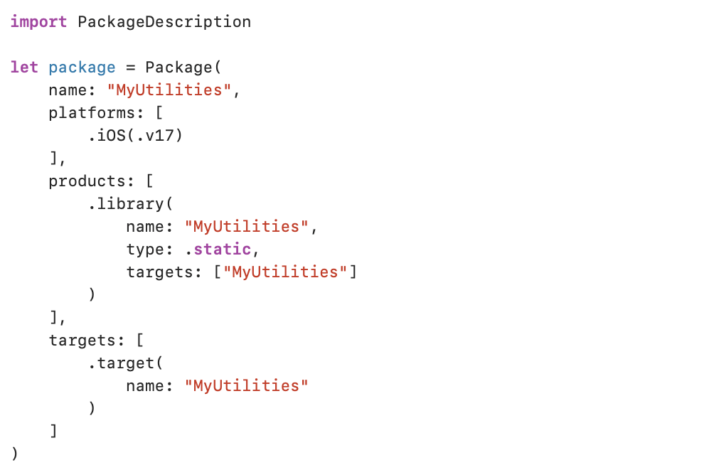
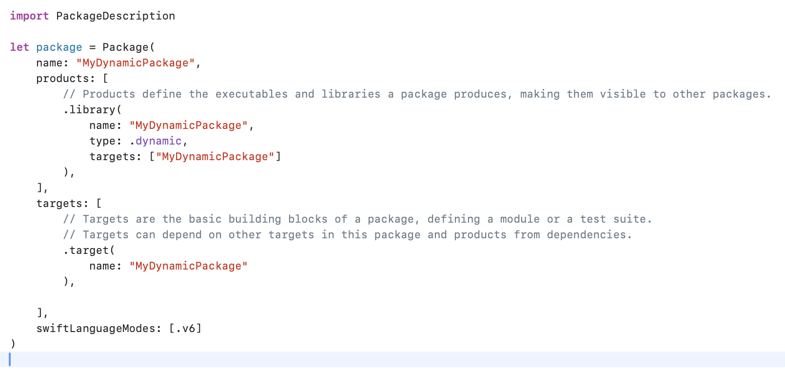
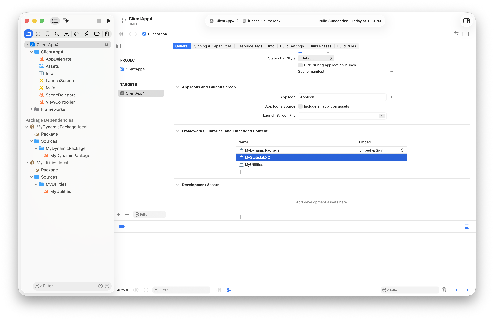
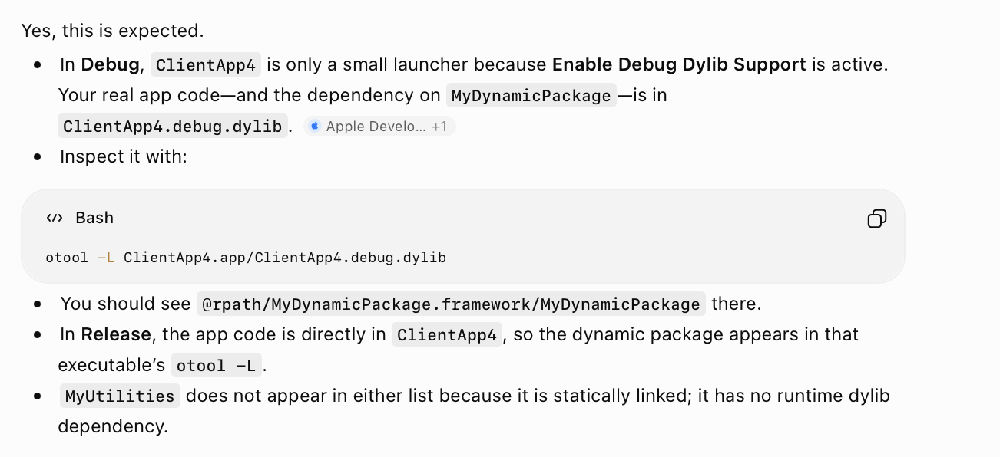
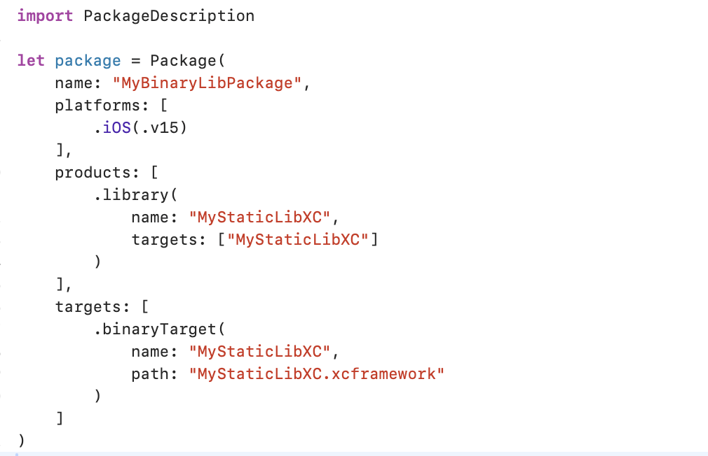

[toc]

##### Creating Static Lib or Dynamic Framework Swift Package

1. Create a new Project - File → New → Package

2. Put the code you want in the Swift files in Sources.

3. In Package.swift - 

   If you want a static lib output, have the product as **.library(.static)**.      If you want a dynamic framework output, have the product as **.library(.dynamic )**.  

##### Using Static Lib or Dynamic Framework Swift Package

Project Settings > Add Package Dependencies > Add the local folder containing the Package.Swift of above lib.framework.  

Ensure the lib from above package shows up in the target's 'Link Binary with Libs' and 'Frameworks, Libs, and Embedded Content'. In case of dynamic framework package, it should be configured as 'Embed & Sign'. 

##### Verifying generated .app

The static lib indeed never appears anywhere explicitly in .app (even otool -L does not return it), thereby indicating its indeed statically linked. The dynamic framework appears in `.debug.dylib` in debug mode, and in .app directly in release config, and all of this is normal too.

##### Creating and Using xcFramework Static Package.

Its actually pretty simple, just make sure that the xcFramework is proper (i.e. something with .swiftinterface).

And then that xcFramework just needs to be put with a Package.swift whose target is **.binaryTarget()** is and then simply adding that package is enough.

##### Resources

Creating and Using Swift packages ([ChatGPT link](https://chatgpt.com/g/g-p-6934bcdfcafc819182baa9435e044320/c/6a5d6d7d-90f4-83ea-9af4-ed0657383421))

Sample Code - SwiftPackages