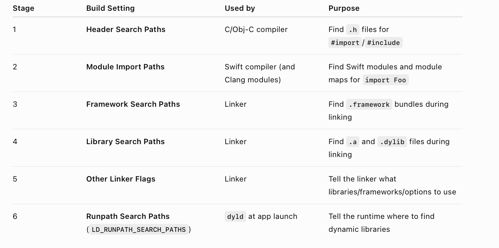
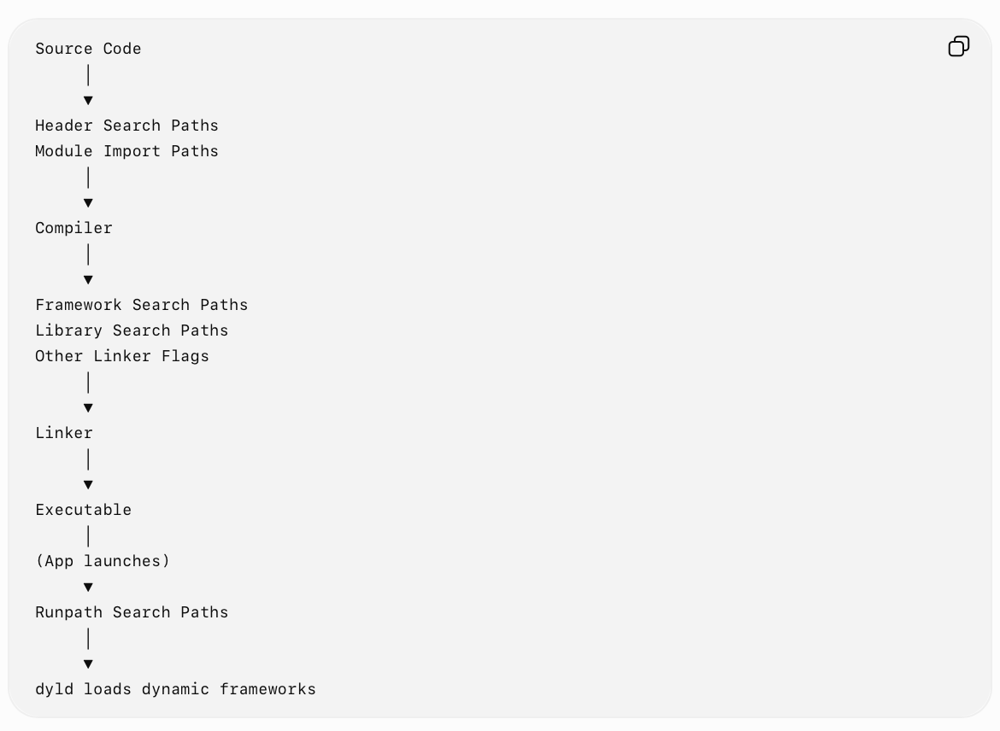

##### Various Settings

Header Search Paths, Module Import Paths  Framework Search Paths, Library Search Paths, Other Linker Flags  Runtime Search Paths 

> Runtime Search Paths is usually the cookie cutter '<EXECUTABLE>/frameworks' path. So I think basically the thing that is happening with 'Embed' step/config for frameworks. 

##### Chronological Order

##### Resources

Build Settings ([ChatGPT link](https://chatgpt.com/g/g-p-6934bcdfcafc819182baa9435e044320-swift-programs/c/6a64c199-27d4-83ea-9352-981d39dfb8fc))