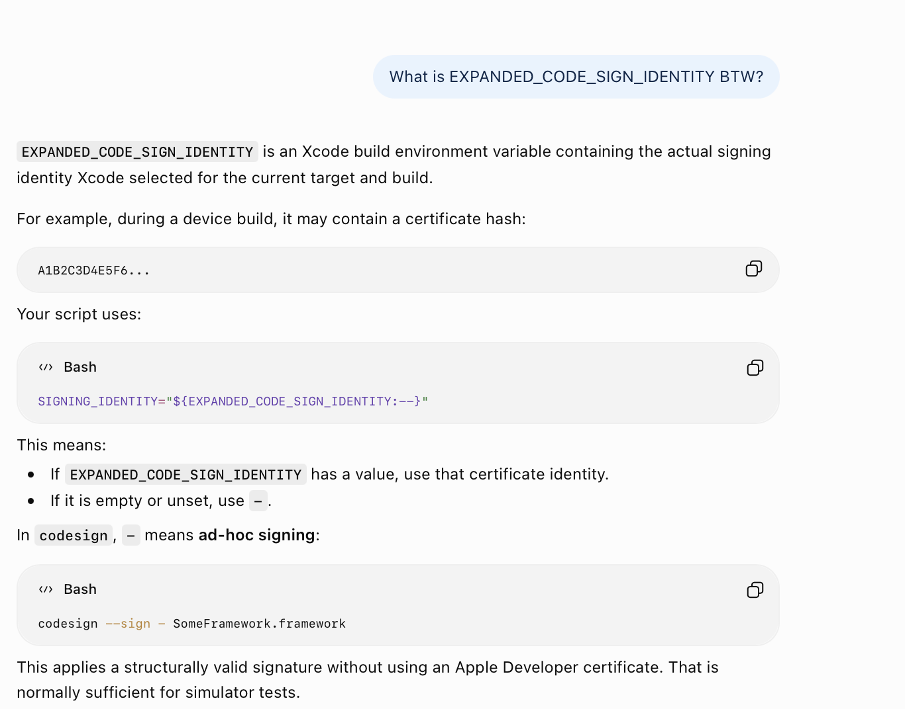
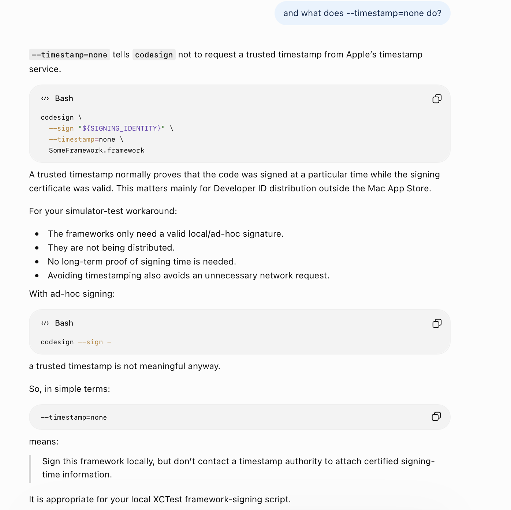

Dynamic frameworks always need to be signed, else loading does not happen.

It can be done using **codesign** executable (which is always there in macOS) and the script is pretty simple for ad-hoc signing that is needed for loading apps in simulator.

```
VENDOR_FRAMEWORK="${BUILT_PRODUCTS_DIR}/VendorSDK.framework"

if [ ! -d "${VENDOR_FRAMEWORK}" ]; then
  echo "error: VendorSDK.framework not found at ${VENDOR_FRAMEWORK}"
  exit 1
fi

SIGNING_IDENTITY="${EXPANDED_CODE_SIGN_IDENTITY:--}"

/usr/bin/codesign \
  --force \
  --sign "${SIGNING_IDENTITY}" \
  --timestamp=none \
  "${VENDOR_FRAMEWORK}"
```






[ChatGPT](https://chatgpt.com/g/g-p-6a92357133908191bd26a40dc7c1a8dd/c/6a9490e3-da60-83ea-93a5-ea2eed37cc16)