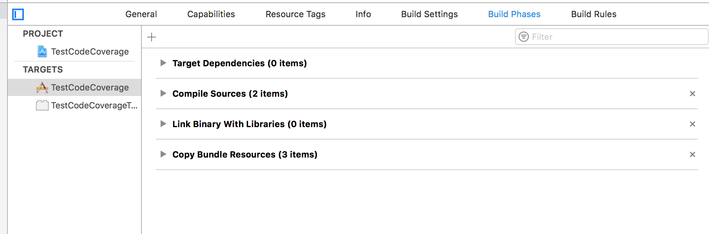
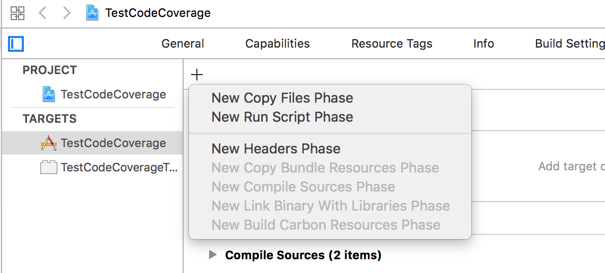
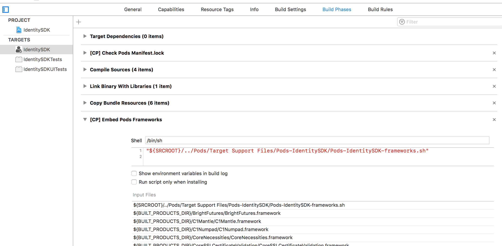
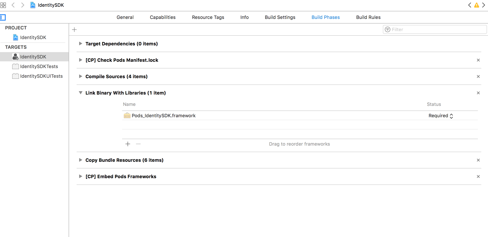

[toc]

Build phases outlines the sequence of tasks to be performed.

##### Standard phases

Four steps that are always there -  1. Target dependencies (this step cannot be removed and its order cannot be changed either)  2. Compile sources  3. Link binary with libraries  4. Copy bundle sources  

In Target dependencies, it is told what dependencies must be built before build of current target starts. For Cocoapods though, I have seen that this phase is typically empty.

Compile sources has a list of all the files that need to be compiled.

Link binary with libraries section lists all static and dynamic libraries that are to be linked with the object files generated by compilation in the previous step. (But if something is a dynamic framework how can it already be linked to other object files. Isn't that the entire point of dynamic frameworks, that it actually gets linked at load time.)

Copy bundle sources is nothing but copying over of static resources, like images, etc. And truly, even as per the build logs this happens in the end.

##### Adding custom phases

New custom phases too can be added here. They all generate different kind of templates. And the thing to note is that these custom phases can actually be positioned anywhere in the entire build phase sequence (other than before 'Target Dependencies'), just drag and move.

In Cocoapods configured project, some custom steps always get added. There is 1 early step for copying manifest.lock and another later step for embedding pod frameworks. All of these are essentially custom shell scripts with some input and output files.

So the thing about a Cocoapods configured project is that Cocoapods eventually generates a single `Pods_xyz.framework` for the main target to include. This framework has all the dependencies in it.

