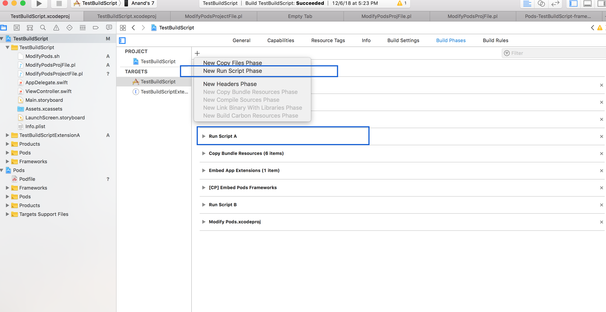
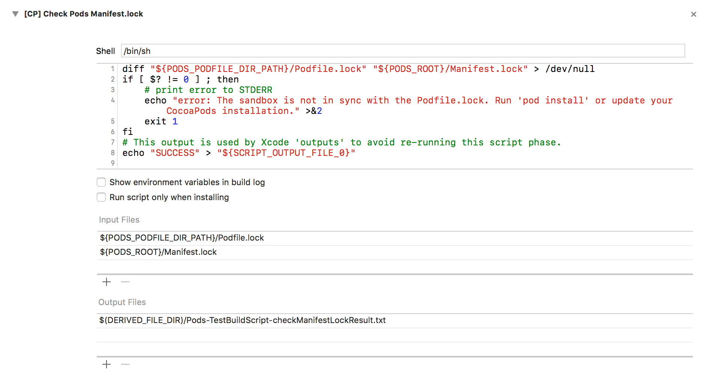
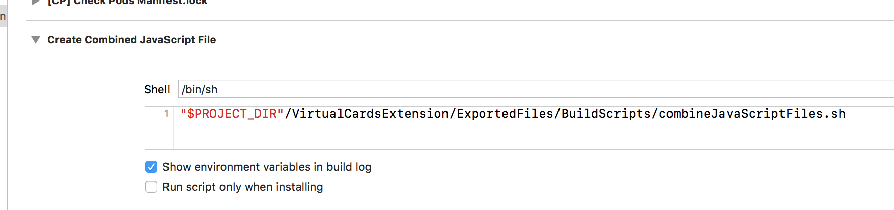
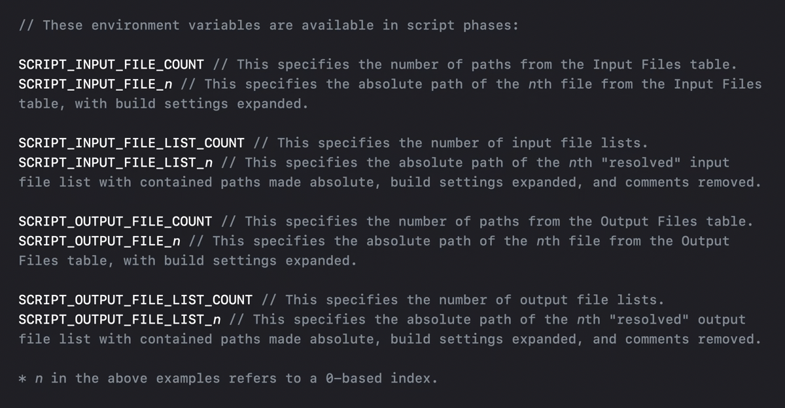
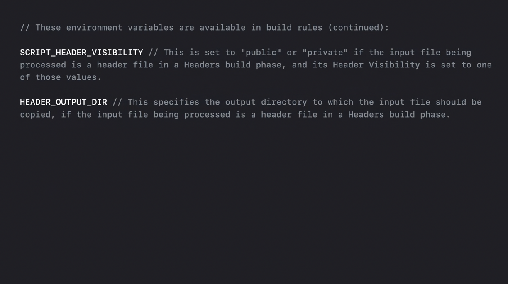
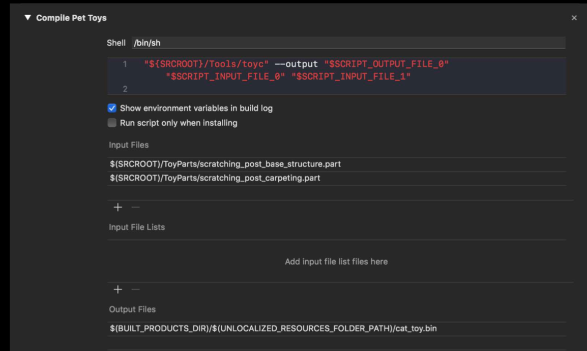
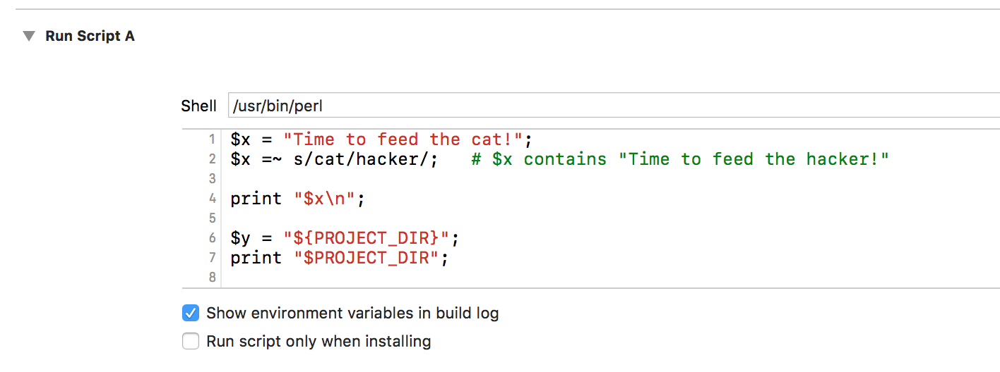
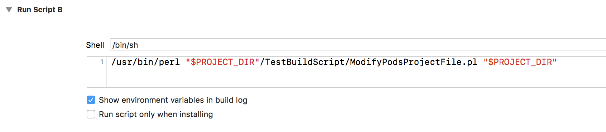

[toc]

> These are also covered in great details in 'WWDC 2021: Explore advanced project configuration in Xcode' 6:30 onwards.

It's possible to add custom shell scripts in Build Phases. They can be even dragged and positioned to any position (apart from being made the first item in BuIld Phases, i.e. they cannot precede target Dependencies phase.)

##### Usual way to add a script

The script language by default is `/bin/sh` and the script itself is usually present in the the same Build Phases UI.

However a better way is to put the script in a separate file and then refer to it in the Build Phases UI. This also makes it easier to manage in source control as its a separate file and this way the pbxproj file too does not have to change every time there is some change in the script.

> Keep in mind that every target gets built no matter which one you are actually building yourself. So even an error in an extension's build script will cause a failure if the main app is being built.

##### Making it an executable

> If the script is not an executable, the you may also have to declare it as executable by also including `chmod +ux <filepath>`

##### Environment Variables

Xcode make quite a few details about the project repository available to scripts via Environment variables.

In usual shell script, they can be accessed by `$ENV_VARIABLE_NAME`. Its important to have them (such as `$SRCROOT`) enclosed in parentheses as otherwise any whitespaces in the project directory will cause the script to error out and fail the build process.

`PROJECT_DIR` - Gives path of the project directory.

Environment variables I | Environment variables II
--- | ---
 | 

To print an environment variable, plain `echo "$ENV_VAR_NAME"` can be used inside a run script phase. It will be printed in the build logs.

##### Inputs and Outputs

If input file and output files are manually specified then Xcode is smart enough to run the script only if needed.

The script will run only if any of these is true
1. The output file does not even exist
2. Any of the input files have changed

Also, the number of input files and number of output files are made available by environment variables `{SCRIPT_INPUT_FILE_COUNT}` and `{SCRIPT_OUTPUT_FILE_COUNT}`. And then all the files themselves can be accessed by files such as `{SCRIPT_INPUT_FILE_0}`, `{SCRIPT_OUTPUT_FILE_1}`, etc.

If no input and output files are provided, then of course the script is run every single time a build is done.

The file list can now also be provided in `xcfilelist` files. These files cannot be modified during build process.

> Keep in mind that a few weird things still happen. For example, script may run even if nothing has changed but no file operations will be executed by it. Largely though it works. If is supposed to run, it does run. [link](https://indiestack.com/2014/12/speeding-up-custom-script-phases/)

##### Using Perl scripts

To use a Perl script by giving the entire script in UI, `/usr/bin/perl` must be specified as the Shell.

To use a Perl script by specifying the script file name, the executable to be used the script (i.e. `/usr/bin/perl`) has to be specified in the description. Also, shell must be left as `/bin/sh`
> Understand that this description effectively becomes  what gets run as a terminal command.

> However with this way the environment variables must be passed to the script explicitly and one by one. (As seen above.)

Test codebase - `\51. Terminal Commands\TestBuildScript`
