[toc]

Build settings has plenty of options for tweaking a whole set of things during the build.

Remember that Xcode inspector itself gives some explanation regarding every build setting.

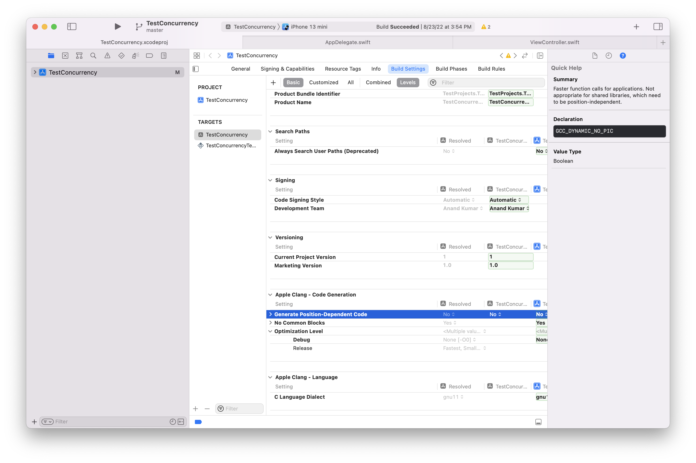

##### Viewing settings names

It's possible to see the actual setting names instead of titles using the menu option `Editor > Show Settings Name`. Alternatively, if a setting is copy-pasted to a text editor, the actual setting name is shown.

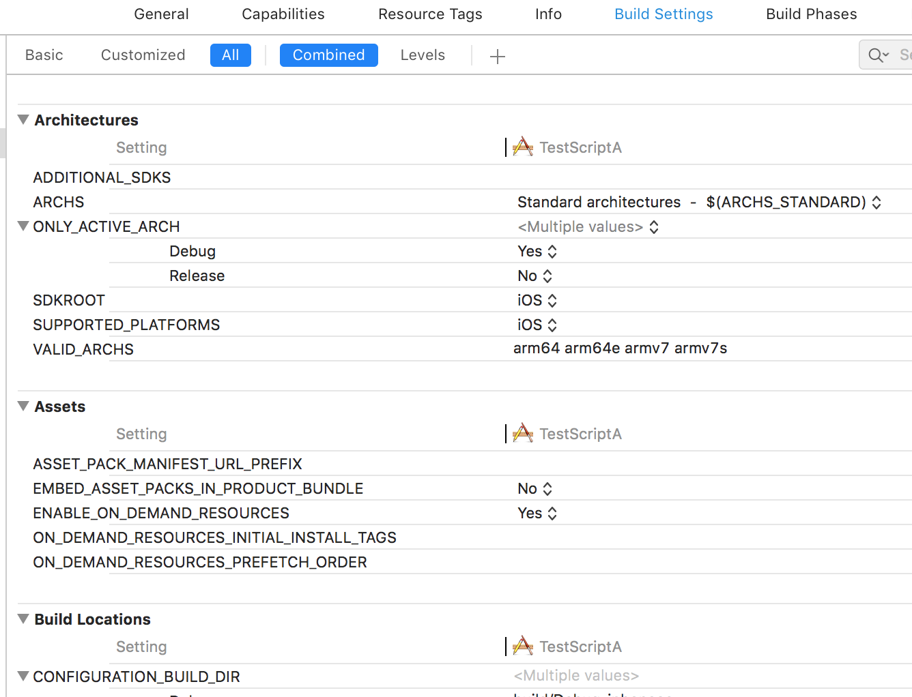

##### Resolving the value for a Build Setting

Build settings are defined at multiple levels which can be visualized by clicking on the `Levels filter`. Each column represents a different level a build setting can be defined in, and they are evaluated from the right to the left. Starting from the lowest level there is the default value, which is defined by the currently selected SDK, the project level configuration settings file, the project level settings from the Xcode project file, target settings defined in a configuration settings file, the target level settings defined in your Xcode project file, and finally, the resolved value of the build setting. Note that if there is a bold setting that denotes that the level has an explicit value for the build setting.

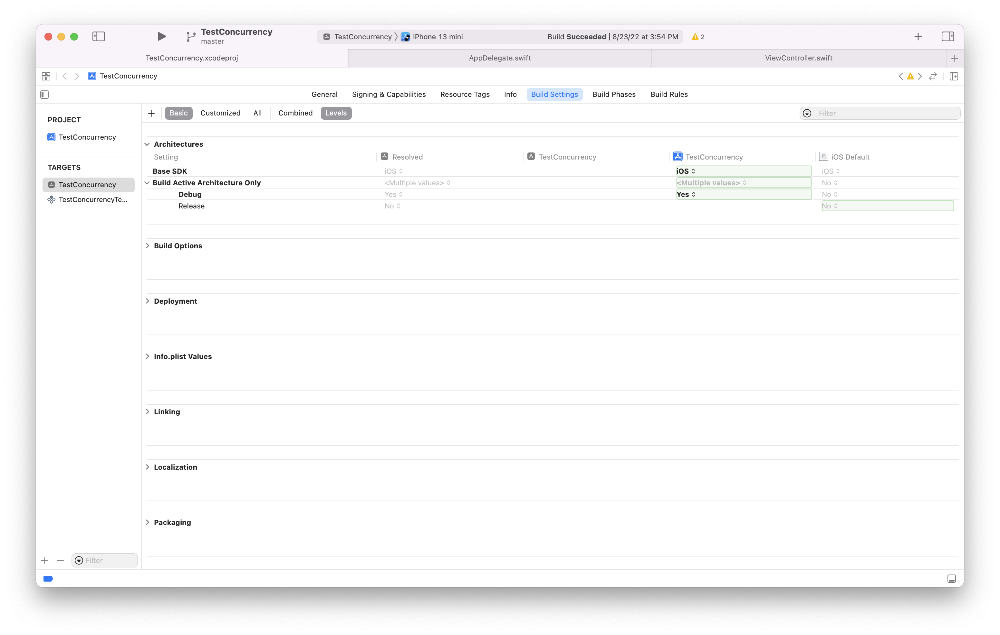

##### Various categories of Build settings

Snippet 1 | Snippet 2
--- | ---
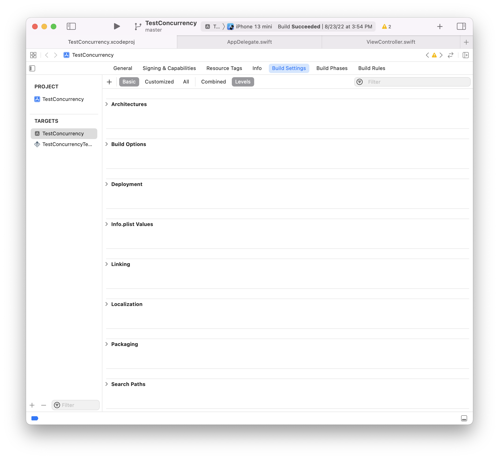 | 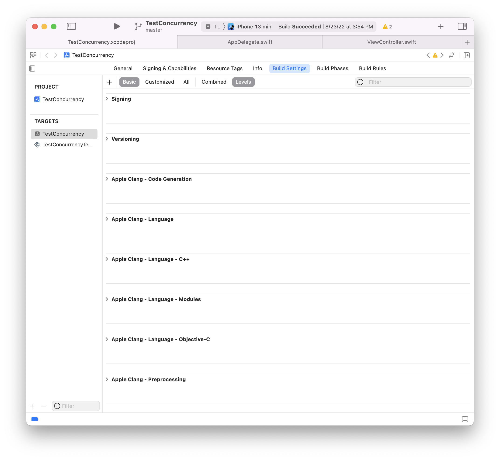

Snippet 3 | Snippet 4
--- | ---
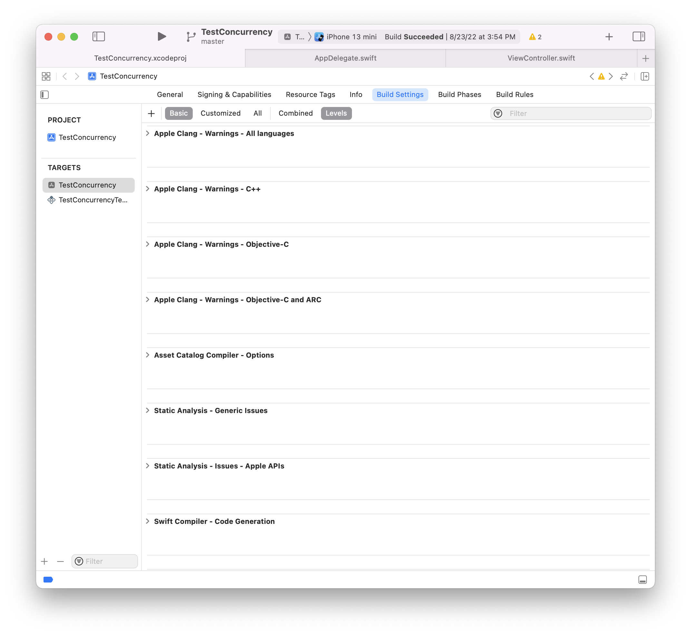 | 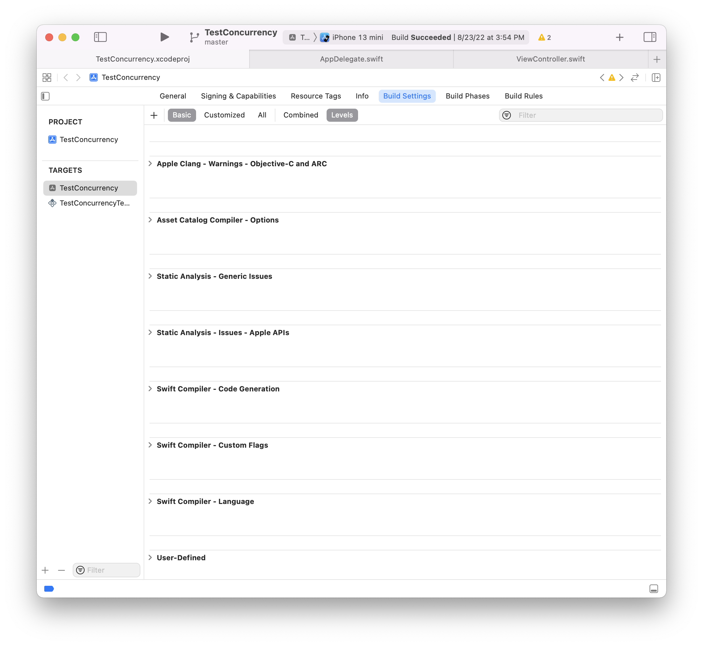

##### Common settings

`Base SDK` - Specifies what iOS SDK version to use for building.

`Compiler flags` - It's possible to add specific flags from build settings which can even be checked in code during compilation. So what it means is that these flags can even be used to determine in code what part of the code should be compiled and what should not.

`Active Compilation Conditions (SWIFT_ACTIVE_COMPILATION_CONDITIONS)` is the setting that can be used to add precise custom flags.

The catch with this flag though is that it should be used in a way where every line individually is still valid. So just a function declaration wrapped in a this flag will not compile. ([link](https://stackoverflow.com/a/27805852/1135417))

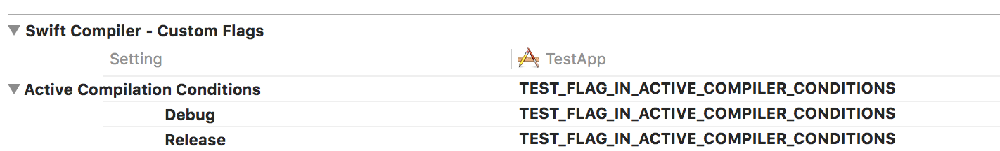

`Other Swift Flags (OTHER_SWIFT_FLAGS)` is another setting that can be used (it has existed since a longer time), but the catch with that is that all the flags added here need to be prefixed with `D`.

> Test and add screenshots for this

In code the presence of these flags can be checked like this.

```
#if TEST_FLAG_IN_ACTIVE_COMPILER_CONDITIONS
    print("Custom flag is present")
#else
    print("Custom flag is not present")
#endif
```

> This can be used very effectively in case you are using some API forbidden in extensions and do not want it to be compiled for extensions (say same file is used in both targets).<br> The catch though is that if same framework needs to be used across the main app and an extension, there seems to be of course no way for the framework to know at compile time that whether it should be compiled for main app or extension.

> `Preprocessor Macros` that have a similar effect as compiler flags can be used with Objective-C code, not Swift.

Custom build settings can also be created using `+ -> User Defined Settings`. This setting's value then becomes available in Info.plist and can be put in a new key there, the key's value is then available in code using `Bundle.main.infoDictionary?["CUSTOM_BUILD_SETTING"]`.

| Custom setting in Build Settings                             | Can be accessed by Info.plist                                | And then from code                                           |
| ------------------------------------------------------------ | ------------------------------------------------------------ | ------------------------------------------------------------ |
| 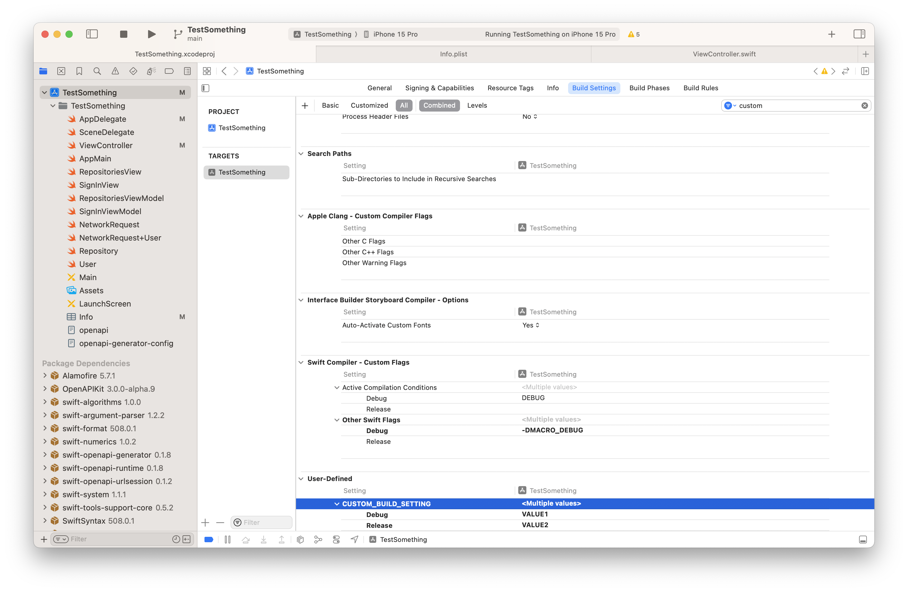 | 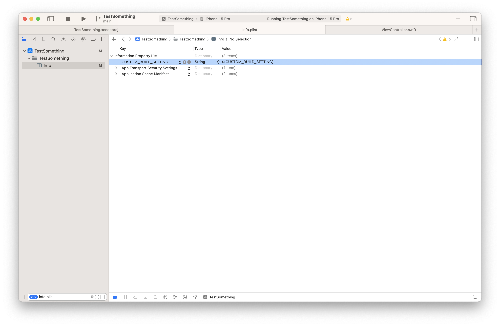 | 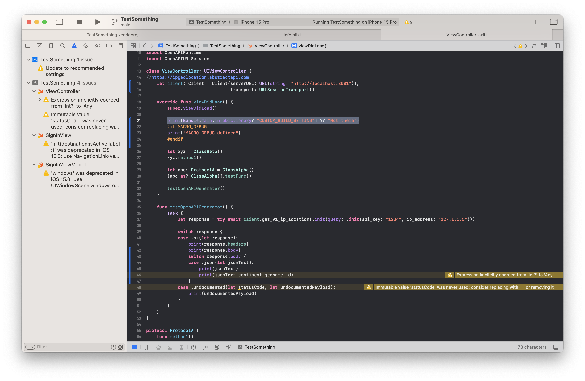 |

`Link Frameworks automatically (CLANG_MODULES_AUTOLINK)` - Introduced around Xcode 8, this is the setting which allows you to not have to explicitly link system (or any for that matter) frameworks (such as Foundation, UIKit, etc.) that you are using in the project in Link Binary with Libraries phase. The build system instead does it automatically. This however should be used only for system frameworks and not custom frameworks (which should continue to be specified explicitly).

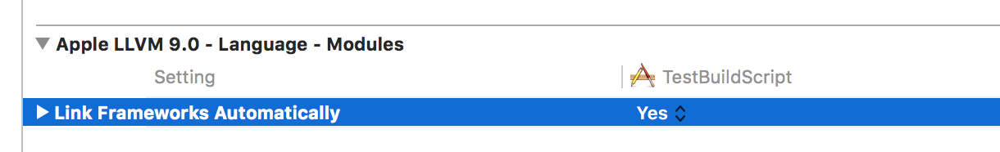

`Enable Clang Modules Debugging (CLANG_ENABLE_MODULE_DEBUGGING)` - Apparently this is the setting that enables Clang Modules. It is true by default.
> If this is turned off, how to visually know that clang modules are not being used during the build process?

`Other Linker Flags (OTHER_LDFLAGS)` appears to be a way to provide some specific flags while linking static libraries/frameworks. Different flags have different purposes. <br>

`-ObjC` I think causes Objective-C categories to be discoverable (apparently its not by default) [Link](https://developer.apple.com/library/archive/qa/qa1490/_index.html) <br>

`-all_load` causes all symbols from the static libraries to be included. It isn't done by default as pulling in all symbols causes executable size to increase. Normally the linker only pulls in an object file from a static library if doing so would resolve some undefined symbol. [Link](https://developer.apple.com/library/archive/qa/qa1490/_index.html)<br>

`-lc++` is another flag (Clearly something to do w C++ files, what?)
So if a custom static library is included and it needed some special flag, this is where it would need to be specified.

`Compilation Mode (SWIFT_COMPILATION_MODE)` -
Until Xcode 9, used to be set as `Incremental` for Debug configuration but is not needed Xcode 10 onwards and can be left as `Whole module` (or even deleted altogether). Not too sure on what it is but apparently improved build timings for fresh builds (but not for incremental builds).

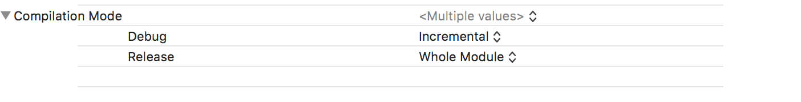

`Swift3 Objc Inference  (SWIFT_SWIFT3_OBJC_INFERENCE)` -

Determines the level to which ObjC availability must be inferred for Swift properties, methods, etc. even when no @objC qualifier has been explicitly given. More details in
Objective-C interoperability note.
