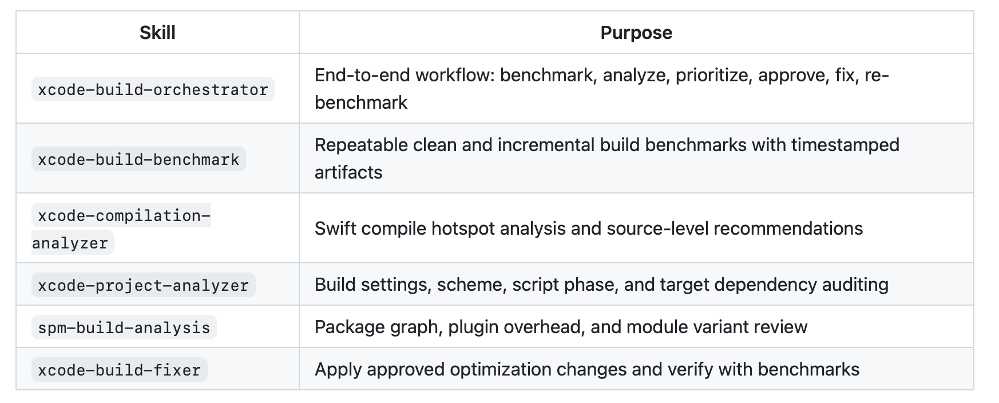
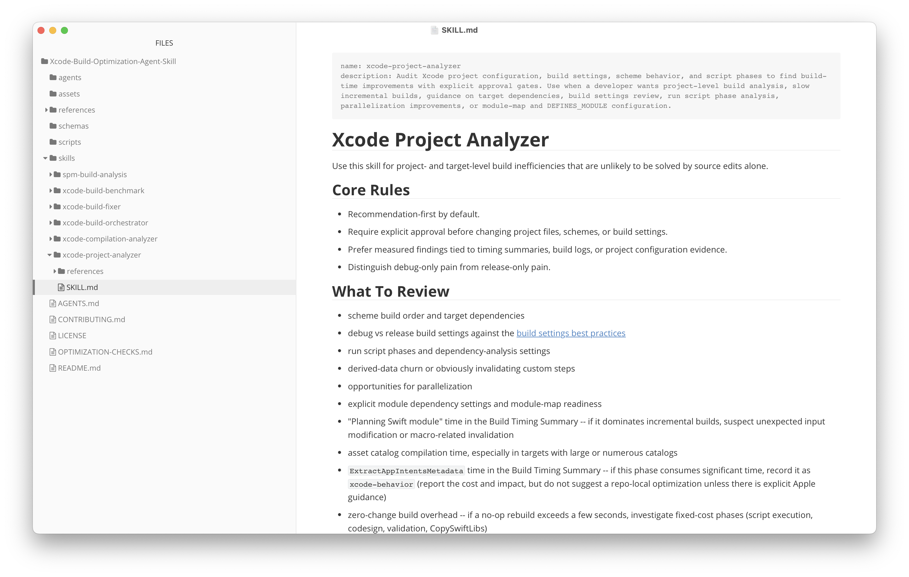
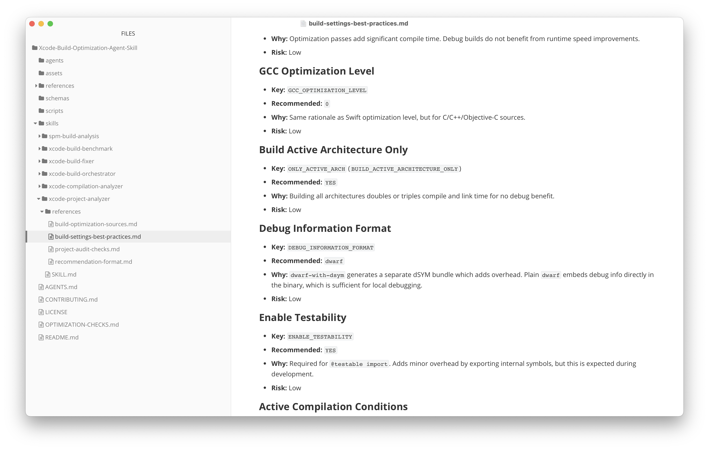
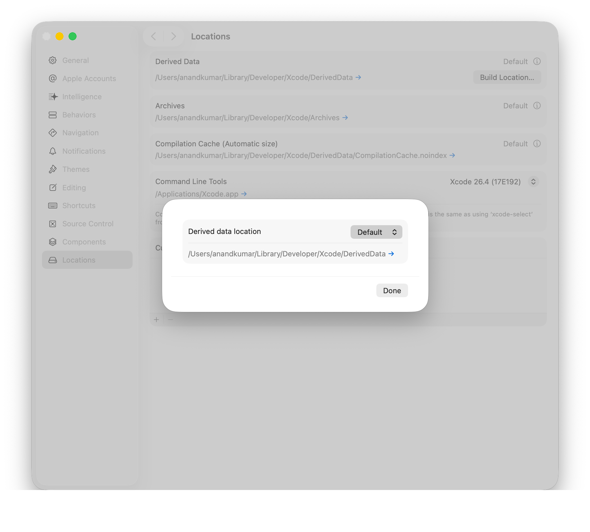
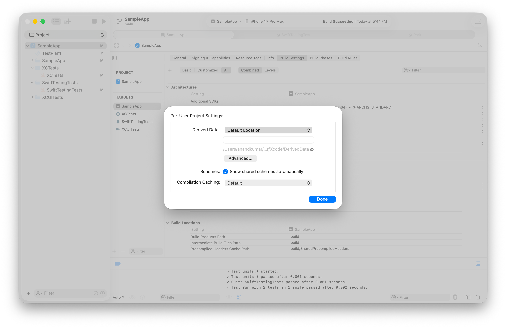

[toc]

##### You can always check Build Logs

Every time the app is run, first build logs are generated and then the debug (i.e. run) logs. They can be viewed in Xcode's Report Navigator.


##### Environment variables

`SRCROOT` and `PROJ_DIR` both refer to the same thing practically, i.e. the current target's directory (link). Do remember to wrap them in parentheses though.
```
"$SRCROOT"/Build-Phases/TestScript.sh
```

##### Improving build times with code improvements

It helps to declare types for complex expressions.

It also helps to reduce declaring types as `AnyObject`, a method called on it is allowed as long as that method is available in any class and exposed to the Objective-C runtime (this ObjC part is there too?). This requires more time in compilation.

Marking outlets and actions as private helps as well, as they then need not be exposed in bridging and generated headers.

##### Antoine v.d. Lee - Xcode-Build-Optimization-Agent-Skill

Antoine v.d. Lee has 6 AI skills available in his [Xcode-Build-Optimization-Agent-Skill repo](https://github.com/AvdLee/Xcode-Build-Optimization-Agent-Skill) that can analyze build deficiencies, package graphs, perform builds and benchmark their numbers, and so on. Running these skills is as simple as just putting the appropriate skill's folder in your `.claude/skills` and then doing `/<skillName>`.



Basically, if you go through their SKILL.md there is a lot of useful information there.

Here is one of the skills





##### Derived Data Location

While the default is `/Users/anandkumar/Library/Developer/Xcode/DerivedData`, the default can also be set to be in the current ptoject folder.



And even this can be changed on a per-project basis through **File > Project Settings**.


