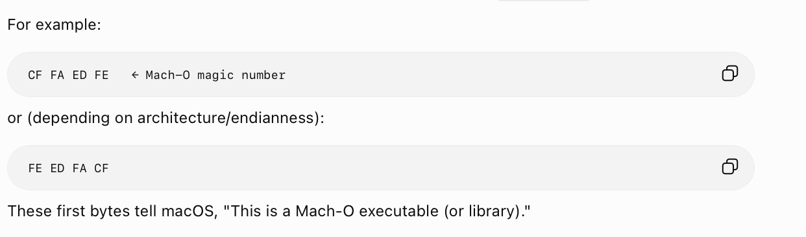
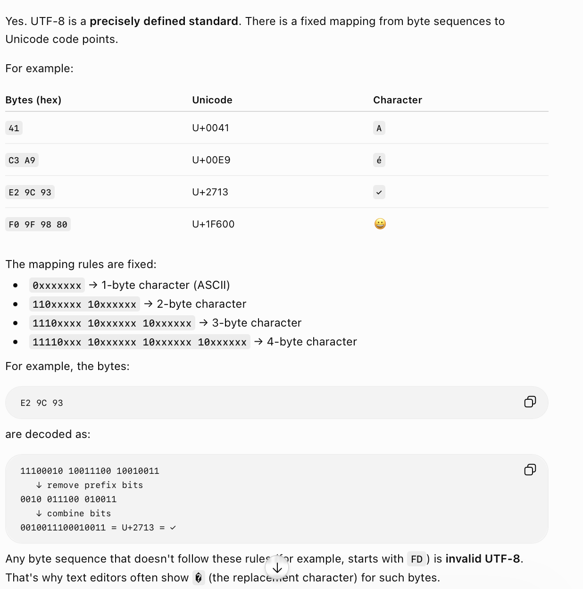
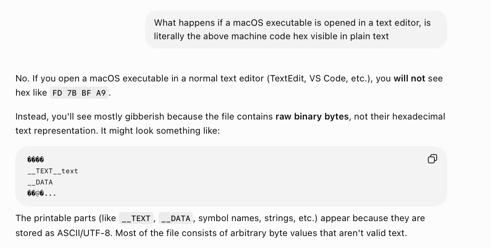
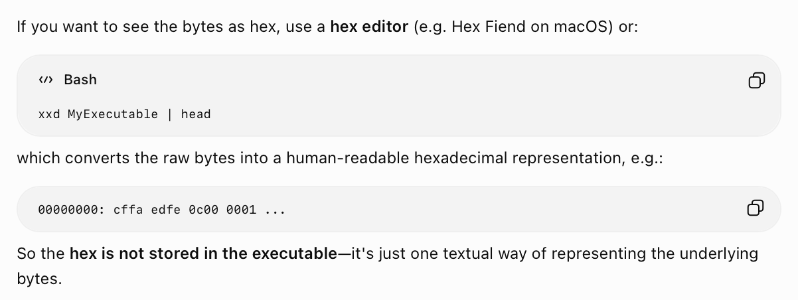
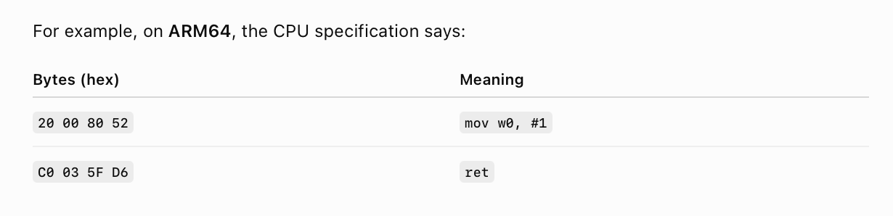
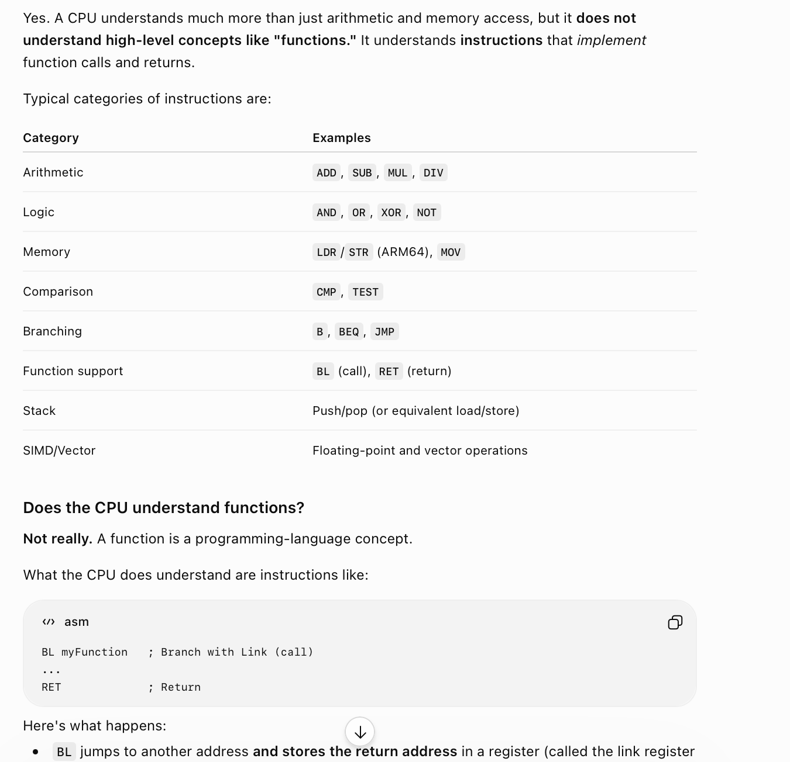
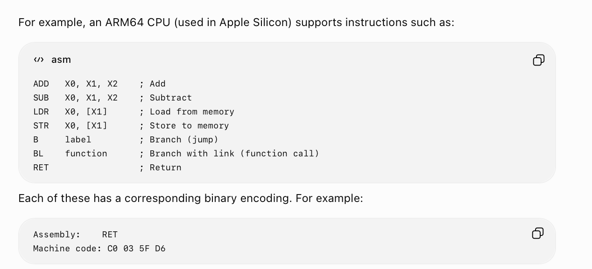
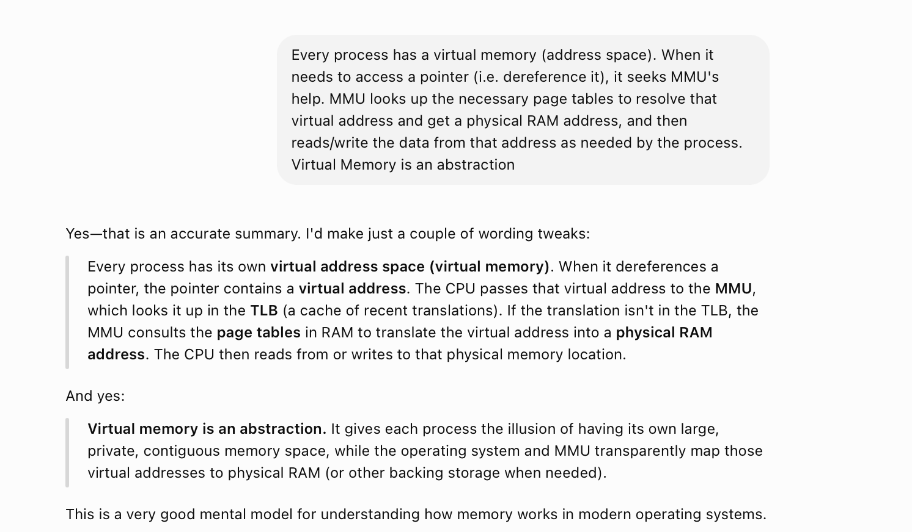

[toc]

##### Everything is Bytes

Everything be it plain english text or an executable is actually a sequence of bytes. These bytes are represented in hex codes. The system knows what is what by looking at the first few bytes of a file. If it has a certain **magic sequence** in the beginning then it is an executable, if its something else it is a plain text file.

##### UTF-8 is a precise mapping of byte combinations to everyday characters

##### Text Editors can only show ~UTF-8bytes

Usual text-editors like TextEdit only understand byte combinations that have a UTF-8 mapping, for anything else it shows gibberish.

##### Hex Editors and CLI for viewing hex bytes

To see actual hex bytes of a file, a **hex editor** like Hex Fiend or a CLI such as **xxd** that needs to be used.

##### CPU instruction set and Machine Code

There are mainly 2 kinds of CPU architectures - ARM 64 (pervasive in Apple and Android now), and x86-64 (Intel's, used by Macs until 2024). A given CPU architecture has a specific **CPU instruction set**. What is basically means is that it declares that some specific set of byte combinations have specific meanings for them and any executable intended for it should work with that instruction set. Eventually those sequence of bytes in an executable that a CPU will understand is what is known as **Machine Code**.

The instruction set is essentially for basic things like simple mathematical operations, accessing data, etc.

##### Assembly Code

Assembly is essentially a human-readable representation of a given CPU instruction set. A CPU maker publishes its CPU instruction set both in hex code as well as its assembly mapping. Its a finite set.

Note, RET basically means return to saved address (known as 'link register').

##### Registers, Stack, Heap

Registers are very tiny bit of memories in CPU. Stack and Heap are on RAM, Stack allows quicker access and Heap gives slower access. Communication between CPU and RAM happens via Memory Bus. 

Virtual address space is basically a collection of the many different virtual addresses that a process ever points to. Every Virtual memory eventually ties to a physical RAM address.

##### Resources

Everything is binary ([ChatGPT link](https://chatgpt.com/g/g-p-6934bcdfcafc819182baa9435e044320-swift-programs/c/6a52f2f3-617c-83ea-8a12-3e90dab024cf))  CPU instruction set and Assembly ([ChatGPT link](https://chatgpt.com/g/g-p-6934bcdfcafc819182baa9435e044320-swift-programs/c/6a4af509-1408-83ea-be3f-47ed2a0662d0))  Stack, Heap, Resgisters, Virtual address space ([ChatGPT link](https://chatgpt.com/g/g-p-6934bcdfcafc819182baa9435e044320/c/6a4da3f4-4d44-83ea-b349-f82bf76ef793?messageId=e7a4ca10-a7ed-40a9-9b11-746c79075b5b&historySearchQuery=heap))