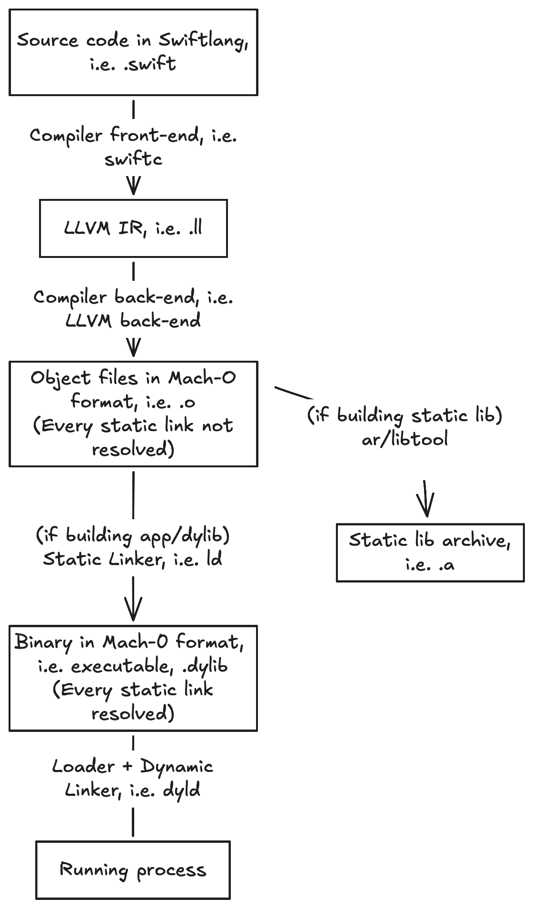
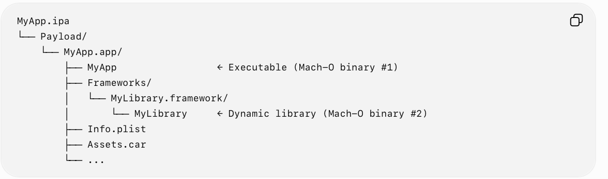
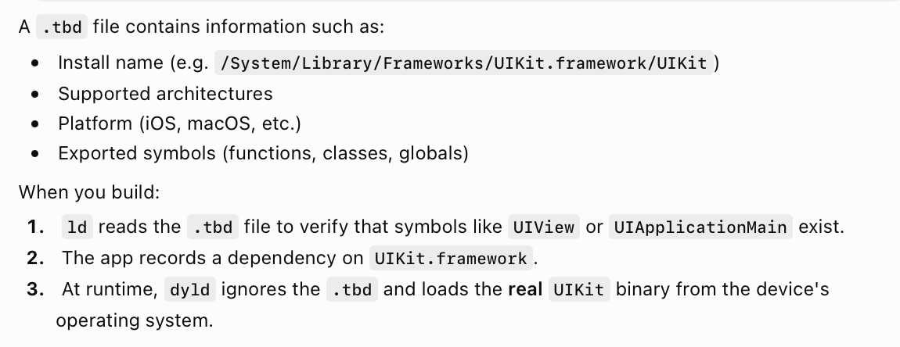
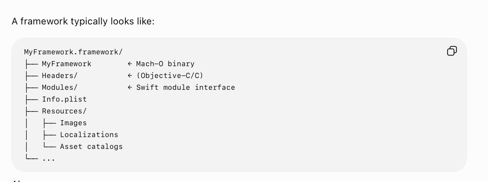

[toc]

##### Various things in pipeline

**GCC** - Classic C compiler  **clang** - Newer C compiler front-end  **swiftc** - Swift compiler front-end (can be done using `swiftc`)  **LLVM back-end** - Compiler back-end (can be done using `xcrun clang`)  **ld** - Linker  **dyld** - Loader

**ar**, **libtool** - Archivers, i.e. static lib generators

**Assembler** - Something that converts LLVM IR to Assmebly codes before finally converting to Mach-O machine code. Is an internal implementation detail of Swift's back-end now and is likely not an explicit interim output anymore.  **LLVM bitcode** - A supplement to LLVM IR that is more condensed, Apple required these too be generated during compilation and then submitted to App Store with the ipa so that they could later do some optimizations on the ipa but this is now obsolete and a relic. Apple doesn't ask for it anymore.

**.a** - Static lib  **.dylib** - Dynamic lib  **.framework** - Framework, may have static or dynamic lib inside  **executable** - Something that can be run inside a process  **image** - A generic term of anything that can be loaded in a process (so executable + dylib + framework having a dylib)  

##### Typical pipeline for swift files

##### Image/Binary

A **binary** can be one of these things - executable (no extension in macOS, .exe in Windows), static library (.a), dynamic library (.dylib).

Among these an executable or dynamic library or even a bundle (if it has loadable code) is categorized as **image**. 

##### Static and Dynamic linking

**Static linking** - Code from all possible libs pulled in before the executable creation. Results in larger binary size, but quicker launch. This is done by the static linker, i.e. **ld**. Note this is done only when building an app or dynamic lib (and not while building a static library).

**Dynamic linking** - Code from missing libs pulled in only during loading. Results in smaller binary size, but slower launch. When a module is built as a **dynamic library (.dylib)** binary, it can only be dynamically linked later on. This later dynamic linking is done by **dyld**.

Static libs are more common and sensible too unless you want to use the same module across extensions as if done as a static lib that lib's binary will get duplicated into every module.

An app ipa typically looks like this, static libs are never present as explicit binaries in it.

A **static library (.a)** binary is produced not by ld but by **ar** (or Apple's **libtool**). It archives the object files into a `.a` but does not resolve final addresses.  A statical lib is later statically linked into a consuming app or dylib by ld.

A **.tbd (text based stub description)** is basically a text representation of a dylib that usually gets generated along with dylib and is then used by ld (i.e. during static linking) for doing some basic checks.

##### Framework

A framework is basically a bundle (**.framework**) that contains librray plus related resources, that 's it. It can contain either a static library or a dynamic library as a binary. If the framework has a static library, then it can only be linked statically (and similarly with dynamic library).

It typically looks like this

A framework has only one primary library binary in it. Now that one binary can be **fat/universal**, what it means is that it contains multiple architecture slices (e.g. `arm64` and `x86_64`). It's still considered one binary, just with multiple architectures..

> Note that a a Mach-O bundle is something else altogether, they are related to macOS plugins.

##### Resources

Static and Dynamic linking, and Frameworks - [ChatGPT link](https://chatgpt.com/g/g-p-6934bcdfcafc819182baa9435e044320-swift-programs/c/6a4b3501-900c-83ea-bc30-3f5e33abaa24)  .tbd files - [ChatGPT link](https://chatgpt.com/g/g-p-6934bcdfcafc819182baa9435e044320-swift-programs/c/6a64f9a6-a814-83ea-9d1f-fad3cecd01f0)

Also check the notes at '03. iOS/08. Developer Tools/03. Library and Frameworks/Summary - 2026 Jul'