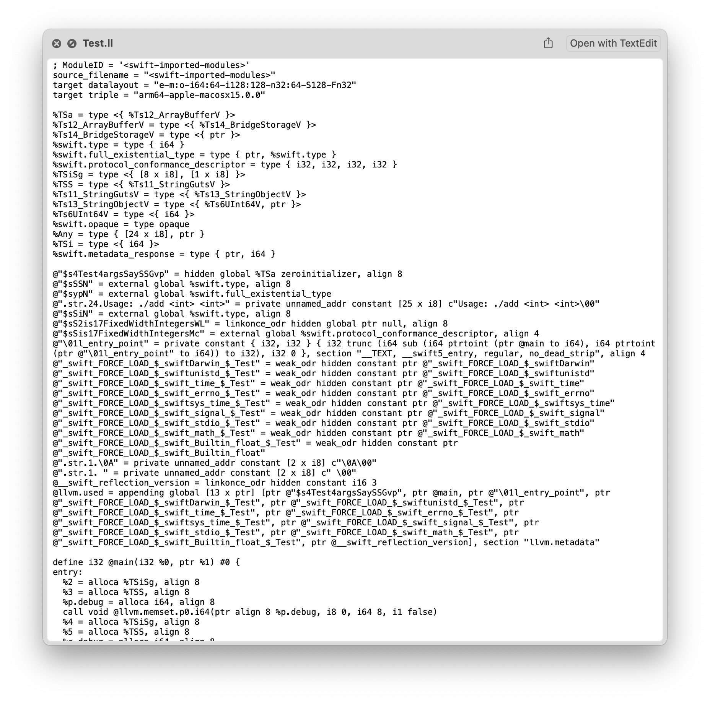
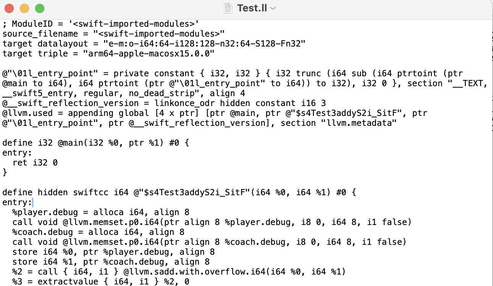
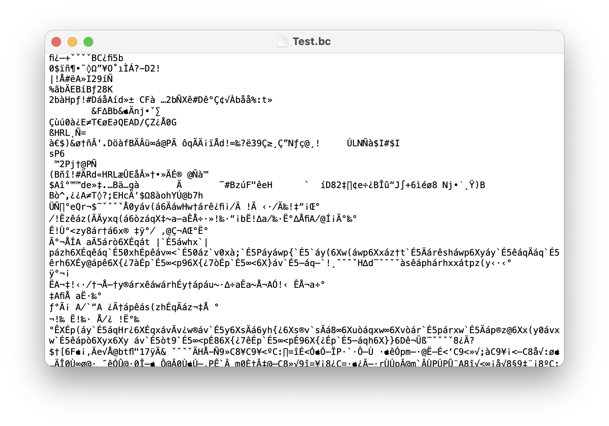
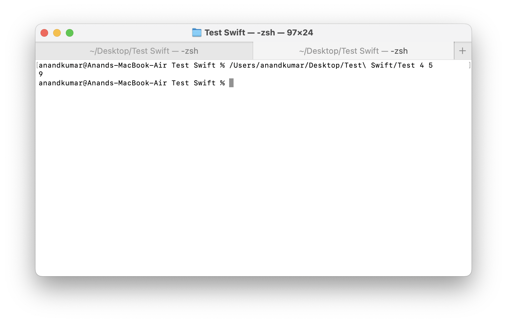

[toc]

Swift file > swiftc LLVM IR + bitcode > LLVM object file > executable > run <br>

##### Gist - Crucial commands

**swiftc** converts Swift code to LLVM IR and (if needed) LLVM IR Bitcode too. <br>**xcrun clang** converts LLVM IR to object file (i.e. machine code) and then exe. Don't be confused by **clang**, its just that the clang exe has LLVM back-end too and that is what is being used here. Also, don't use homebrew's llvm i.e. **lc** as the LLVM IR generated by swiftc is slightly different from that generated by default LLVM (the former is a fork of the latter).

##### Step 1- Consider a Swift file such as this

> Note that here `import Darwin` is needed only because Swift standard library by itself does not understand the `exit` command used in the file, which in turn will be needed to be able to run the exe that will be generated from this. 

```
import Darwin

func add(_ player: Int, _ coach: Int) -> Int {
    player + coach
}

let args = CommandLine.arguments

guard args.count == 3,
      let p = Int(args[1]),
      let c = Int(args[2]) else {
    print("Usage: ./add <int> <int>")
    exit(1)
}

print(add(p, c))
```

##### Step 2a - Convert to LLVM IR

Convert it to LLVM IR with this command

```
swiftc -emit-ir Test.swift > Test.ll
```

LLVM IR is human-readable and looks something like this

| Entire LLVM IR for above example                             | Sample recognizable snippet of a function                    |
| ------------------------------------------------------------ | ------------------------------------------------------------ |
|  | > For a simpler swift file that just adds two arguments <br> |


##### Step 2b (optional) - Convert to LLVM IR bitcode

The command is this

```
swiftc -emit-bc Test.swift
```

Bitcode is in binary format (very little readable text) and looks like this. TBD: Explain



##### Step 3 - Convert to object file

The shell command

```
xcrun clang Test.ll -c -o Test.o
```

> Its important to use **xcrun clang** here, otherwise by default using just **clang** may pick up Homebrew's version/fork which is different from what Xcode and Swift needs. Apple has its own fork of actual clang that it uses.

Looks like this


##### Step 4 - Convert to exe

```
xcrun clang Test.o -o Test -lswiftCore -framework Foundation
```

And then it can be run like an exe



##### References

ChatGPT link used for theory and basic commands ([link](https://chatgpt.com/g/g-p-69279ccb2f608191ad229eb13fec17aa/c/69279cd8-0f30-832f-b645-0afc8d31ae44)) <br>ChatGPT link used for troubleshooting  ([link](https://chatgpt.com/c/692b190f-77f8-832e-9b22-f2a4af5da053)) <br>

