[toc]

#### Basics

The format for object files in Apple systems is **Mach-O**. It has some distinct and specific parts, but if you grab hold of an object file you will not quite find those parts as most things are in binary characters with very few ASCII strings. To make sense of it you need to use tools such as **otool** and **nm**.

#### otool

It reads Mach-O binaries and displays specific internal data structures, such as Load commands, Headers, Segments & sections, Symbol tables, etc. It works on any file that follows Mach-O format, i.e. object files, dynamic libraries, static libraries, bundles, executables, kernel extensions, etc.

| A real object file                                           | The same file when inspected with `otool`                    |
| ------------------------------------------------------------ | ------------------------------------------------------------ |
| 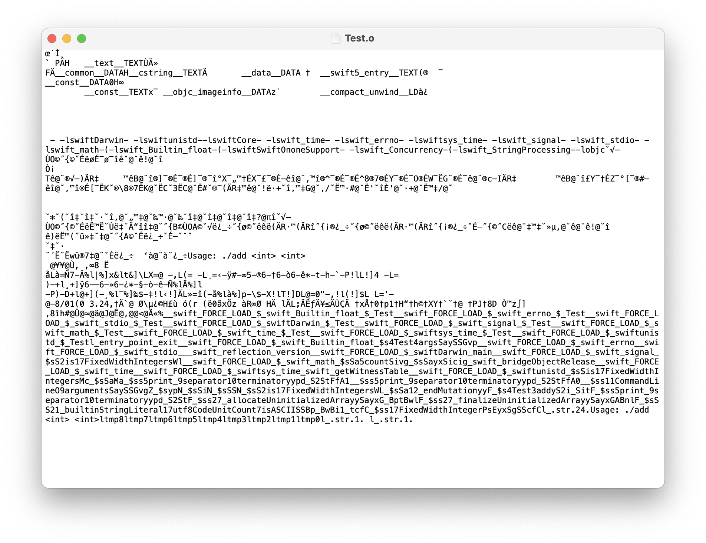 | 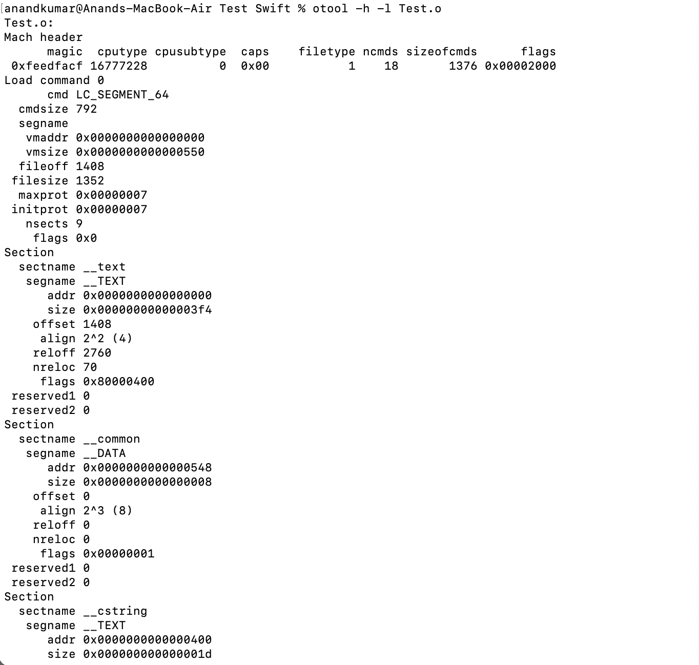 |

> Header Load commands 	Segment (LC_SEGMENT_64) >  		_text section  		_data section  		....  	Symbol Table (LC_SYMTAB)  	Symbol Table (LC_DYSYMTAB)  	LC_LINKER_OPTION  	....  

##### Header followed by load commands

| The `header` followed by the first `load command`            | And then there are lot many more `load commands`             |
| ------------------------------------------------------------ | ------------------------------------------------------------ |
| 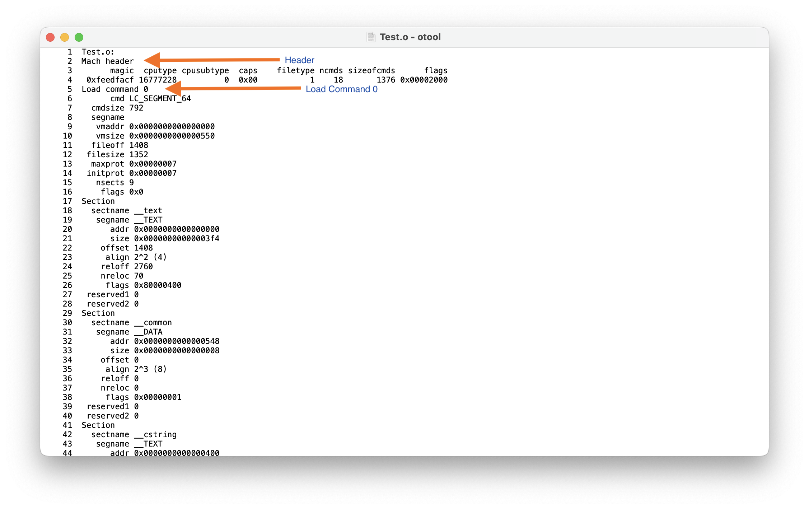 | 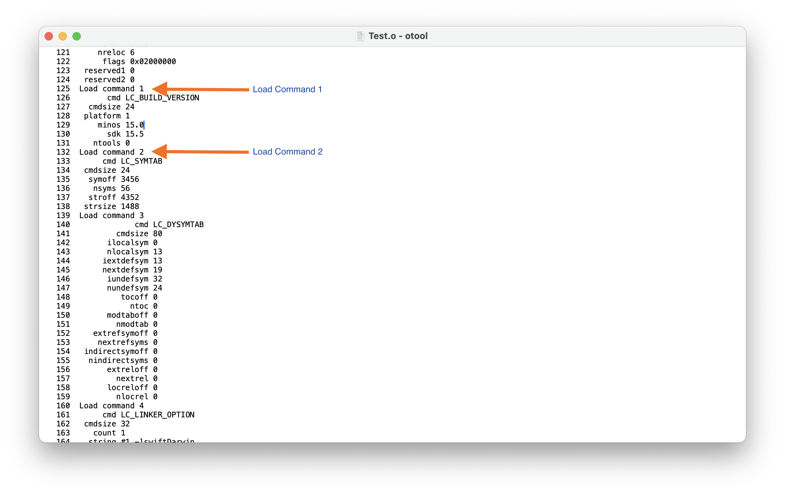 |

##### Segments and Sections

If there is a load command with `cmd` value `LC_SEGMENT*` that indicates a **Segment**. The Segment can then itself have **Sections**, these sections then themselves have `sectname` and `segname` as their identifiers.

> The segments are indeed indentified by the load commands `LC_SEGMENT_64` or `LC_SEGMENT` (`segname` is nil). Modern 64-bit Mach-O object files have them as `LC_SEGMENT_64` . Object files probably do have just one segment listed in them. Executables and libraries (dylibs) however have multiple segments.

| All the load commands (cmd) in this object file              | All the sections in the one segment in this object file      |
| ------------------------------------------------------------ | ------------------------------------------------------------ |
| 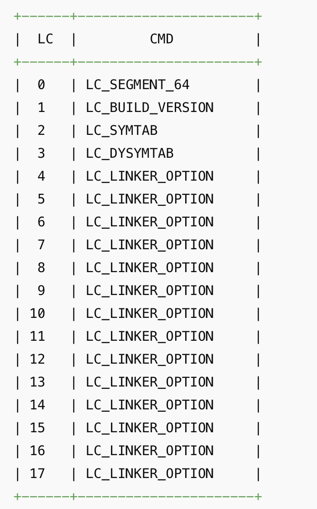 | 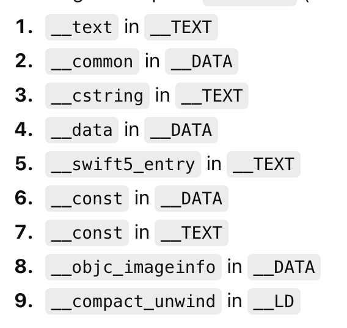 |

##### TEXT and DATA

Syntactically `__TEXT` and `__DATA` are 'segments' in **different sections of a segment load command** in an object file. Practically, though the compiler uses them to tag sections so the linker knows how to lay them out later. In the final linked binary, **TEXT** contains read-only and executable content and **DATA** contains writable global state.

Here is what various **sectname** values in those sections mean

For __TEXT segment -

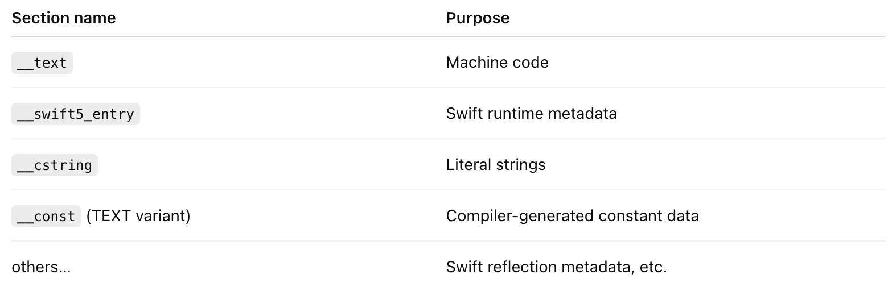

For __DATA segment - 

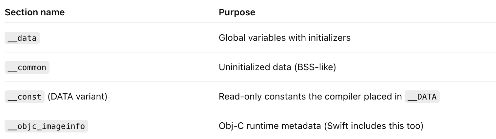

##### Symbol Tables

Towards the end there are certain load commands that represent **Symbol Tables**. These are tables for symbols defined in program source that produced the object file and a list of places where a symbol is referenced but not defined in that file and must later be resolved. There is a **LC_SYMTAB** that is **static symbol table** (this is the main symbol table), and a **LC_DYSYMTAB** that is a dynamic symbol table.

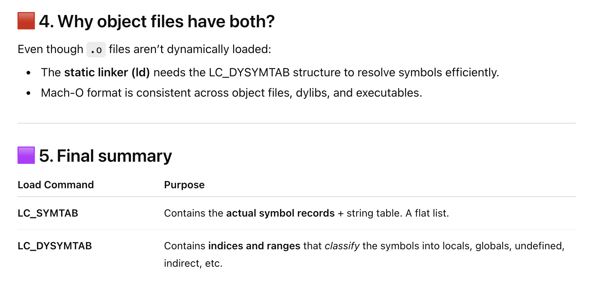

The static Symbol Table looks something like this. Note that it only contains compiler-level symbols and not any runtime or Swift standard library symbols (those only appear after linking).

> `otool -l` alone doesn't show symbol names. To see actual symbol names `nm- m` needs to be used.

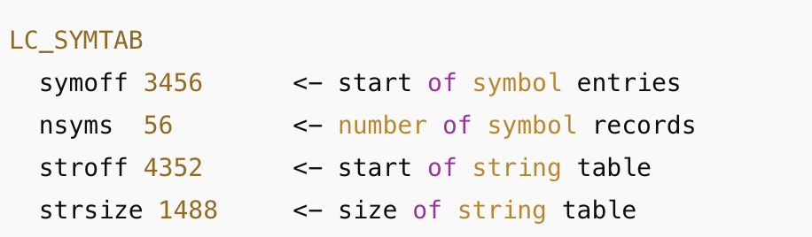

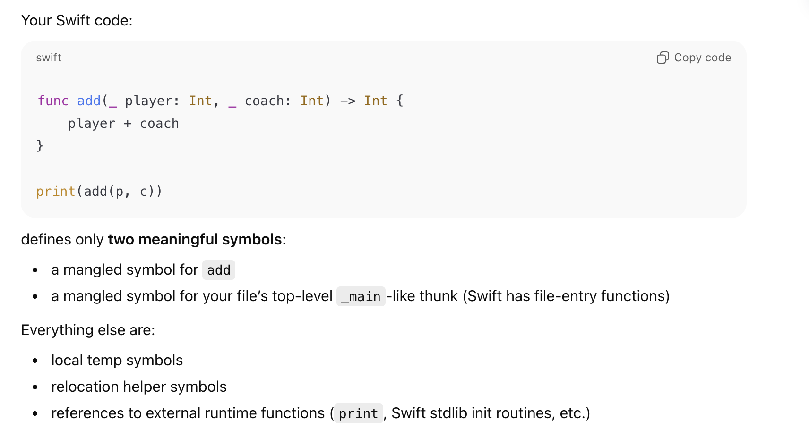

> To see actual symbol contents you need to use `nm` . `otool` only shows load commands.

#### nm

**nm** is specifically a symbol table inspection tool. Its the main tool for getting the functions defined in a file, and the globals it exports. 

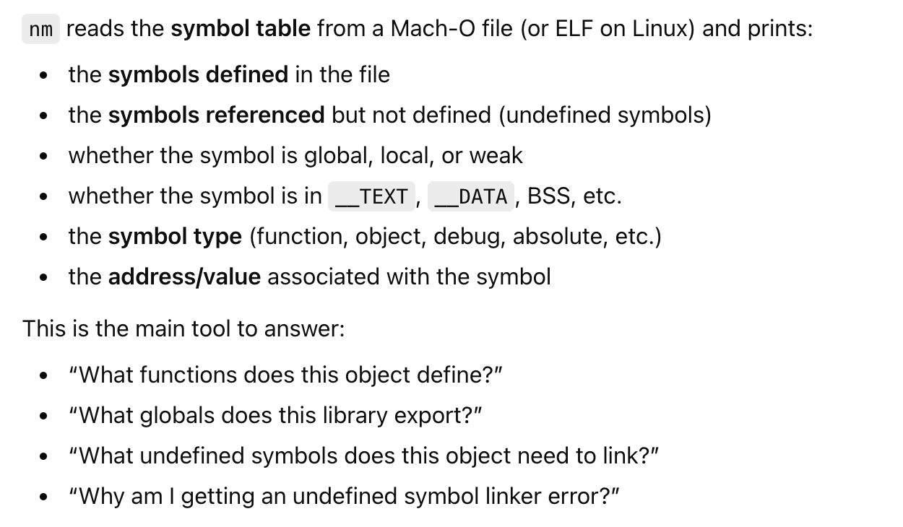

> nm almost certainly stands for 'name list', and comes from very early Unix history (1970s).
> The original tool was literally called “nlist” in early Unix manuals, and the command evolved into nm as a shorter name.

##### Name mangling

The symbols saved in symbol table have their names mangled. What it means is that for any interface (function, etc.) in user facing code, the corresponding entry in symbol table has a certain fully qualified name (set using standard deterministic rules) that indicate everything about it including its module, parameter types, argument types, etc.

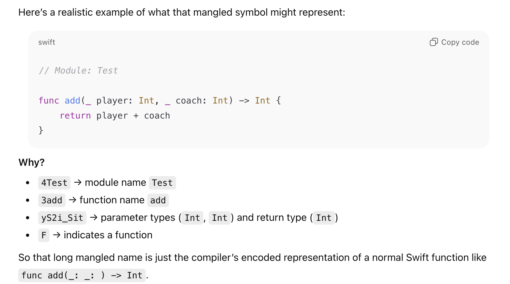

> There is even a Swift runtime function that can de-mangle a mangled name given to it. 'Swift Secrets' book has that code snippet in pages 7-9.
>

##### Sample output of plain nm

> Entries in the “type” column are either “U” for an undefined external reference or other characters related to segment in which the symbol is. These characters are upper case for global symbols and lower case for symbols that are hidden or local and can take no part in dynamic linking.

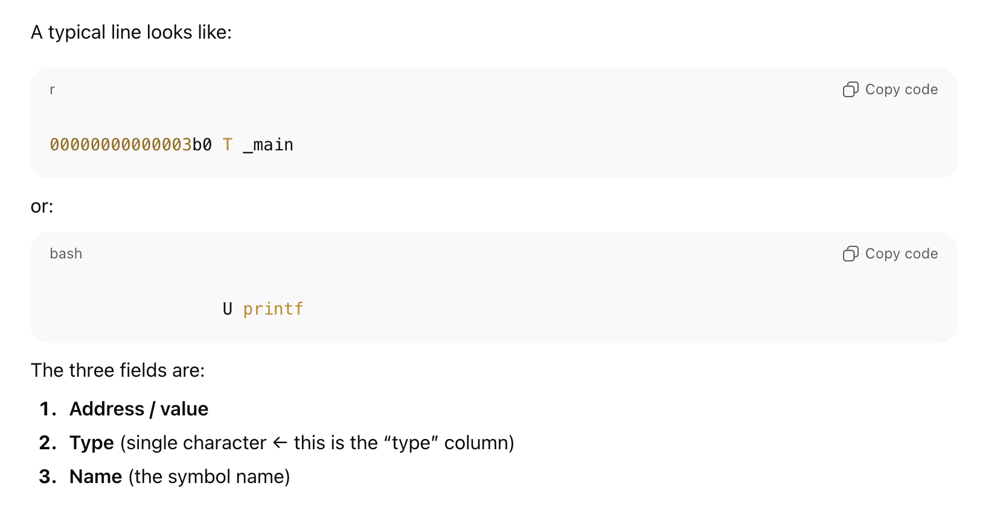

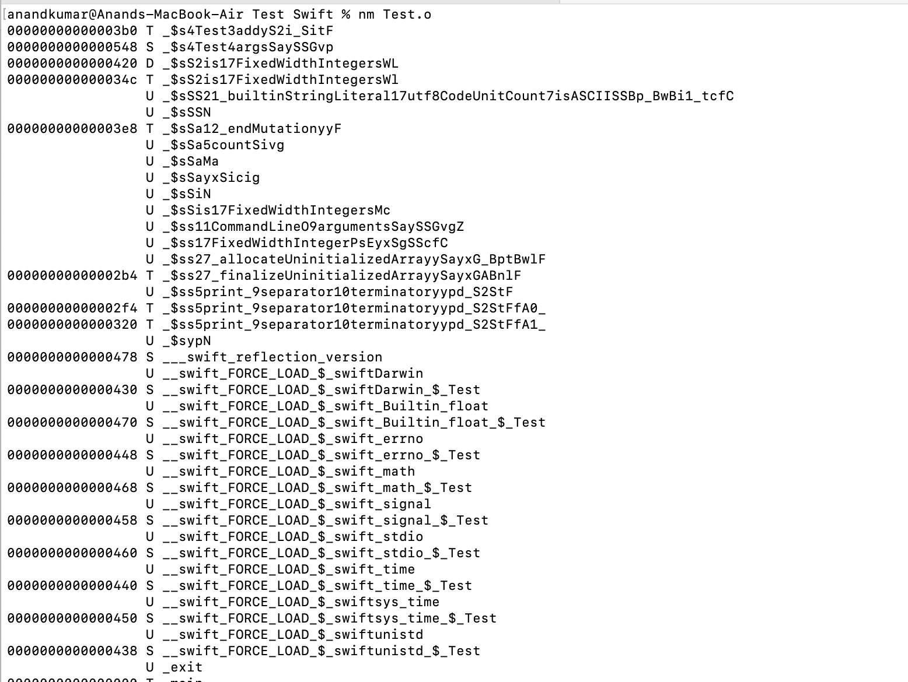

##### Meaning of one of the symbols shown by nm -m

`nm -m` is the Mach-O–specific, fully verbose mode of `nm` on macOS.

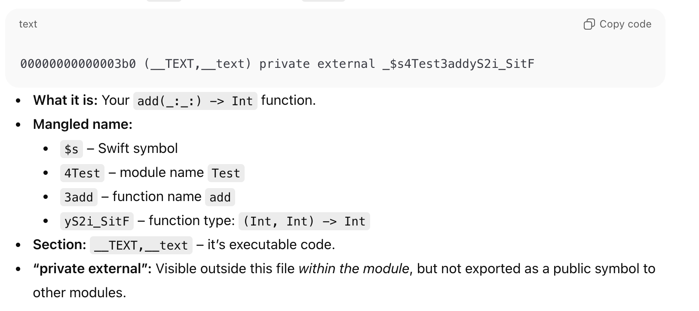

#### Resources

[ChatGPT link](https://chatgpt.com/c/692cd096-d3d8-8326-9b53-792653516202)

