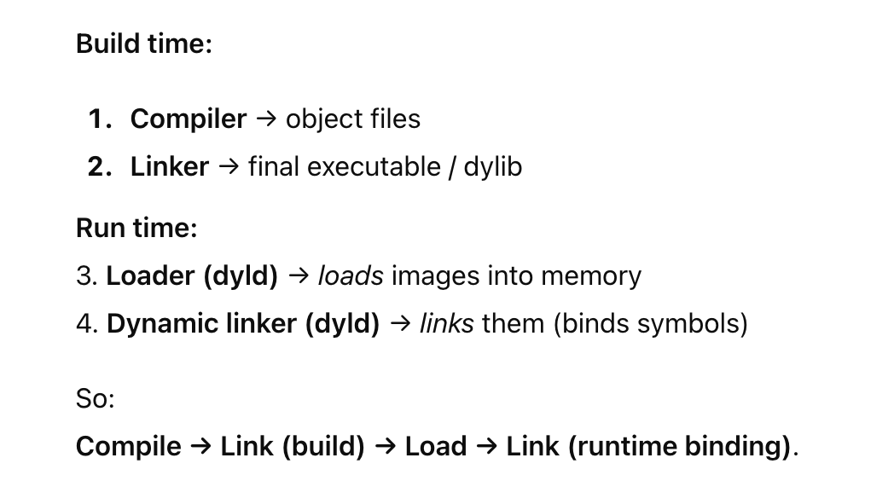
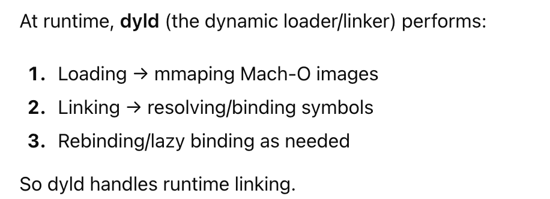
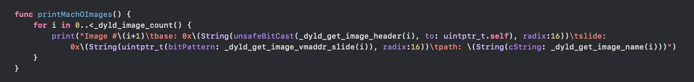
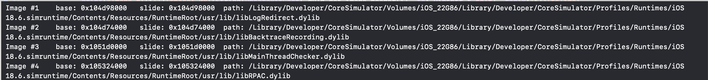
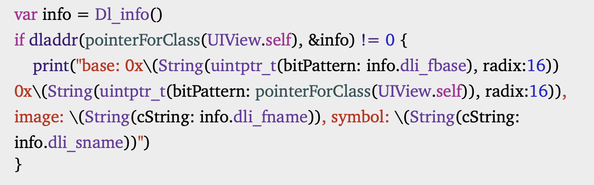
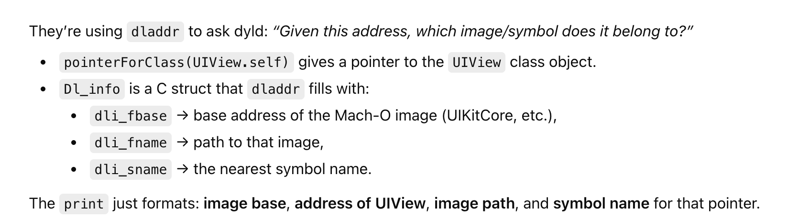
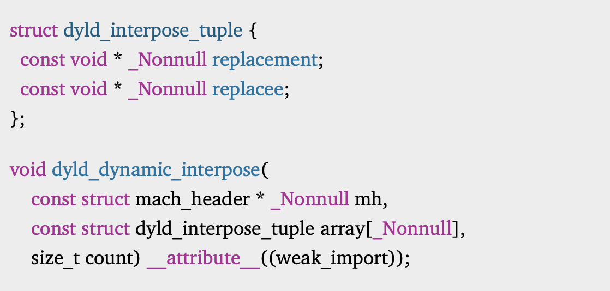
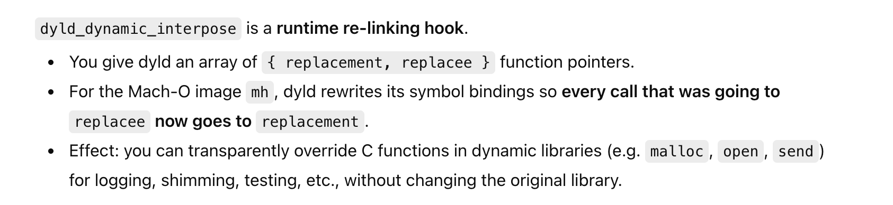

[toc]

#### Linking

**Linking** is where object files are consolidated and symbol references between them are resolved (some of the symbols could even be from system of third party libraries), and an executable or module (library/framework) then made.

Traditionally **static linking** was done where code from all other libraries was pulled in already before the executable (or module) creation thereby producing larger and larger executables and then at runtime having large amounts of code from those libraries duplicated across processes even when there were only read-only things happening in those libraries. It gradually became wasteful enough, that **dynamic linking** came in where symbol resolution only gets done at some point after process launch/loading. On Apple systems, dynamic linking is done for what are called **dynamic libraries (.dylib)** or **frameworks**.

#### Loading

**Loading** is when the executable and its dynamic libraries (i.e. not static libraries which would have already been embedded into the executable) are loaded into memory and mapped into processes's virtual space using `mmap`.

**Virtual memory** exists in RAM and gives each process an address space known as **Virtual address space**. `mmap` just adds new mappings inside that address space (mapping pages to files or anonymous memory) such that there are maps to all the segments (TEXT, DATA, LINKEDIT, etc.) of the Mach-O executable/dynamic library related to the process. Technically, these maps are said to be stored in **page tables** (small data structures). 

And then when the memory (it could also be during runtime in case of 'lazy linking)' is accessed it results in what is termed as a **Page fault** (named so as the virtual memory page is not fully loaded into RAM yet), which then resolves the links and reads the contents from the file. These can be any files, mach-o exe, libs or even data files. This mechanism allows to access those files' contents as if they were regular memory (no read/write syscalls), enabling efficient I/O and sharing between processes

#### Chronology of static vs dynamic linking

##### ld - Build-time linker

`ld` is the compile/buildtime linker that takes object files (.o) and produces an executable or dynamic library.

##### dyld - Runtime linker

`dyld` is what performs the dynamic loading and linking. Technically, it is a system binary (a Mach-O executable) that the kernel launches before your app’s main(). dyld is what calls mmap.

#### Images

**Images** is the general term used for Mach-O binaries that are loaded into the process. It could be an exe, .dylib or .framework, or (in case of macOS) plugins/bundles, etc.

##### Sample code for knowing all the images

`mach-o/dyld.h` can be imported in the bridging header of a Swift project, and then some of the functions exposed by it can easily print all the images the application loads. Even for a simple iOS app, there are ~300+ images that get loaded. These images are then pulled into RAM only when touched (i.e. accessed).

> Taken from 'Swift Secrets' book page 10.

It then loads a long list of images.

##### Sample code for getting the image a symbol belongs to

**dladdr** can be used for it.

> This too is from 'Swift Secrets' book page 10.

##### Using dyld_dynamic_interpose to change symbol bindings at runtime

There is an API (`dyld_dynamic_interpose`) in `dyld-priv.h` (shown below) that can change functions at runtime by effectively relinking them. These are in fact dyld-managed binding and used by dyld to patch call sites to the correct function addresses. They don't modify virtual tables.

> This is from 'Swift Secrets' book page 11.

#### Resources

[ChatGPT link](https://chatgpt.com/g/g-p-69279ccb2f608191ad229eb13fec17aa-current/c/69337e12-0a14-8325-aaa2-a95e1a1bc8f6)

---------

