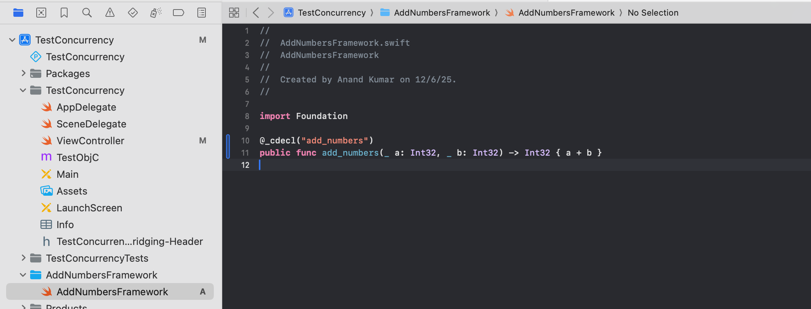
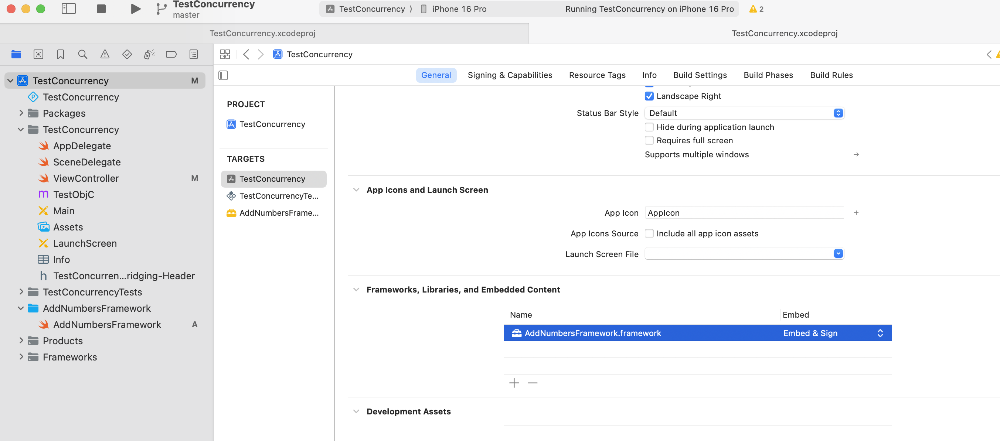
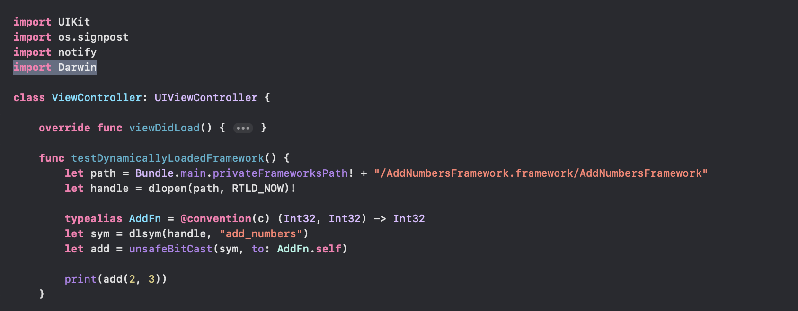
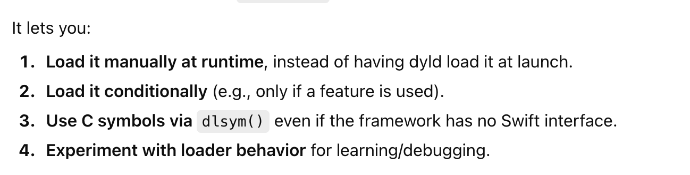
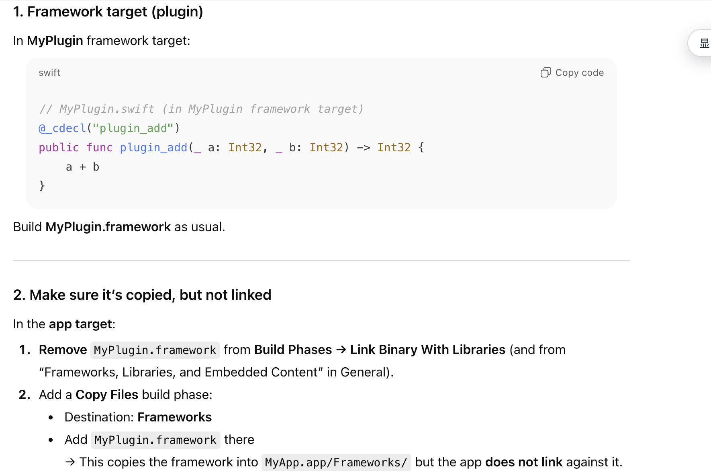
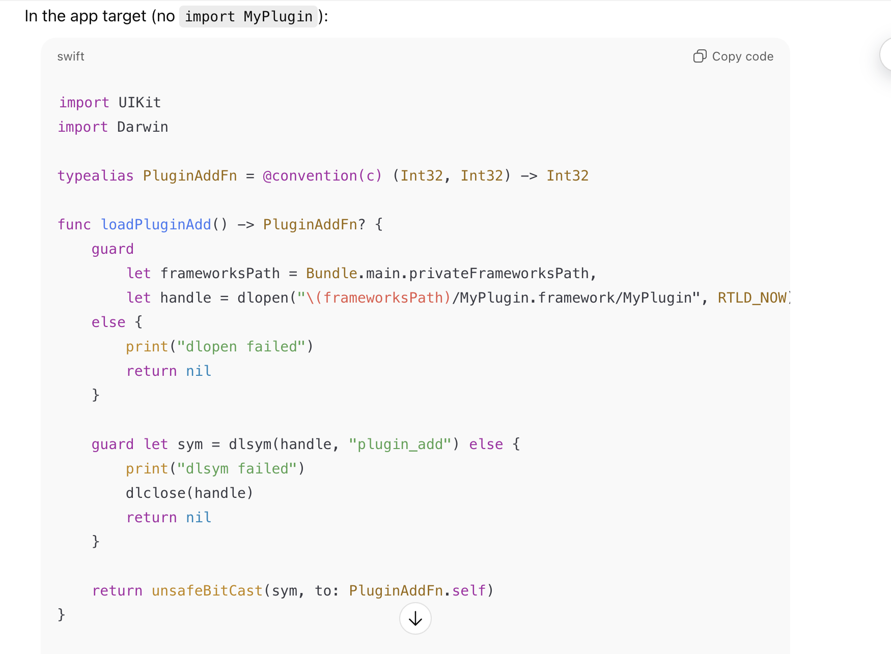
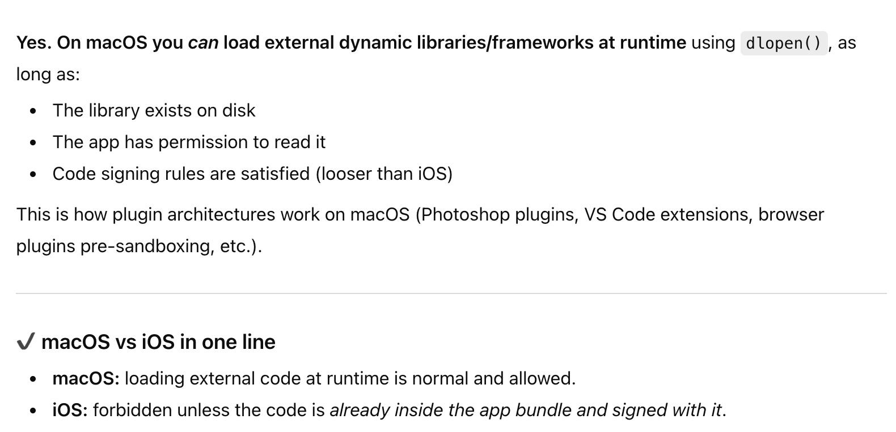

#### How to do it

In iOS, its actually possible to link a framework at runtime and use it without importing it. It still requires you though to ship the framework with the app bundle. Usually that shipping is do ne by Embed the framework in 'App target > Frameworks, Libraries, and Embedded Content', but there are other ways too ('Copy Files' phase).

##### Step 1 - Create the framework in Xcode

Make sure to annotate it with `@_cdecl`.

##### Step 2 - Ensure the framework is added in app's target 

##### Step 3 - Use it in your Swift code by importing Darwin

The framework can be loaded using `dlopen()`, and then its interface used with things such as `dlsym()`.

#### What is the point

Learning reasons aside, it allows to import/load a framework conditionally (i.e. only when the source code really needs it). But parctically, that doesn't mattter much.

#### Is it ok to ship such code to iOS App Store

Actually yes, the only requirement is that the dylib/framework does ship with the app bundle. Theoretically, I can even put it in my App Bundle and not link to it at build time at all but it still has to ship with the bundle.

#### Loading frameworks from outside in macOS

On macOS, things are more lenient. Its in fact supposedly common in macOS plugins.

#### Resources

[ChatGPT link](https://chatgpt.com/g/g-p-69279ccb2f608191ad229eb13fec17aa-current/c/69337e12-0a14-8325-aaa2-a95e1a1bc8f6)