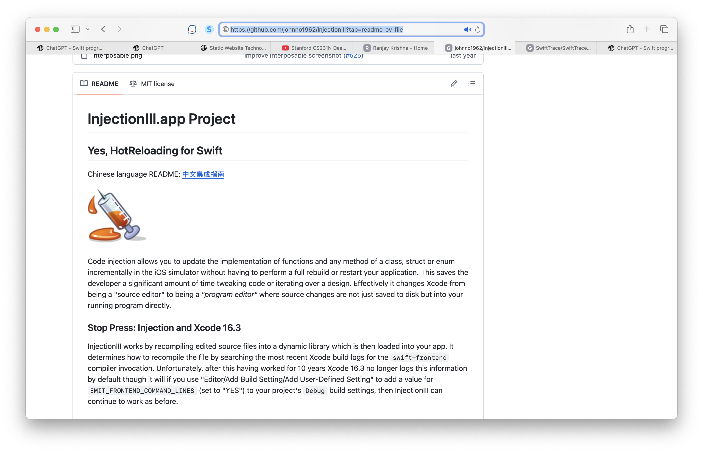
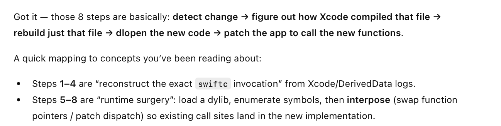
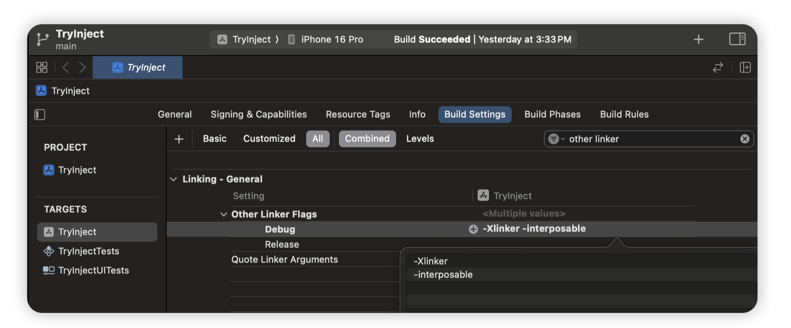
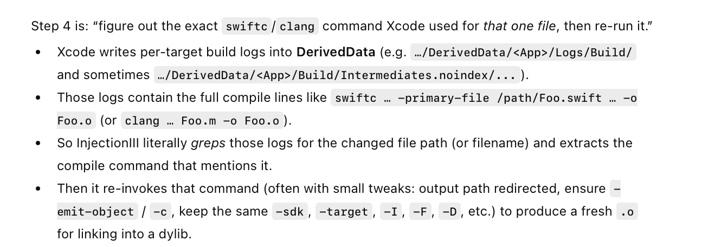
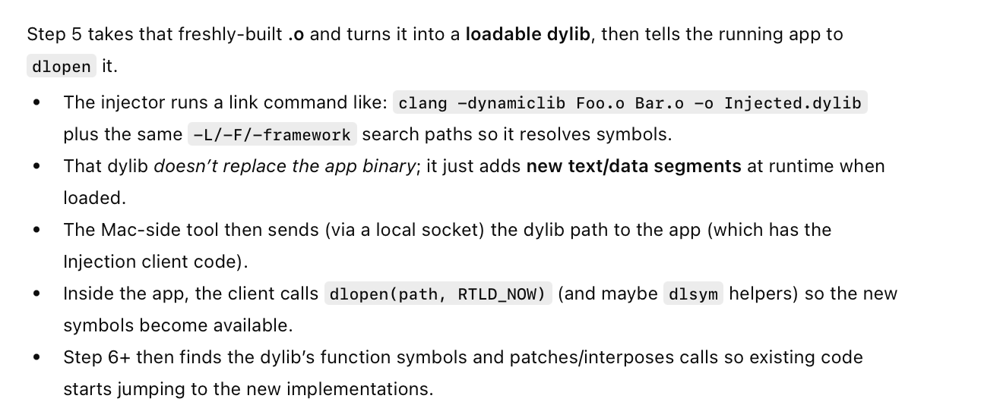
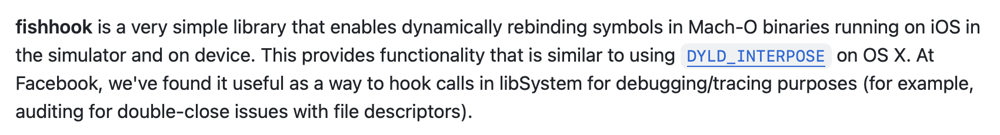
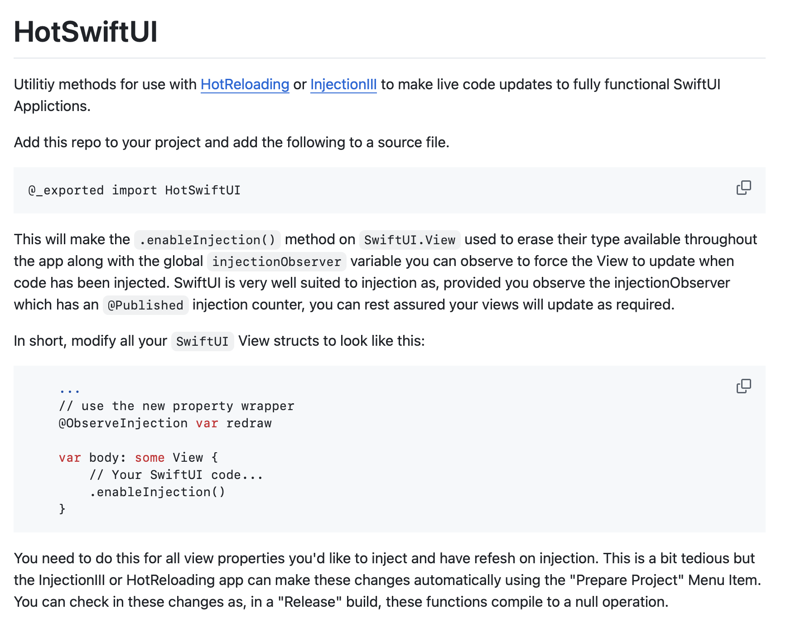
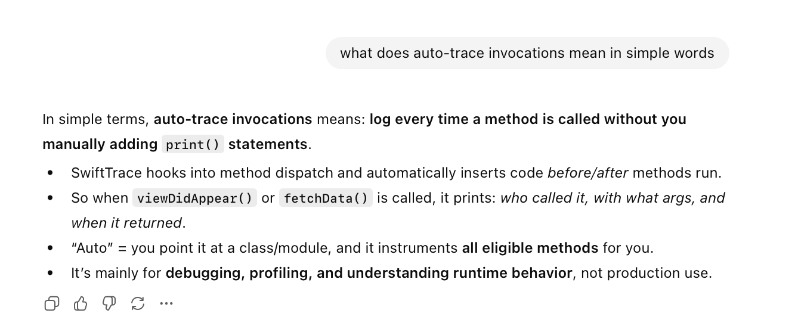
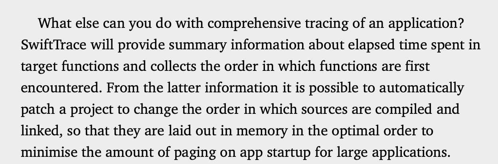
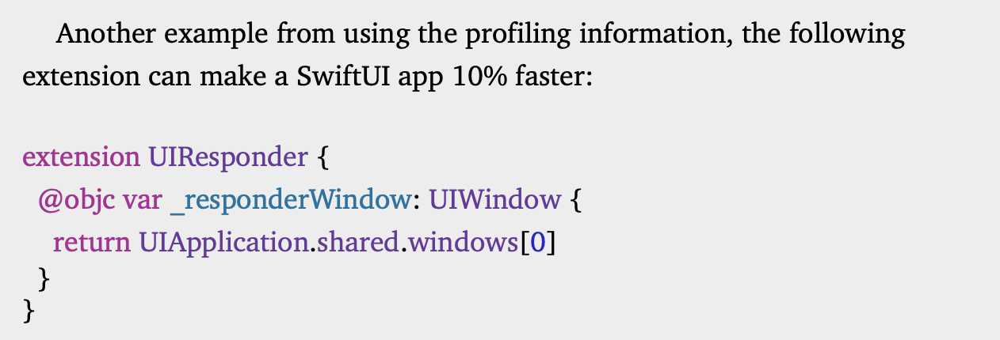

[toc]

##### Resources

- Explained in 'Swift Secrets > Developer Power Tools chapter > InjectionIII' 
- The actual macOS app source code for InjectionIII - [GitHub link](https://github.com/johnno1962/InjectionIII?tab=readme-ov-file) (can download from there or from [macOS App Store](https://itunes.apple.com/app/injectioniii/id1380446739?mt=12) itself)
- [ChatGPT link](https://chatgpt.com/g/g-p-6934bcdfcafc819182baa9435e044320-swift-programs/c/6952ca8d-8a18-8332-bc00-a1e9cbfdaa6d)

##### High Level Steps

> Essentially - Files are observed for any changes to them > then for those files the compilation commands are searched for in previous build logs > they are compiled and then a dynamic librray created > the symbols for functions in this new dynamic library are put in (interposed) in the existing app's binary.

1. Monitor the project directory for files that have changed using an **FSEventStream2**.	
2. From the modified source being injected, determine its project file.
3. From the project file determine the path to the project’s Derived data.
4. “Grep” through the build logs for the project to find how to recompile the modified source file.
5. Link the new object file into a **dynamic library** and message the app to load it through a socket.
6. Search through the symbols of the newly loaded library for function definitions.
7. Use the symbol name to look up address of the existing version of this function.
8. **Interpose** and use the new version of the function as if it had been compiled into the app.

##### Pre-step: Enabling 'interposable' while creating app binary

It's also important to add the options **-Xlinker** and **-interposable** (without double quotes and on separate lines) to the "Other Linker Flags" of targets in your project to enable "interposing" later.

##### Step 4: 'Grep'-ing build logs for compile commands

##### Step 5: Creating dynamic library from changed files

The dynamic lib is created using using commands like **clang -dynamiclib**. This lib then gets loaded inside the app client using **dlopen**.

##### Step 8: Interposing new version of functions

It was previously done using **dyld_dynamic_interpose**, but its lately been marked as a private API by Apple. Its now done using Facebook's **fishhook** ([link](https://github.com/facebook/fishhook)) that does the same thing and is open source.

##### Injecting SwiftUI changes

As per the book, InjectionIII can 'swizzle' Swift functions, structs, enums, etc. but for swizzling SwiftUI Views' body properties another tool [HotSwiftUI](https://github.com/johnno1962/HotSwiftUI) needs to be used. There is a section on this in the same 'Swift Secrets > Developer Tools chapter.'

##### SwiftTrace

Another tool by John holdsworth ([GH link](https://github.com/johnno1962/SwiftTrace/tree/main?tab=readme-ov-file)). This probably automatically prints invocations of every function at runtme without you needing to add any print statements. And it probably uses some kind of interpose internally to achieve that.

It can be used in various ways. An example that the book cites - 

##### Misc.

> Did not read 'Developer Power Tools chapter > Recovering Metatypes section'.