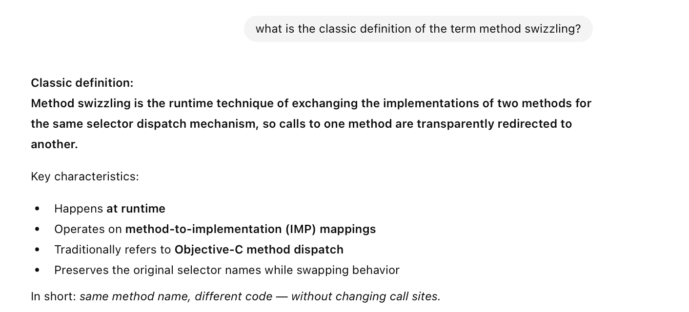
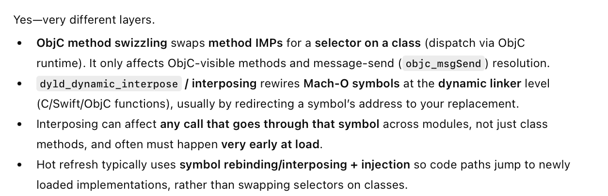
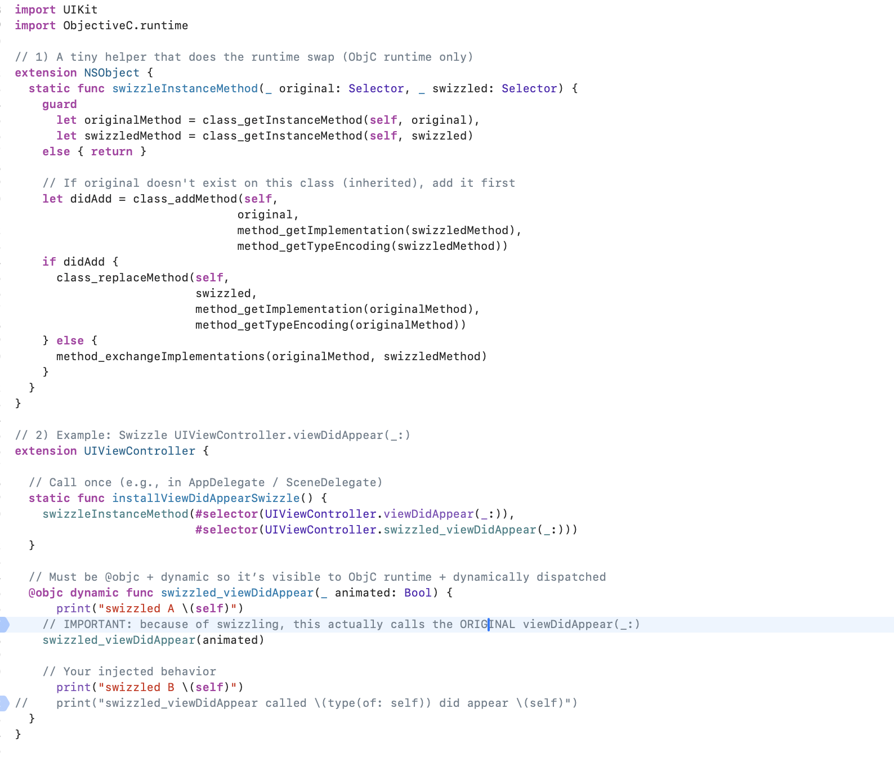
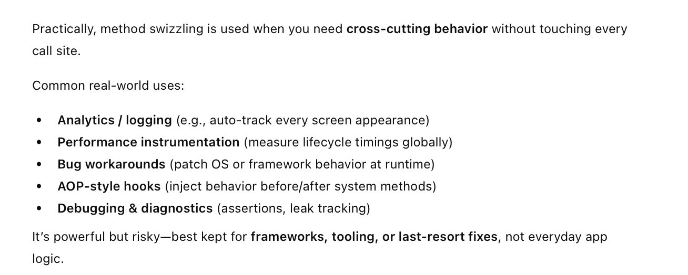

[toc]

##### What is Method Swizzling

Its a way to include code such that at runtime if 'method1' is invoked by someone 'method2' actually ends up getting invoked. Its specified for the methods of a specific class.

> It is not the same thing as what is used for implementing 'hot refresh'.   

##### How is it implemented

Its done using things like **ObjectiveC.runtime**'s **class_getInstanceMethod** and **class_addMethod**, **class_replaceMethod**.

##### Practical Uses

##### Resources

[ChatGPT link](https://chatgpt.com/g/g-p-6934bcdfcafc819182baa9435e044320-swift-programs/c/6952bb08-dc50-8330-b012-695478eac543)

Test project - /TestSwiftObjC-InterOp/SwizzlingUtilities.swift