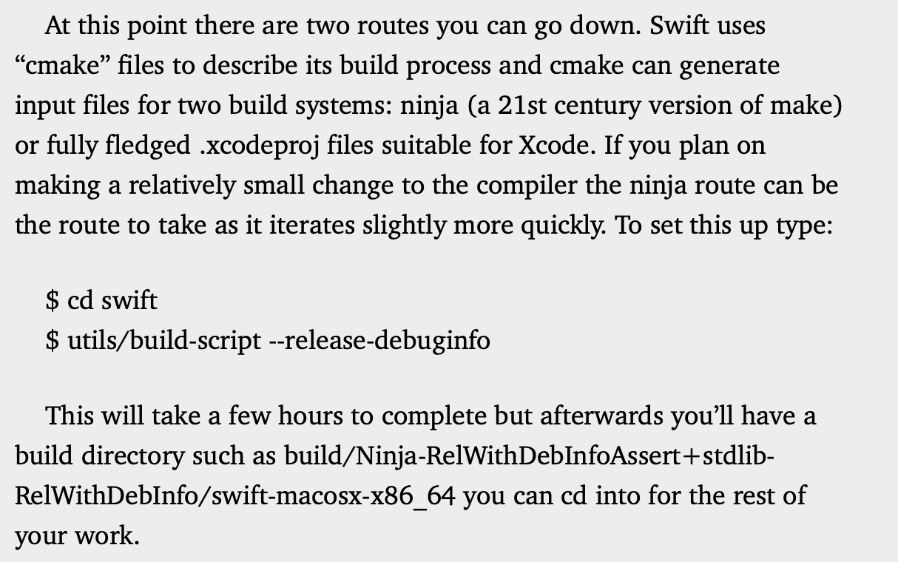
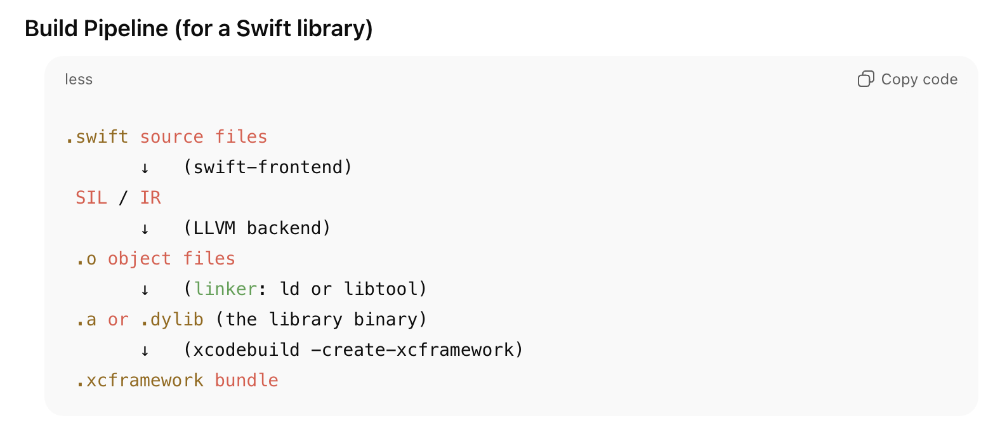
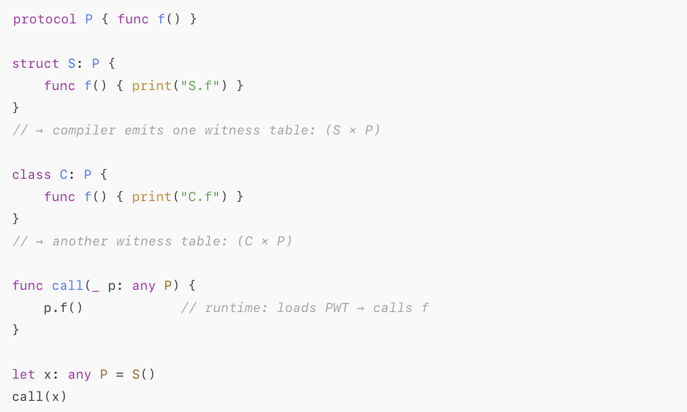
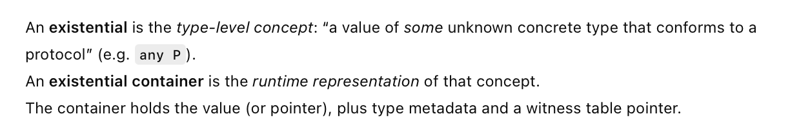
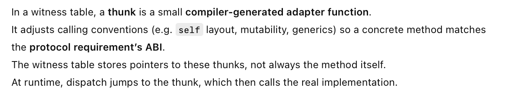
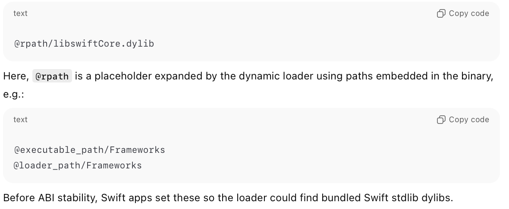

[toc]

#### Building swift compiler

> Haven't read or tried yet but has been explained in 'Swift Secrets > Swift Open Source project > Building and Testing the Swift Compiler' .

After cloning the git repo, you can build the compiler in two ways - Using **cmake** or (for simpler changes) **utils/build-script**.

#### Generics implementation

C++ has had code templating (Swift generics is inspired from that), but C++ implements that using code duplication whereas Swift implements that using generics.

#### Mirror API for introspection

Its possible to user **Mirror** ([reference](https://developer.apple.com/documentation/swift/mirror)) to learn about the properties of just about any type at runtime.

#### Outputs leading to xcframework

----

**Method dispatch** is the process of deciding which function implementation gets called for a given method invocation. It can happen at compile time or runtime.

**Compile time (static) dispatch** happens when the compiler can know the exact implementation, i.e. when with methods of a final class, static methods, etc. These are implemented using **direct call**, and gets done during SIL generation phase of swiftc.

**Runtime dispatch** happens when the implementation may vary, with overridable class methods or protocol based calls. The exact mechanism there too varies.

1. **Vtable (~Virtual Table) lookup** is used in case of overridable class methods. This table is formed during compile time, and is a per-class array of function pointers for overridable methods
2. **Protocol Witness Table (PWT) lookup** is used in case of protocol based calls. This table however is formed during compile time, with every 'concrete type + protocol conformance'  having a PWT formed for itself. At runtime, the call site gets a pointer to the correct PWT.

Consider below code snippet

At compile time an **existential** is passed to the function, whereas at runtime an **existential container** is passed. The container has the value of the concrete instance that conforms to the protocol, and also the PWT for that concrete type.

The witness tables also contain pointers to **thunks**, which are basically compiler generated functions that adjust some of the functional implementations for better ABI stability.

Before ABI stability, Swift apps used **RPATH** to load a bundled Swift standard library from the app. Since the introduction of ABI stability, the loaded uses a **fixed system path** (such as `/usr/lib/swift` ) instead for those system libraries. This is how `rpath` was used before ABI stability.

