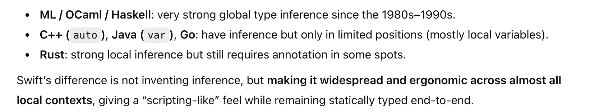
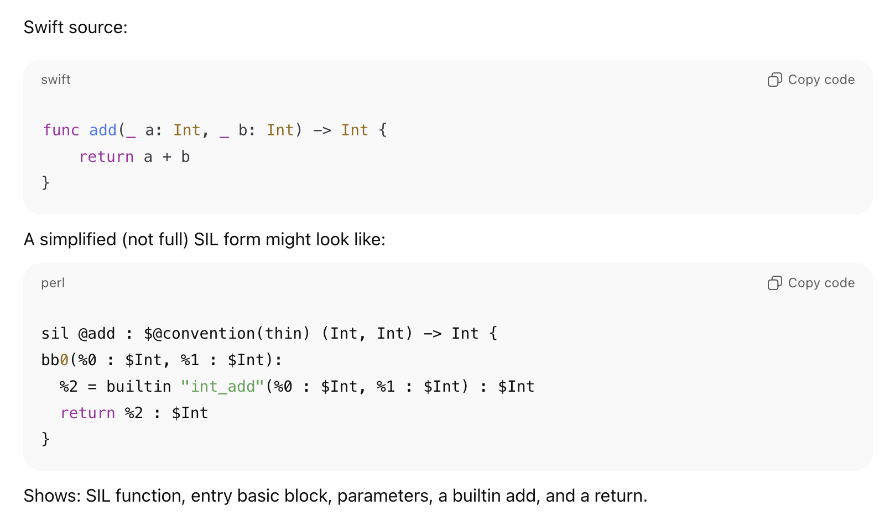
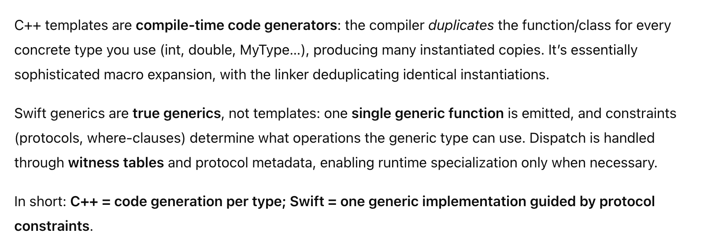
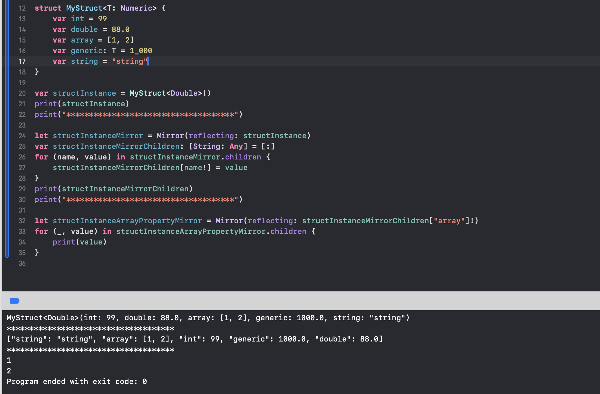

[toc]

#### Phases of swiftc pipeline

There are 5 phases of swiftc pipeline -  1. Parsing the Swift sources and imported modules into declarations  2. Semantic analysis (Sema)  3. SIL generation  4. SIL optimisation (for release builds)  5. LLVM IR generation.

##### Semantic Analysis

**Semantic analysis** includes translating function bodies into applicable calls to other functions. For example, operators too are functions internally and they gets resolved in this phase. The `+` in `a + b` becomes a specific call like `Int.+(Int, Int)` or `String.+`.

Types, overloads, generics, protocol conformances, access control, etc. all get resolved here. Type inference gets done here, followed by AST (Abstract Syntax Tree) generation. There are limitations though, complex expressions cannot be type checked in a reasonable amount of time, although its improving a lot with time. 

> Using the `Other Swift Options > -Xfrontend -warn-long-expression-type-checking=150` in Debug build settings allows one to know which expressions that could be better split up for quicker type inference.

Universal type inference was not a norm in other compiled languages before Swift.

##### SIL

**SIL** is Swift Intermediate Language, which is swiftc's own intermediate language. It looks something like this

> There are various ways to generate SIL yourself if you want to, although you should not need to. Its an unstable compile-internal format.  From Swift source - `swiftc -emit-sil main.swift` (or `swiftc -emit-silgen` for earlier, less-optimized SIL)  You can also use the lower-level frontend: `swiftc -frontend -emit-sil main.swift`.

#### Generics implementation

C++ has had code templating (Swift generics is inspired from that), but C++ implements that using code duplication whereas Swift implements that using generics.

#### Mirror API for introspection

Its possible to user **Mirror** ([reference](https://developer.apple.com/documentation/swift/mirror)) to learn about the properties of just about any type at runtime.

#### Linking

**Linking** is the build step that combines all compiled object files and libraries into a final executable or library. It happens after compilation, i.e. after both compiler front-end and back-end have done their work. 

It looks at the contents of all the object files, the symbols in them, and then resolves the symbol references as it knows the contents of all files, and lays everything into one final executable binary removing duplicates and applying relocations.
