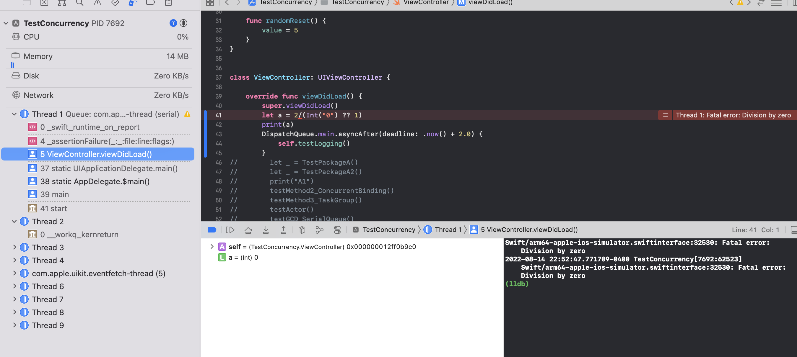
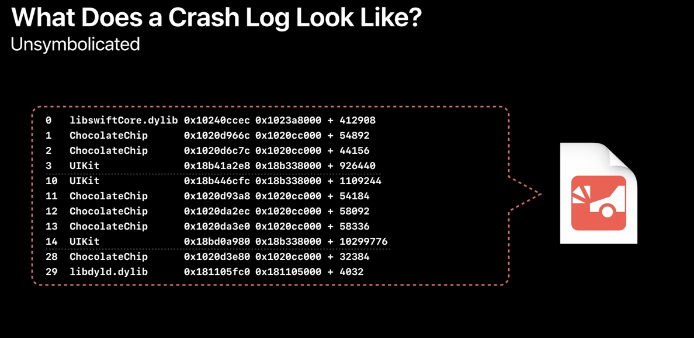
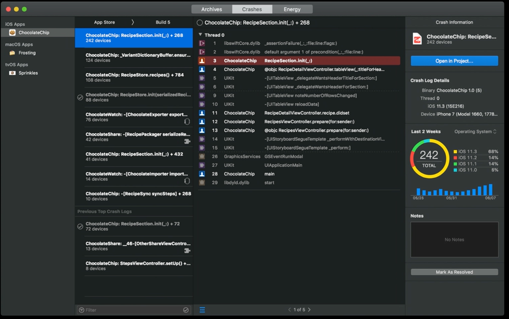
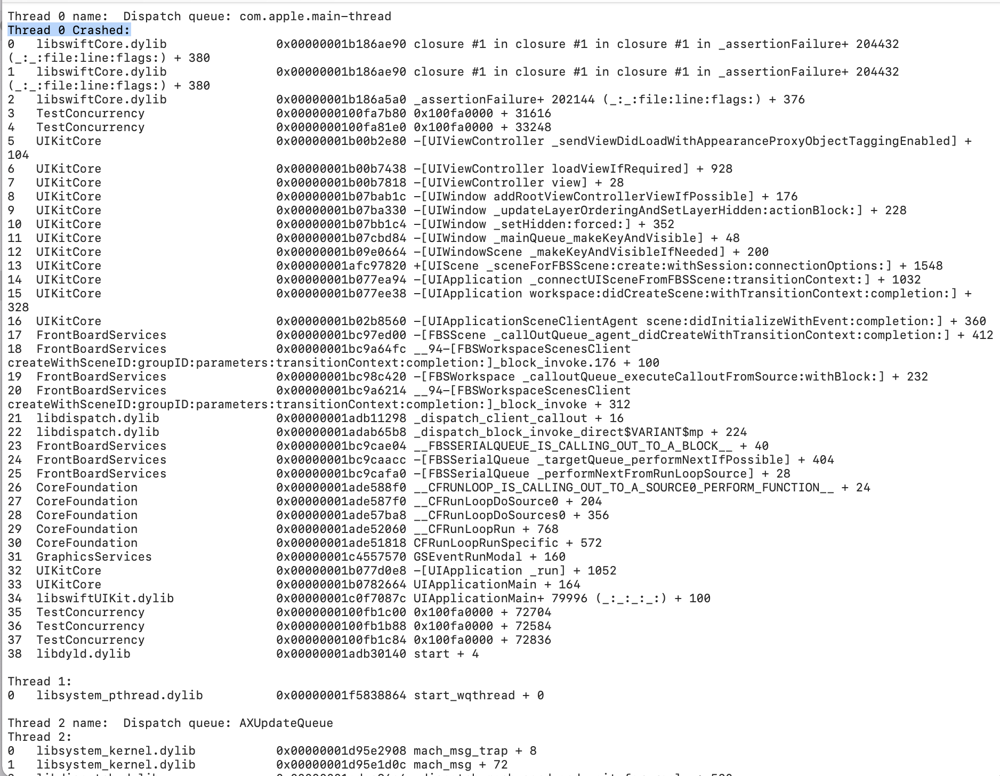
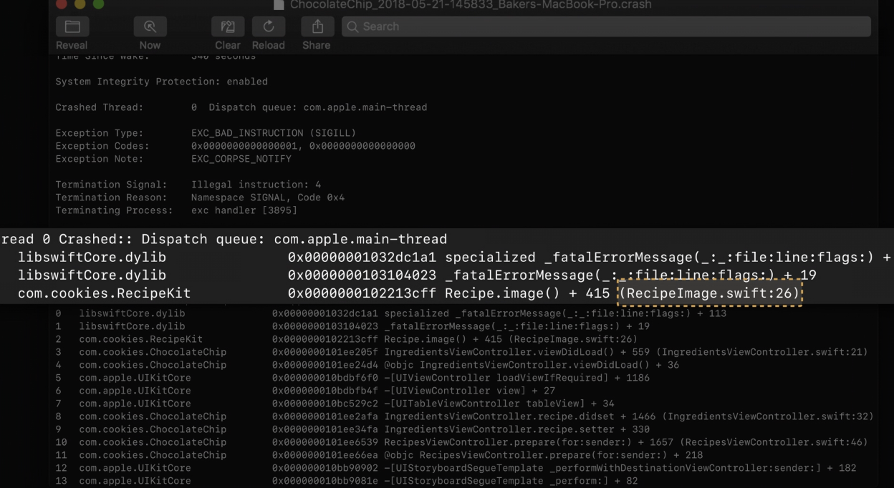

[toc]

> This is largely from 'WWDC 2018: Understanding Crashes and Crash Logs' and 'WWDC 2021: Symbolication: Beyond the basics'.

#### What really is crash

Basically, its a sudden termination of your app when it attempts to do something that is not allowed.

This can be many different kinds of things. For example, if a division by zero is attempted the CPU does not allow it and causes a crash. Sometimes the OS can terminate an app if its taking too long to launch or is using too much of memory.

At times the programming language itself causes a crash to prevent a more serious issue (for example accessing an array element that's outside the array's bound). And yes, its possible to crash using assert from normal code too.

#### Crash logs - Symbolicated, and Unsymbolicated

When a crash is about to happen, if the debugger is attched (Which usually is, when the app is being run from Xcode) the debugger receives a signal that the app is about to crash and pauses the app.

In such a situation where debugger is attached a very clear stack trace for all the active threads at that point gets captured.

However when the debugger is not attached, the operating system captures  and saves (in plaintext) the backtrace to disk. This is what is known as 'crash log'. When the release build of an app crashes the log doesn't actually look this pretty and is `unsymbolicated`. What's actually written out is a list of binary names and addresses. As is clear below, (while the module name is visible) the file name, function name, line number, etc. are not visible. They then need to be symbolicated using some manual steps to make sense.

#### How to capture Crash logs

##### Xcode > Devices and Simulator

All the crashes saved in a device can be accessed using Xcode > Devices and Simulators (Cmd Shift 2) > `View Device Logs`.

Devices and Simulators window | Logs
--- | ---
 | 

> The logs shown here are automatically symbolicated using the local symbols on the Mac. Also, this is a more reliable list of logs than the one in 'Crashes Organizer' below.

##### Xcode > Crashes Organizer

For all the crashes generated on TestFlight builds crash logs can be accessed using Xcode > Organizer > `Crashes Organizer`.

Navigating from Xcode | An example when there are apps pushed to App Store/Test Flight
--- | ---
 | 

> When uploading the app to App Store or TestFlight, symbols should be included for server-side symbolication of crash logs.

##### Device > Settings > Privacy > Analytics Data

Crash logs (in fact all logs) are also available in device's Settings app under Privacy > Analytics. If the app was installed by running from Xcode, the logs are symbolicated. (If the app was installed in some other means, may be it will not be?)

#### Recommended practices for automatic symbolication of crash logs

When uploading the app to App Store or TestFlight, symbols should be included.

All app archives (`xcarchive`) must be saved locally. The app archives () contains a copy of debug symbols. Xcode uses Spotlight to find these dSYMs and to perform local symbolication when necessary.

And if the uploaded app contains bitcode, the 'Archives Organizer > Download Debug Symbols button' should be used to download any dSYMs that come from a store-side bitcode compilation. (Is it that if uploaded app has bitcode, usual symbols are not enough and store-side bitcode symbols must be downloaded locally for symbolication?)

##### Contents of Crash Log

Top of the file has basic things like process name, device types, date, OS version, etc.

Then there is the reason for the crash. The specific error, the specific signal that the OS sent to stop the process, etc. In some cases, it also includes the console logs.

Thereafter there are the stack traces for all the threads that were active at that time. One of them is marked as the 'crash thread', with full debug information regarding file and line number in the code of what the crash happened.

Example 1 | Example 2
--- | ---
 | 

 Below that there is some low-level information, the 'register state' of the thread that crashed and the 'binary images' that were loaded into the process, i.e. the application executable and all the other libraries. And Xcode uses this for symbolication in order to look up the symbols, the files and line number information for the stack traces.

Snippet 1 | Snippet 2
--- | ---
 | 

##### Trying to guess things from memory address
