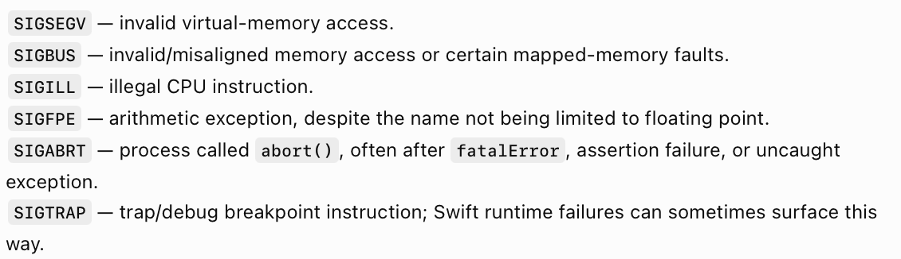
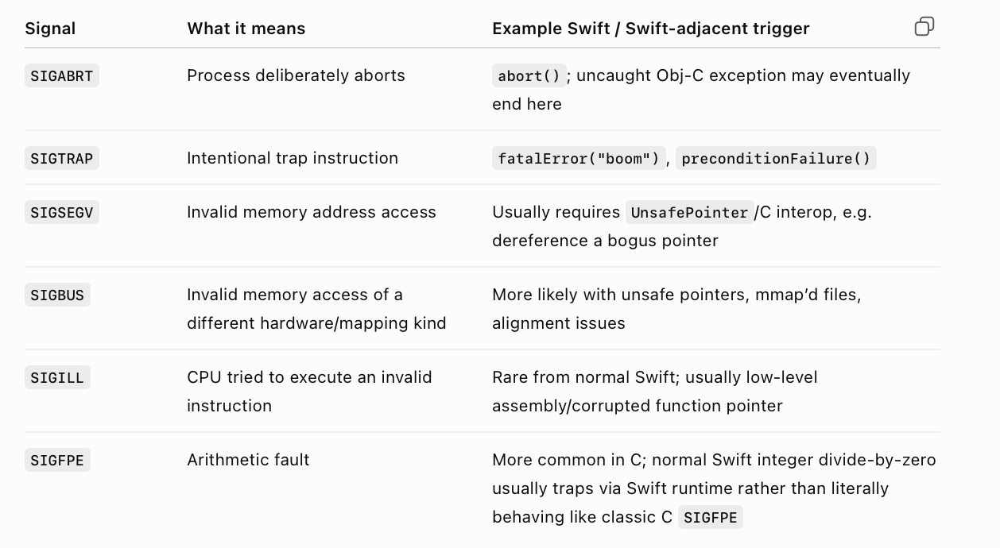

##### What is a Crash

Simply put, it's an unusual termination of a process. 

Signals are asynchronous notifications delivered by the OS/kernel to a process. Some signals have a default action of terminating process.

Here are some common signals that cause a crash.

In Swift-speak - 

##### Resources

Crash reporting guide ([ChatGPT link](https://chatgpt.com/g/g-p-6934bcdfcafc819182baa9435e044320-swift-programs/c/6a793914-9b98-83ea-9497-53541ca5976f))  Crash reporting guide - Comapnion ([ChatGPT link](https://chatgpt.com/g/g-p-6934bcdfcafc819182baa9435e044320-swift-programs/c/6a7a3f66-1b04-83ea-a4d8-3325f065f22d))  What is Stack Trace, How Crashlytics, etc. work ([ChatGPT link](https://chatgpt.com/g/g-p-6934bcdfcafc819182baa9435e044320-swift-programs/c/6a7a48b4-a084-83ea-ada5-73d6f8a2a830))  What is crash and signals ([ChatGPT link](https://chatgpt.com/g/g-p-6934bcdfcafc819182baa9435e044320-swift-programs/c/6a7a4a2c-c9a0-83ea-97e7-b70fd9b54f07))  