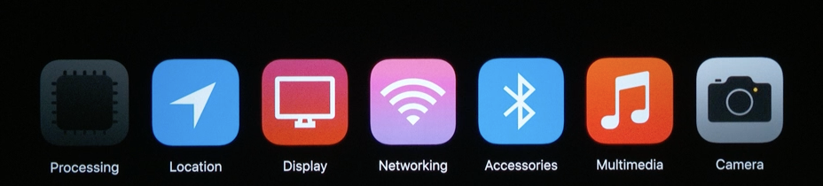

[toc]

#### Categories of measurable metrics

Very broadly speaking, (as of 2019) it seems that Apple classifies various measurable metrics into two different categories. 

1. **Battery metrics** - Things that have definite impact on battery. These include processing, location, display, networking, Bluetooth and accessory metrics, multimedia metrics, and camera metrics.

   

2. **Performance metrics** - Things that have performance/usability implications but don't have as much of an impact on the battery drainage. These include hangs, disk metrics, application launch metrics, memory metrics, and custom interval metrics.

   

   

#### Battery metrics

**Processing metrics** - Measures things like CPU and GPU time taken by the app. Use it to understand workloads by looking for CPU spinners and unexpected rendering.

**Location metrics** -  Gives cumulative usage, different accuracy buckets, and the background location usage

**Display metrics** - There are several of these. On OLED devices such as the iPhone X and XS, the color of UI in the application has a direct impact on the amount of energy that is consumed by the display. And that is  represented through a metric called `Average Pixel Luminance` (i.e. `APL`). Lighter colors that are used in the UI, more energy that will be consumed on OLED devices, this is what is called as a higher APL.

**Networking metrics** - These re things such as upload and download bytes over cellular and wifi, and othe connectivity metrics.

#### Performance metrics

**Hang metrics** - This is the time the application spends as being unresponsive to user input. Its typically shown as a histogram. It should be addressed by moving work off the main thread if possible.

**Disc metrics** - This measures logical writes to disk (and possibly also how much its used?).

**Application Launch metrics** - Measures launch and resume times. (Resume time meaning the time it takes to reactivate the app?)

**Memory metrics** - Measures the memory taken by the app. Gives `Average suspended memory` and `Peak memory`. Can help reduce  launch times and the susceptibility to background termination. 
