[toc]

#### What is MetricKit

`MetricKit` is a framework that allows the code to receive app related diagnostics and metrics from the OS. The code can then choose what to do with it, send them to a server or to save them locally. Diagnostics related data is received immediately (iOS15 onwards), and performance related metrics is received atmost once a day. It was introduced in 2019, and the v2 of its API followed in 2020. ([Reference](https://developer.apple.com/documentation/metrickit#overview))

> Note that metrcis are only collected from device if the user consents to share app analytics.

#### Basic code structure

The code roughly looks like this. 

| 1. Configure MXMetricManager                                 | 2. Receive data in MXMetricManagerSubscriber delegate method |
| ------------------------------------------------------------ | ------------------------------------------------------------ |
| 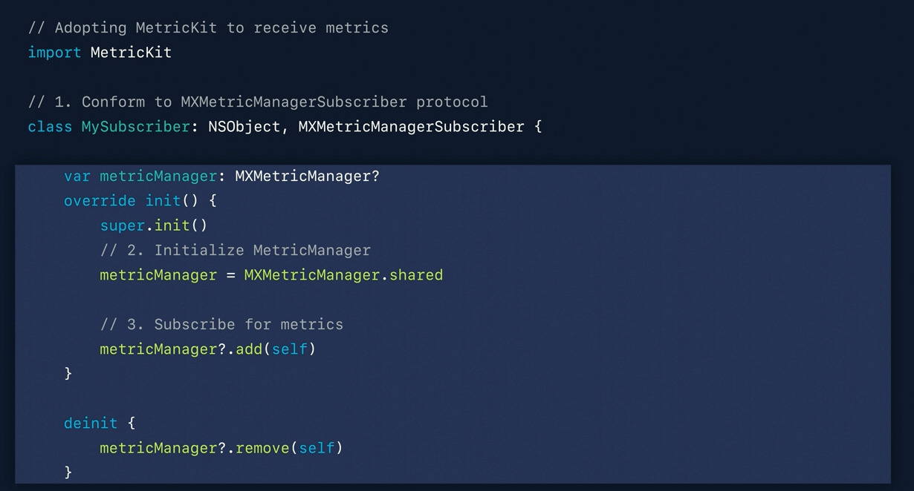 | 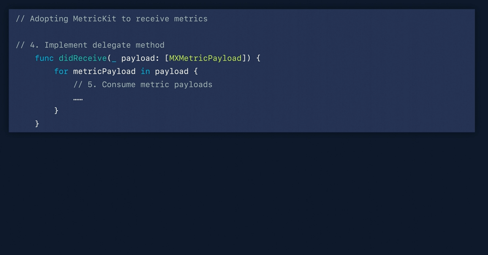 |

Diagnostics are reported using `MXDiagnosticPayload`, metrics are reported using `MXMetricPayload`. The functions for diagnostics and metrics are semantically similar.

##### MXMetricPayload

`MXMetricPayload` has properties for various kinds of performance related metrics. Each of those properties has a type that corresponds to some kind of performance aspect, for example one for network, another for CPU, etc. It can also be made to report custom metrics using a singposts like API.

| Battery metrics                                              | Performance metrics                                          | Responsiveness metrics                                       |
| ------------------------------------------------------------ | ------------------------------------------------------------ | ------------------------------------------------------------ |
| 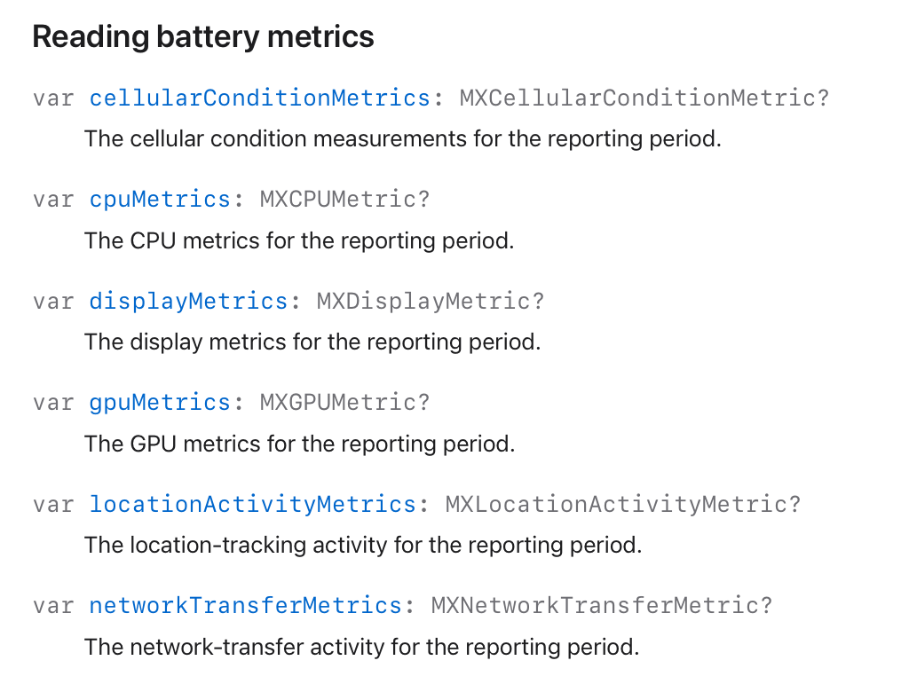 | 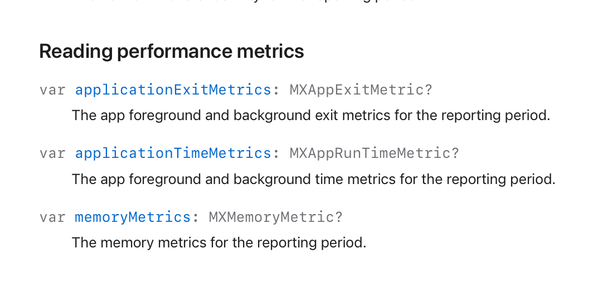 | 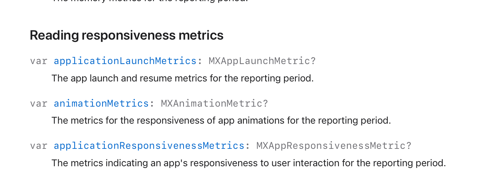 |

| Disk access metrics                                          | Custom metrics                                               |
| ------------------------------------------------------------ | ------------------------------------------------------------ |
| 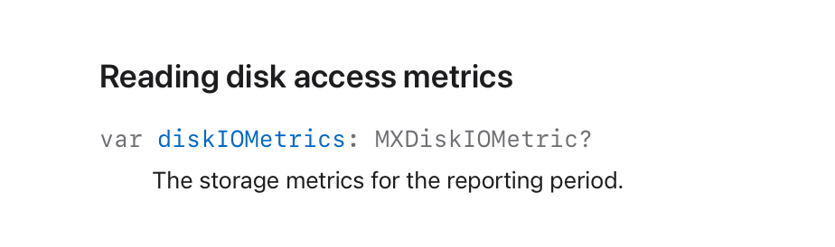 |  |

And then there is also data regarding the report, i.e. when it was generated, details regarding the device, etc. And yes, there is a function for generating a JSON representation too.

| Details regarding the payload and device                     | Generating JSON representation                               |
| ------------------------------------------------------------ | ------------------------------------------------------------ |
| 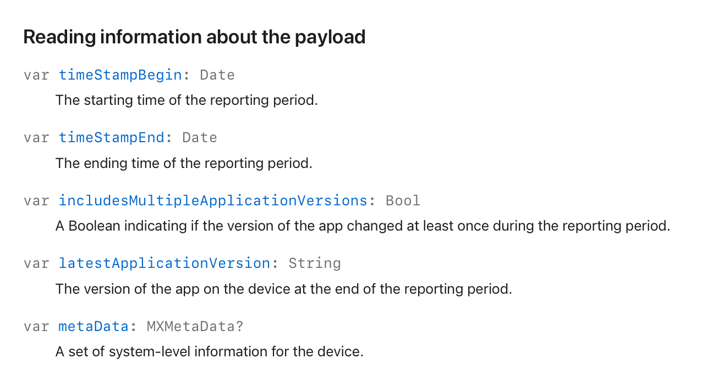 | 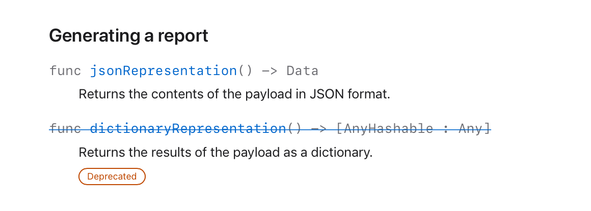 |

`MXCPUMetric` also include 'CPU instructions', which are an absolute metric for the work that the application does on the CPU. It is both hardware and frequency independent.

`MXAppExitMetric` represents metrics about the reasons for foreground and background exits.

A scroll hitch is when a rendered frame does not end up on screen at its expected time during scrolling. They are reported using `MXAnimationMetric` ([reference](https://developer.apple.com/documentation/metrickit/mxanimationmetric/3552265-scrollhitchtimeratio)).

##### MXDiagnosticPayload

`MXDiagnosticPayload` has properties for various kinds of diagnostics related data for when something happens.

| Crashes and CPU exceptions                                   | Responsiveness                                               | Disk access exceptions                                       |
| ------------------------------------------------------------ | ------------------------------------------------------------ | ------------------------------------------------------------ |
| 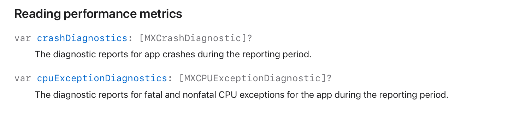 | 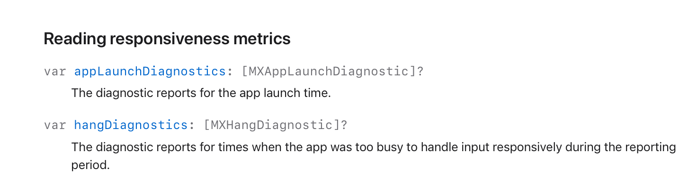 |  |

`MXCPUExceptionDiagnostic` gives details of CPU time consumed, total sampled time, and backtraces of threads spinning the CPUs. `MXDiskWriteExceptionDiagnostic` has details of total writes caused and backtraces of threads causing writes.

The stack traces are represented using `MXCallStackTree`. These backtraces are unsymbolicated and designed for off-device processing. 

Here's an example of what these call stack trees look like after they've been converted to a human-readable JSON.

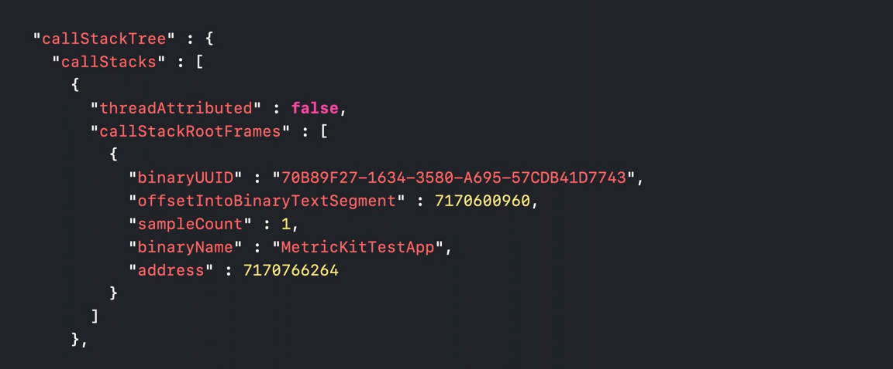

`MXHangDiagnostic` represnts hangs, i.e. when the app is too busy to handle user input responsively.

#### Custom metrics

Custom metrics can be generated using `mxSignpost()`, a signpost based logging API. By bookending the critical sections in your application with mxSignpost, you can capture the precise impact. 

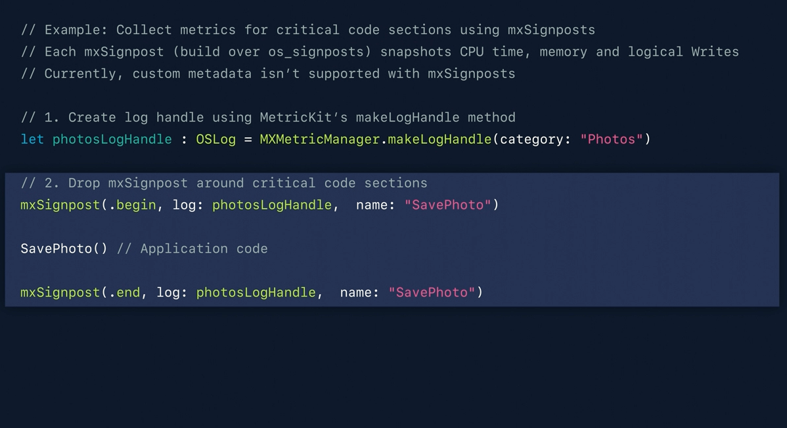

#### Simulating metric payload

While running the app the receiving of a metric payload can be simulated in Xcode using a menu option named ''Simulate MetricKit Payloads'.  

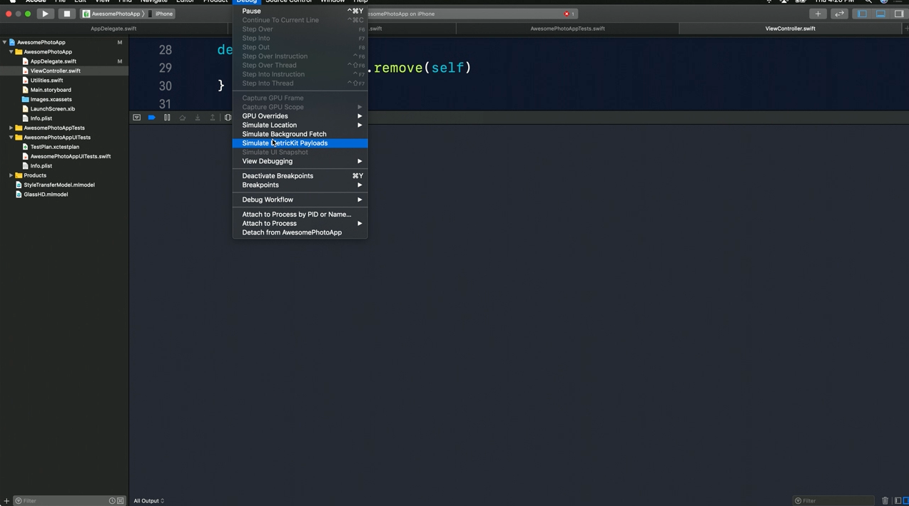

Here is what the payload looks like.

| 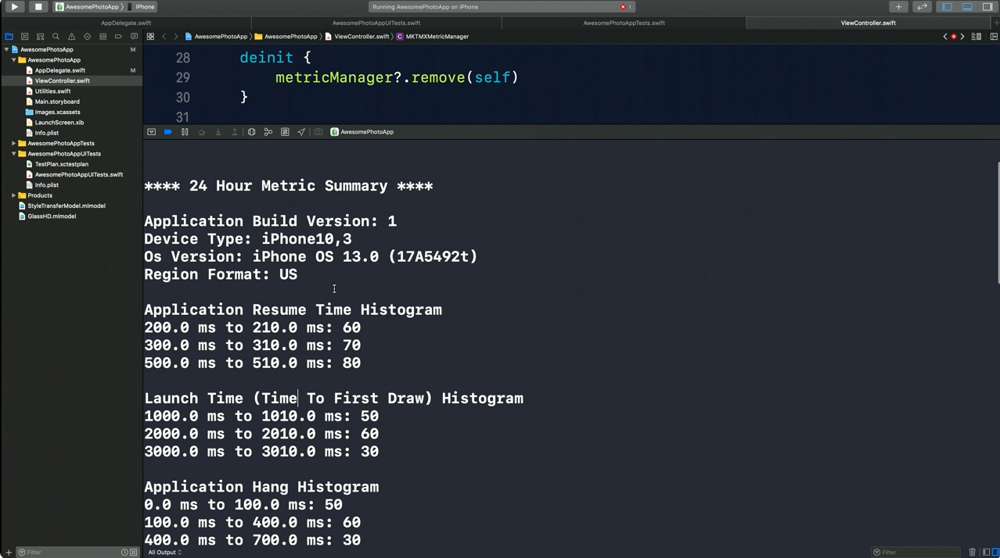 | 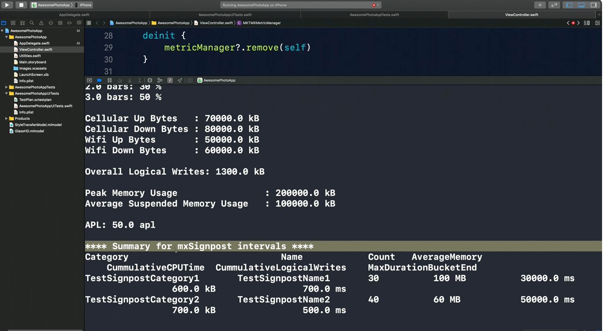 |
| ------------------------------------------------------------ | ------------------------------------------------------------ |

> Cold launches, is when the app is being launched from scratch with no resources in memory. In a typically well-performing app, resumes should be be much more prevalent than launches. The metric payload below shows how it looks when that is not happening. 
>
> | 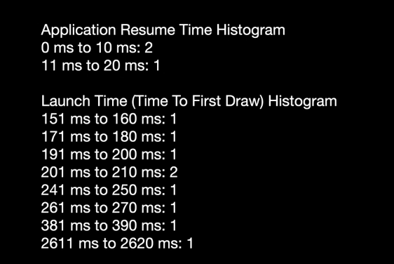 |  |
> | ------------------------------------------------------------ | ------------------------------------------------------------ |
