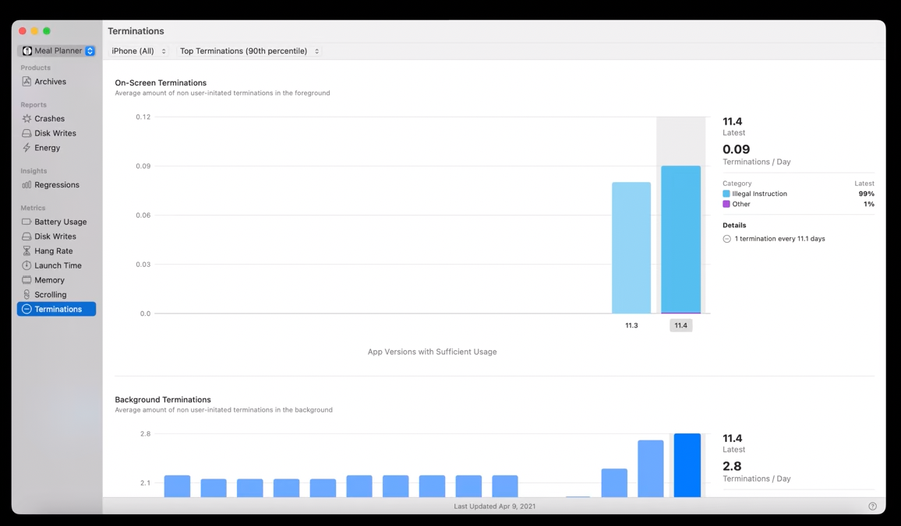
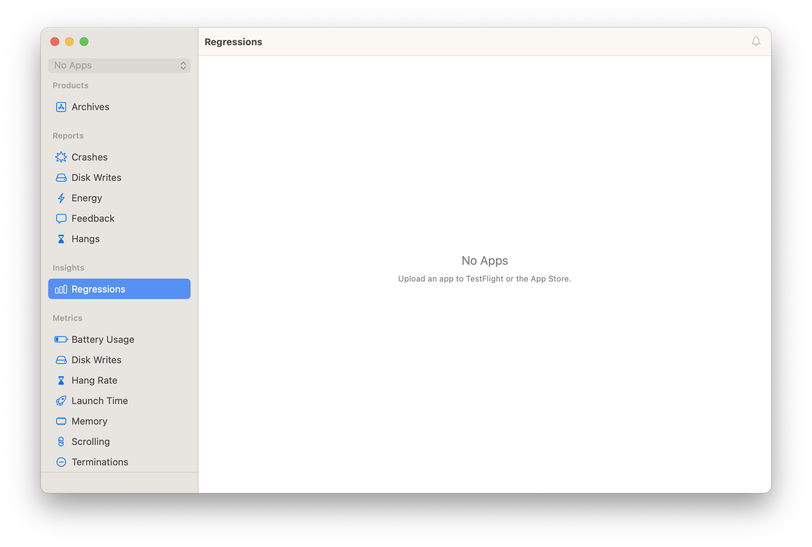
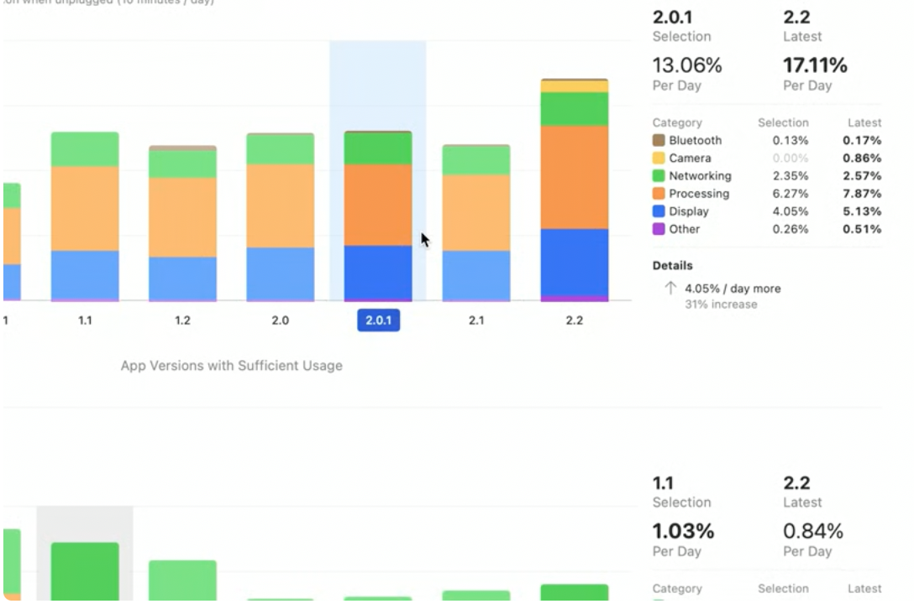
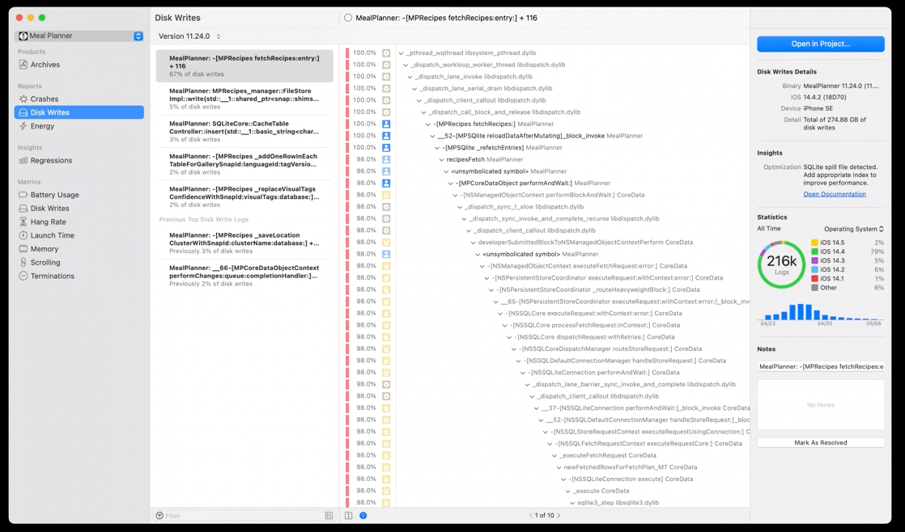
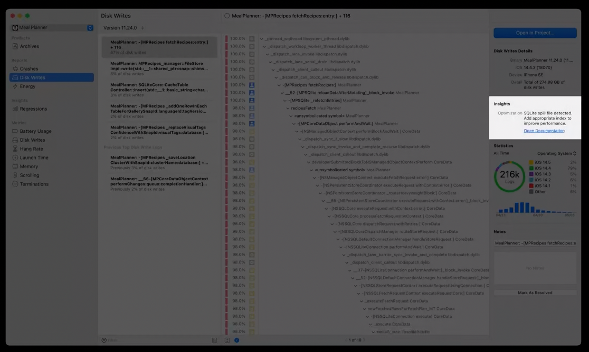
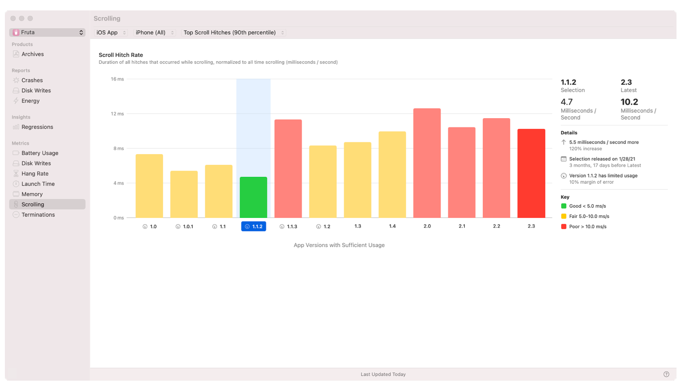
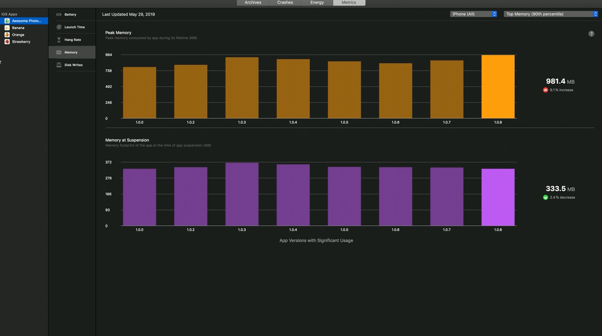
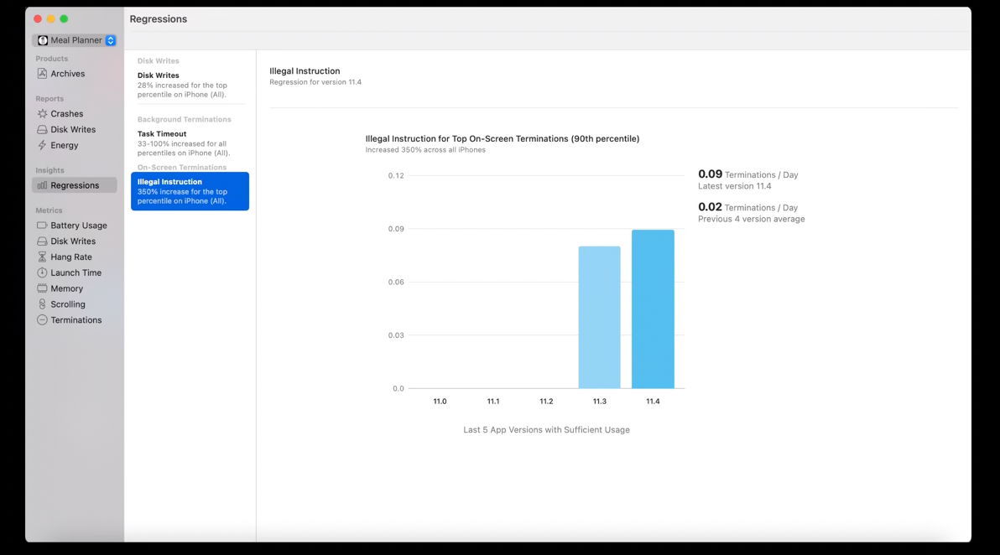

[toc]

#### What is Xcode Organizer

`Xcode Organizer` can be accessed using Xcode menu (or command shortcut 'Cmd + Shift + Option + O'). It automtaically shows various metrics for your apps that are in App Store. So basically the kind of thing that you can otherwise collect through code using MetricKit. There are sections for various metric types in it.

Organizer window with some real data (~2020).

Organizer window as of 2023.

Some categories, like battery and terminations, can have multiple sections, as well as subcategories detailing different event types.

The interactive UI allows to compare and contrast metrics for different versions of the app.

###### Gotchas

Saw this somewhere on the internet, so the logs in Organizer can probably be exported to Finder too.

> If you issue a secondary click on a Metrics Organizer view, you will see a contextual menu pop up with an option to Show in Finder. This will open a Finder window and show you the Metrics.xcmetricsdata file for your app, which is a cached JSON data file of all the metrics and insights that have been recently loaded for your app in Organizer.

Interestingly, as per intrnet Organizer actually does not show anything for most apps. Apple saves data in their servers only for apps that have thousands and thousands of users. Its better to rely on MetricKit instead. ([link](https://stackoverflow.com/a/71915148/1135417))

#### Some of the metrics and reports

##### Disk Writes

Disk write diagnostics logs are aggregated when disk writes exceed one gigabyte in a 24-hour period. They also contain information about the stack trace that led to the writes. The stack trace from each report is broken down into multiple signatures, and the writes are tracked for a signature across all reports. 

|  |  |
| ------------------------------------------------------------ | ------------------------------------------------------------ |

> File activities instruments is a fantastic resource to debug all storage-related issues.

##### Scrolling

A scroll hitch is when a rendered frame does not end up on-screen at its expected time while a user is scrolling within your app. This usually causes frames to be dropped, which can be perceived as a jittery scroll. For the scrolling section of the Organizer, we take the hitch time, which is the total amount of extra time frames take to show up on-screen, and we divide that by the scroll duration, which is the total amount of time a user spends scrolling within your app.

The result is the hitch rate, which is an important metric you can use to measure app performance.

There are three buckets for how you should interpret hitch rate. First is when the hitch rate is less than five milliseconds per second. Between five and ten milliseconds per second, frames are dropped every couple of seconds. And when the hitch rate is greater than 10 milliseconds per second, users will be perceiving frame drops very frequently, leading to a poor scroll experience.

([Reference](https://developer.apple.com/documentation/xcode/analyzing-responsiveness-issues-in-your-shipping-app))

##### Memory

(~2019 screenshot)

#### Regressions and Insights

The Organizer has an `Insights` section that highlight all the your performance priorities and streamline your workflow. The Xcode Organizer processes metrics data and identifies interesting trends such as performance regressions. Its essentially something to help  understand key things when there is a lot of data generated.

`Regression` (i.e. downward trend) is when  an app performs poorly in a power or performance area relative to recent releases. For example, when it takes longer to launch after a release.

The UI looks like this (~2020). The left-hand side summarizes metric regressed, by how much, and for which percentiles, highlighting exactly what to focus on.

