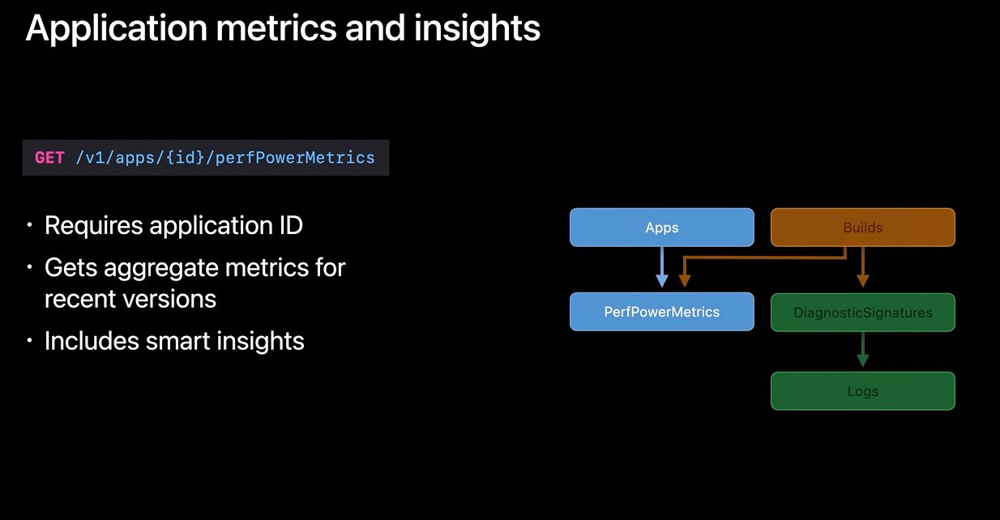
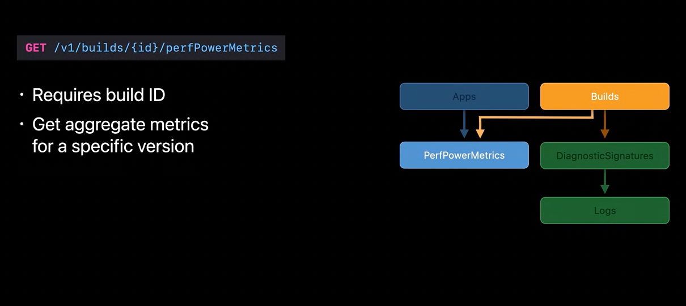
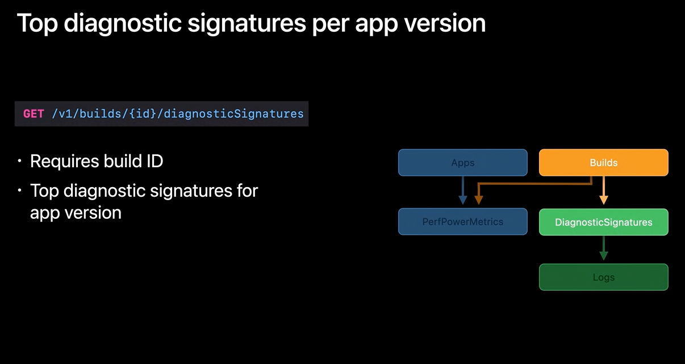
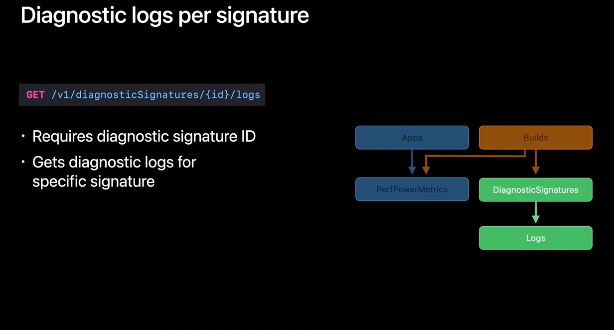

[toc]

`Power and Performance API` is a part of `App Store Connect API` . The API enables to programmatically access the Xcode metrics and diagnostics data, allowing you to consume this data yourself. So kind of same thing that MetricKit can otherwise do.

##### Four REST APIs

There are four REST API resources available. These are commonly known as `perfPowerMetrics`, and `diagnosticSignatures` APIs.

First API resource uses application's ID to provide aggregated metrics and insights for THE app's most recent versions.  Second API resource allows to download metrics for a specific app version.  Third API allows access to top diagnostic signatures for a specific app version. These signatures are used to group common problems. Fourth API allows to download logs corresponding to diagnostic signatures for your root cause analysis. This requires the diagnostic signature ID as part of the GET request.

| 1. Get aggregated metrics and insights across app versions   | 2. Get metrics data for one particular app version           |
| ------------------------------------------------------------ | ------------------------------------------------------------ |
|  |  |

| 3. Get diagnostic data for one particular app version        | 4. Get diagnostic logs for a particular signature            |
| ------------------------------------------------------------ | ------------------------------------------------------------ |
|  |  |

##### Resources

WWDC 2020 - Expanding Automation with the App Store Connect API WWDC 2020 - Identify trends with the Power and Performance API

