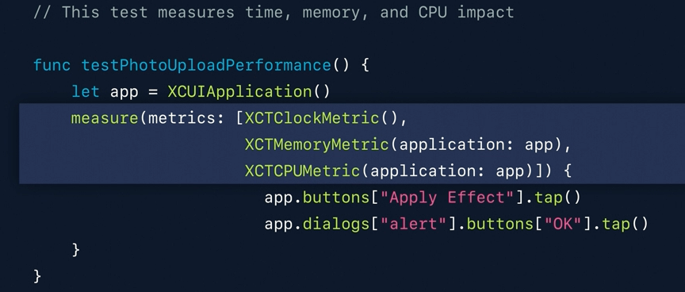

[toc]

#### Various Tools available

Until 2018 - Instruments, Energy Gauge, Profiling Tools, XCTest metrics (Performance of measure blocks from XCTests)

Since 2019 - Xcode organizer, MetricKit

Right inside the debug navigator of XCode, you can get a high-level overview of the CPU memory and energy subsystems. And when you want to dig into the details or diagnose some issues, Instruments is a real useful tool.

#### Measuring using `measure()` function

*Rough notes from 'WWDC 2019 - Improving Battery Life and Performance'*

With every new UI testing target that you create using XCTest, we're going to give you an application launch test for free.

The baselines are a mechanism wherein you set guidelines for what you expect your performance numbers to be.

 It's a good idea to not have the debugger attached to your process at it adds some overhead and it's also a good idea to turn off all diagnostic options like sanitizers. You can do this easily by either creating a separate scheme or you could use the test plan feature that was recently introduced to turn it off easily. 

You can also use it for unit tests.

#### Resources

##### WWDC videos

###### MetricKit

WWDC 2020 - What's new in MetricKit - k WWDC 2019 - Improving Battery Life and Performance (*MetricKit introduced in this*) - k 

###### Xcode Organizer

WWDC 2021 - Diagnose Power and Performance regressions in your app - k WWDC 2020 - Diagnose performance issues with the Xcode Organizer - k WWDC 2018 - What's New in Energy Debugging - Obsolete?  WWDC 2015 - Performance on iOS and watchOS - Obsolete?  

###### AppStore Connect APIs

WWDC 2020: Expanding Automation with the App Store Connect API WWDC 2020 - Identify trends with the Power and Performance API - k 

###### Next

WWDC 2021 - Detect and diagnose memory issues WWDC 2018 - iOS Memory Deep Dive  

WWDC 2023 - Analyze hangs with Instruments WWDC 2022 - Track down hangs with Xcode and on-device detection WWDC 2021 - Understand and eliminate hangs from your app WWDC 2021 - Ultimate application performance survival guide   

WWDC 2020 - Eliminate Animation Hitches with XCTest Tech Talk - Demystify and eliminate hitches in the render phase Tech Talk - Find and fix hitches in the commit phase Tech Talk 2020 - Explore UI animation hitches and the render loop 

##### Official references

Performance and Metrics official complete documentation ([link](https://developer.apple.com/documentation/xcode/performance-and-metrics)) MetricKit official reference ([link](https://developer.apple.com/documentation/metrickit)) 