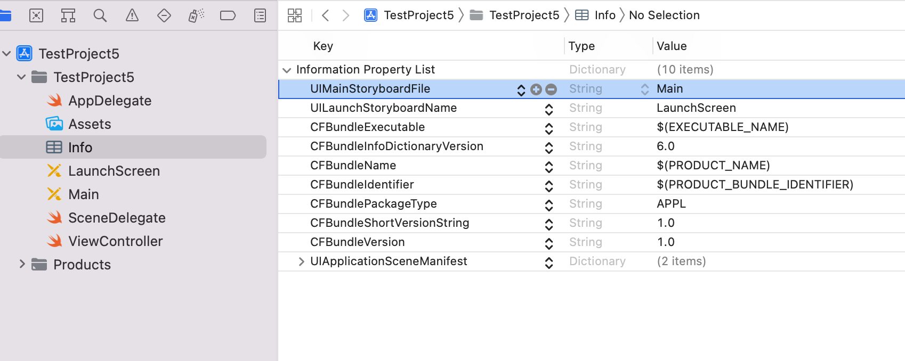

[toc]

#### Setting up a basic project.yml

1. Create the Xcode project first. <br>
2. Create the yml file, here is the minimal content. <br>
```
name: TestProject5
options:
    bundleIdPrefix: TestProjects
targets:
    TestProject5:
      type: application
      platform: iOS
      deploymentTarget: 15.0
      sources: TestProject5
```
3. Enter version and build numbers. <br>
4. Ensure Info.plist has all these 10 keys. <br>



#### Command

Generating the Xcode project based on the config yml. It probably by default looks for a project.yml in root folder. If a different yml files is to be used, then that file name would need to be specified in the `--spec` argument.
```
// All of these work
xcodegen
xcodegen generate
xcodegen generate --spec project.yml
```

#### Various configurations

`include` - It can be used to split specs across various files for batter organization. Included specs can also include other specs and so on. `include` can either be a list of includes or a single include. They are merged in order and then the current spec is merged on top. ([Documentation](https://github.com/yonaskolb/XcodeGen/blob/master/Docs/ProjectSpec.md#include))

```
include:
  - includedFile.yml
  - path: path/to/includedFile.yml
    relativePaths: false
```

In project.yml -
```
name: TestProject5
include: project-more-specs.yml
```

In project-more-specs.yml -
```
options:
  groupSortPosition: top
```
