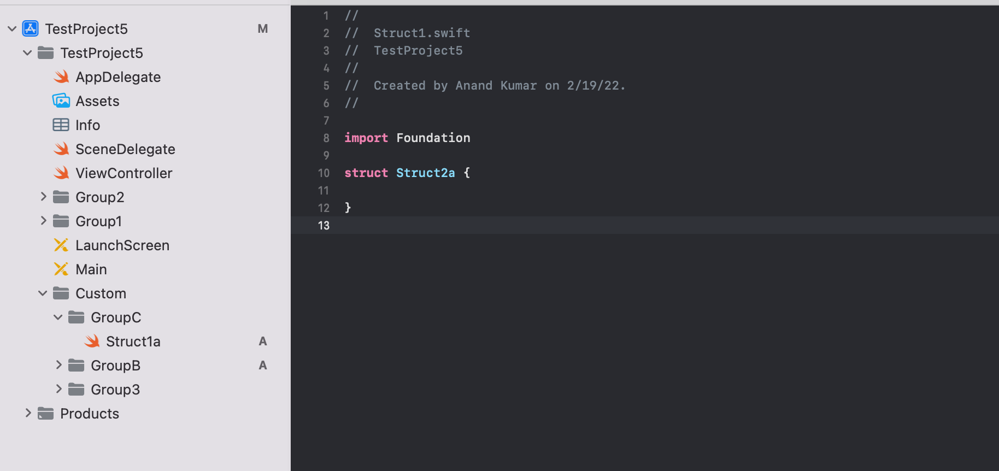
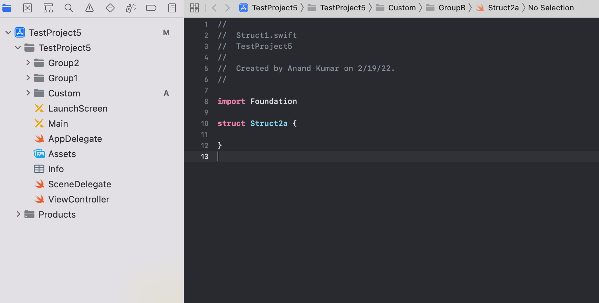
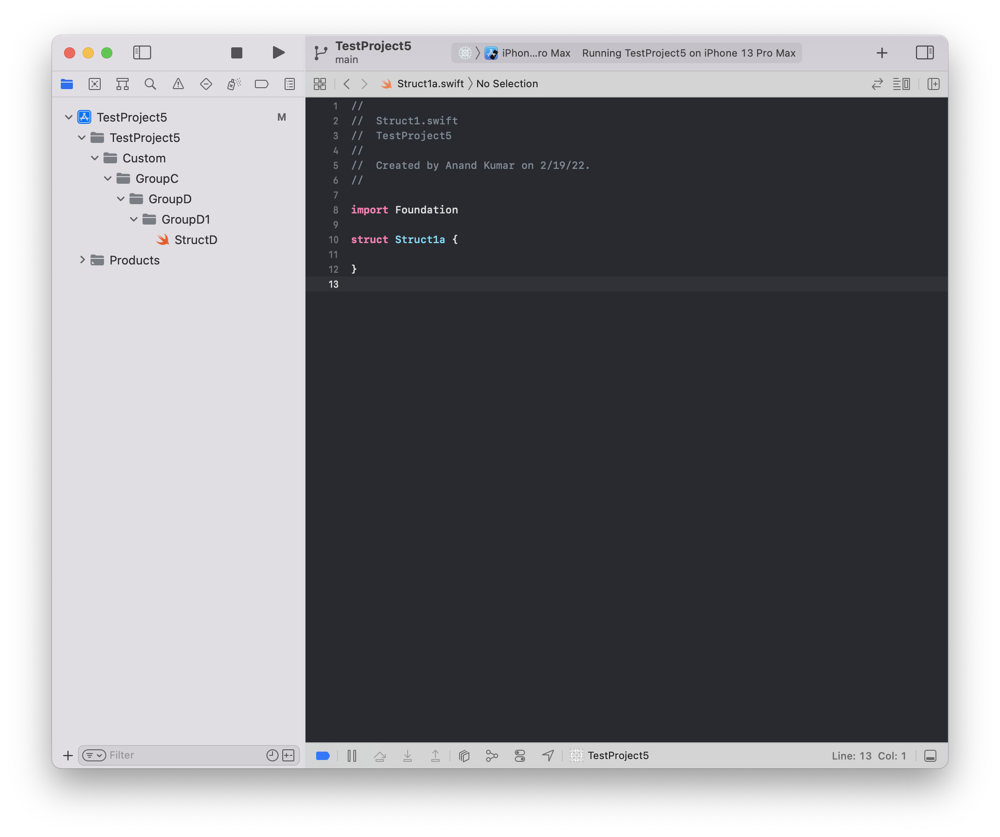

`options.groupOrdering` - Specifies the order in which groups are shown in project navigator (by default they are shown alphabetically). ([Documentation](https://github.com/yonaskolb/XcodeGen/blob/master/Docs/ProjectSpec.md#groupordering))

```
options:
  groupOrdering:
    - pattern: 'TestProject5'
      order: [Group2, Group1]
    - pattern: 'Custom'
      order: [GroupC, GroupB, Group3]
```

The above config for example, will sort the groups like this. For the first pattern the first specified order is used, and for the second pattern the second specified order is used.



The pattern can likely be a regex too. For example, `'^.*Screen$'`. Also, specifying the pattern is likely optional itself as then the order is applied on root folder by default.

`groupSortPosition` - Indicates how groups are sorted in relation to other files. Possible value are `none`, `top`, `bottom` (default).

```
options:
  bundleIdPrefix: TestProjects
  groupSortPosition: top
```



`createIntermediateGroups` - If it is specified and set to true, groups are created in a way that totally mimic the actual structure in the file system. The default value is false (in which case there is just one group). This option however does not seem to work well if options like `groupOrdering` are used too (I could get it to work only in this way, and with `path` attribute specified as well).

```
targets:
  TestProject5:
    sources:
      - path: TestProject5/Custom/GroupC/GroupD/GroupD1/StructD.swift
        createIntermediateGroups: true
```

