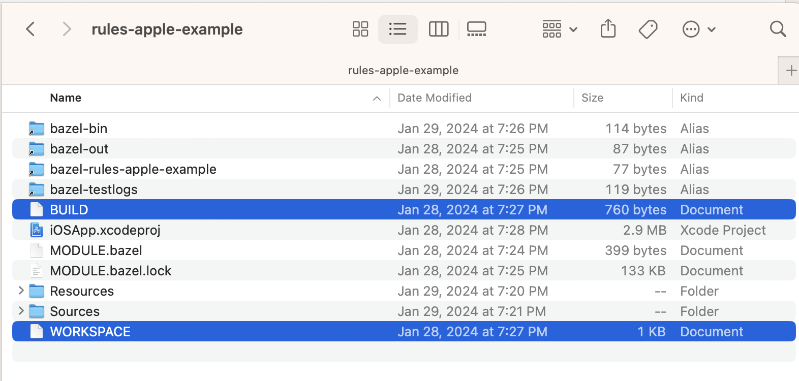
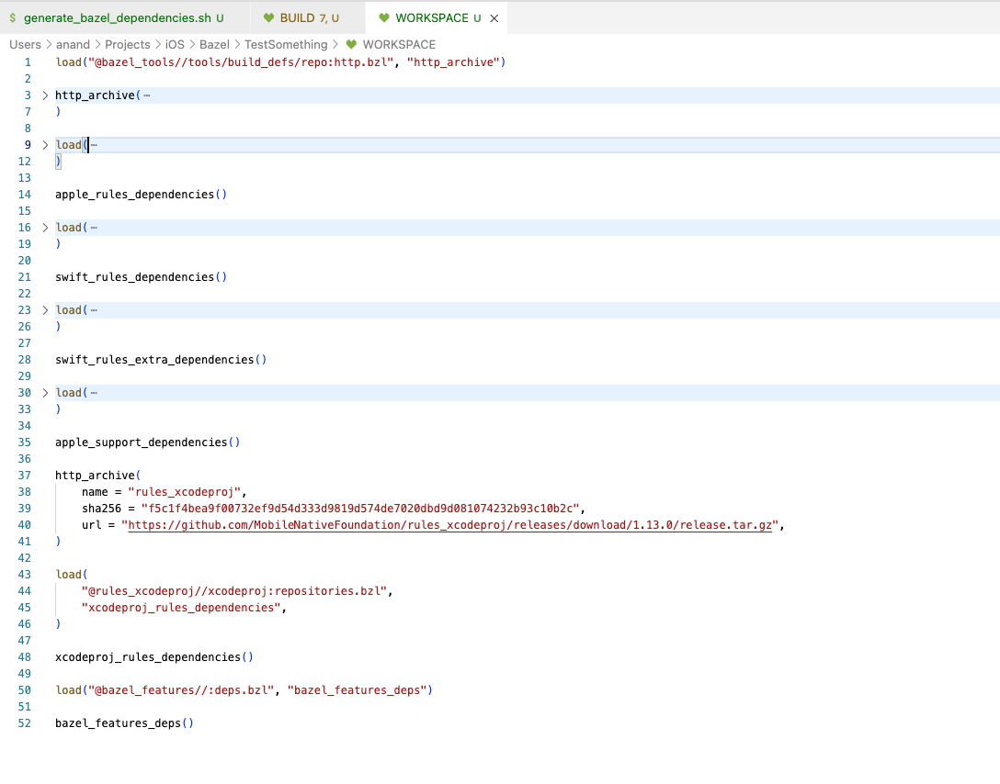
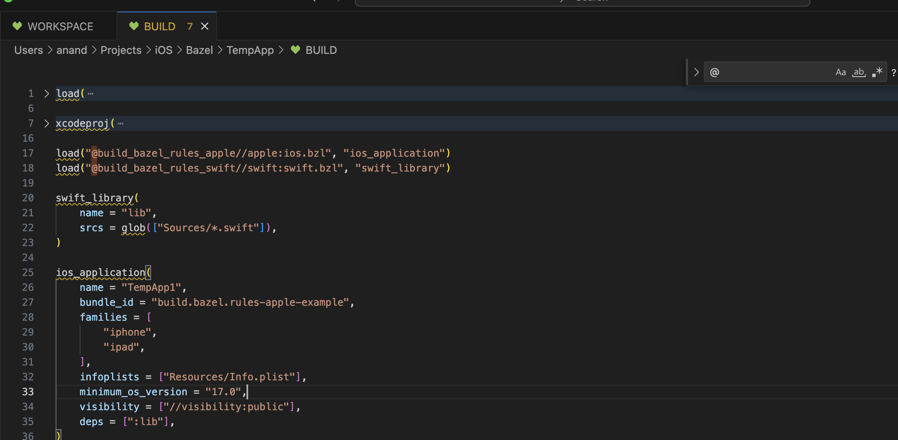
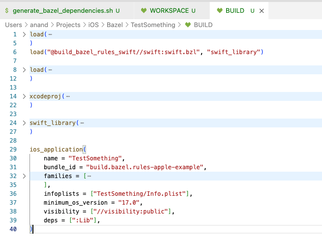

[toc]

#### What is Bazel

A build system developed by Google. Offers the benefits of faster and predictable builds. Builds can be distributed across multiple machines , and hence supports remote caching too. 

Built-in support is available only for some languages and platforms (iOS is not in that), but there is extensive open source support for other languages and platforms (and iOS is there in that).

#### Installation

##### Using Homebrew

([Reference](https://bazel.build/install/os-x))

Need to have Xcode Command Line Tools installed too.

```U
brew install bazel
bazel --version
brew upgrade bazel
```

##### Using Bazelisk

`Bazelisk` is the recommended way to install Bazel ([reference1](https://bazel.build/install/bazelisk), [reference2](https://github.com/bazelbuild/bazelisk)). It downloads and installs the appropriate version of Bazel, and can be used to switch between different versions of Bazel in different working directories on the same computer.

`````
brew install bazelisk
`````

This installs Bazelisk as bazel. Because of this, when you see bazel in future examples, it's actually running Bazelisk (which then runs Bazel).

#### Basics

##### Workspace

`Workspace` - Its the environment shared by all Bazel commands run from the same main repo. It encompasses the main repo and all the defined external repos too.

As far as file system is concerned, every workspace must have the text file named `WORKSPACE`. Conceptually, its a folder that contains the source files, and importantly also a `WORKSPACE` file and atleast one `BUILD` file. These files contain the instructions that Bazel uses. The workspace typically also contains symbolic links to output directories. 



###### WORKSPACE file

A sample `WORKSPACE` file. Loads 'http_archive' and uses that to download other modules like 'rules_xcodeproj'.



##### Package

`Package` - The folder containing the `BUILD` file, has the source files, and something that can produce a output artifacts. Includes all sub-folders which are not packages themselves.

##### Repo

`Repo` - A folder with a boundary marker file at its root, i.e. a `MODULE.bazel`, `REPO.bazel` or in legacy context `WORKSPACE.bazel` file. Repo in which the current command is run is called the `Main Repo`,  external repos are defined by repo rules.

##### Target

`Target` - Defined in `BUILD` files, a package typically contains multiple targets. Can be of two kinds - `Files` (Source files, and Generated files), and `Rules` (specifies the relations between input files and output files). The inputs to a rule may be source files or even output of other rules. In some cases, input to a rule may also be another rule.

`Label` - Identifier for a target. The entire line in each of the examples below.

```
@@myrepo//my/app/main:app_binary     <---- @@myrepo is Canonical repo name
@myrepo//my/app/main:app_binary      <---- @myrepo is Apparent repo name
//my/app/main:app_binary             <---- Repo name is omitted altogether when label is refered to in the same repo from where it is used

@rules_xcodeproj//xcodeproj:defs.bzl <---- A real world example in a BUILD file
```

The part after the `repo name` (i.e. '//my/app/main:app_binary') is the `unqualified package name`.

When the label refers to the same package it is used in, the package name (and optionally, the colon) may be omitted. So simply ':app_binary' or even 'app_binary' can be written.

##### Rules

A special kind of function in a `BUILD` file, that can define a `rule target`  ([link](https://bazel.build/reference/glossary#rule)), i.e. declare a target. They are the primary way for extending Bazel to support new languages and platforms. They always produce some outputs (such as executables and libraries). For example, the built-in C++ binary rule takes a bunch of '.cpp' source files and produces executable output files.

A few rules (such as 'cc_library' and 'java_binary') are built into Bazel itself. You can write your own rules to extend Bazel to other languages and platforms. These rules are written in Starlark, are saved in `.bzl` files, and can be loaded from `BUILD` files.

Detailed documentation ([Link](https://bazel.build/extending/rules))

As an example, 'swift_library' and 'ios_application' below are rules.



Every rule invocation has a name attribute (which must be a valid target name), that declares a target within the package of the BUILD file. And a set of attributes; the applicable attributes for a given rule, and the significance and semantics of each attribute depend upon the rule.

###### BUILD files

Every package contains a `BUILD` file. Most BUILD files consist only of declarations of build rules. When a build rule function, such as 'cc_library', is executed, it creates a new target in the graph. This target can later be referred using a label.

BUILD files cannot contain function definitions, for statements or if statements (but list comprehensions and 'if' expressions are allowed). Functions can be declared in '.bzl' files instead. Crucially, programs in Starlark can't perform arbitrary I/O which is essential for ensuring that builds are reproducible.

A sample `BUILD` file. Actually defines the product, etc.



#### Extension

Bazel extensions are files ending in '.bzl'. Use the load statement to import a symbol from an extension.

```
load("@bazel_tools//tools/build_defs/repo:http.bzl", "http_archive")
```

You can use load visibility to restrict who may load a '.bzl' file.
