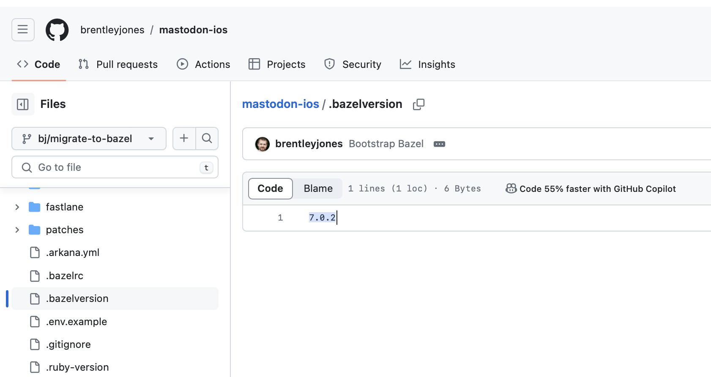

[toc]

#### Bazel wrapper script, `tools/bazel`

Unrelated to Bazelisk per se, its a common practice to have a certain [wrapper script](https://github.com/bazelbuild/bazel/blob/master/scripts/packages/bazel.sh) installed as bazel. determines right version to run and runs it. Actual Bazel versions are installed next next to it as 'bazel-1.0.0', etc.. This script basically takes care of checking the bazelversion file itself and then running the appropriate real bazel binary. It however does not download the bazel version if its missing. (So its a semi-Bazelisk of sorts.)

Now, there is another standard thing in Bazel called the `tools/bazel` executable that can be there. If its there the wrapper script it does not not directly execute any Bazel exe, but instead stores the path to the required Bazel exe in the environment variable `BAZEL_REAL`  and then executes the "tools/bazel" wrapper script. The location of the tools/bazel exe relative to the workspace can be changed with the `BAZEL_WRAPPER`  environment variable.

#### Bazelisk

`Bazelisk` is the recommended way to install Bazel ([GH Readme](https://github.com/bazelbuild/bazelisk/blob/master/README.md)). It downloads and installs the appropriate version of Bazel, and can be used to switch between different versions of Bazel in different working directories on the same computer.

##### Installation

There are various places in which Bazelisk binary can be installed and then used from. ([GH link](https://github.com/bazelbuild/bazelisk/blob/master/README.md#installation))

1. Using Homebrew (in which case it gets symlinked in standard Homebrew locations like `/opt/homebrew/bin/`). This also installs Bazelisk as 'bazel' in PATH.

    ``` brew install bazelisk```

2. Install the binary directly in a standard PATH location such as `/usr/local/bin/bazel` (how to get the binary though). In this way too, bazelisk gets installed as 'bazel' in PATH.

3. Check it into your repository and recommend users to build your software via `./bazelisk build //my:software`. 

##### Bazel version used

With Bazelisk, the Bazel version to use can be specified by creating a `.bazelversion` file and having the Bazel version written there. Actually there is a strict order that is used to determine which Bazel version gets used by Bazelisk and the version specified in `.bazelrc` takes precedence over the one specified in `.bazelversion` ([link](https://github.com/bazelbuild/bazelisk?tab=readme-ov-file#how-does-bazelisk-know-which-bazel-version-to-run)).



##### `tools/bazel` and Bazelisk

If `tools/bazel` exists in the workspace root and is executable, Bazelisk too runs this file instead of the Bazel version Bazelisk downloaded. It sets the environment variable `BAZEL_REAL` to the path of the downloaded Bazel binary. This can be useful, if you have a wrapper script that e.g. ensures that environment variables are set to known good values. 

This behavior can be disabled by setting the environment variable `BAZELISK_SKIP_WRAPPER` to any value (except the empty string) before launching Bazelisk.

##### Verifying if Bazelisk is present from `tools/bazel`

([Link](https://github.com/bazelbuild/bazelisk/blob/master/README.md#ensuring-that-your-developers-use-bazelisk-rather-than-bazel))

Its possible that the standard bazel wrapper script is there, Bazelisk is there (but not configured properly), and the user is running the wrapper script which is then not able to find the bazel version asked for so it gives an error. That could be confusing if user as user may somehow think that Bazelisk would have taken care of it. To tackle that it is advised to add some code in `tools/bazel` that can check if the environment variable `BAZELISK_SKIP_WRAPPER` exists. If not, then that implies Bazelisk is not installed and a message can be given to the user.

> Not too clear, but it looks like the above is what the link says.

#### `.bazeliskrc` configuration file

(Supported only by Go version of Bazelisk but I think that is what gets installed by default). 

This file allows users to set environment variables persistently. Some of the variables that can be set.

BAZELISK_BASE_URL
BAZELISK_CLEAN
BAZELISK_GITHUB_TOKEN
BAZELISK_HOME
BAZELISK_INCOMPATIBLE_FLAGS
BAZELISK_SHOW_PROGRESS
BAZELISK_SHUTDOWN
BAZELISK_SKIP_WRAPPER
BAZELISK_USER_AGENT
BAZELISK_VERIFY_SHA256
USE_BAZEL_VERSION

([Link](https://github.com/bazelbuild/bazelisk/blob/master/README.md#bazeliskrc-configuration-file))